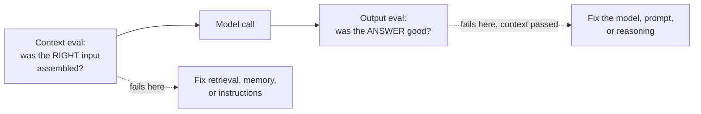

# Evaluating context quality

*Part of [Context engineering for the product leader](./README.md)*

## TL;DR

[Eval-driven development](../technical-product-management/tpm-for-ai-products.md) grades
whether an AI feature's *output* is good. That's necessary and not sufficient: a failing
output score doesn't tell you whether the model reasoned badly or was simply never shown
what it needed. **Context evals** answer the narrower, faster question — did the pipeline
supply the right instructions, the right retrieved facts, the right memory, the right
live state — *before* you spend a debugging session blaming the model. Separating "was
the context right?" from "was the answer right?" turns a vague quality regression into a
five-minute check instead of a week of prompt archaeology.

> 🎯 **For the product leader**
>
> **Why it matters** — Most AI debugging time is spent re-reading model output looking
> for a pattern, when the faster diagnostic is checking what the model was shown. A
> context eval turns that check into a repeatable score instead of a guess.
>
> **What it changes in your decisions** — You ask "did retrieval find the right
> document?" as a separate, gradable question from "was the final answer good?" — and you
> fund whichever one is actually failing, instead of tuning the prompt for a retrieval
> problem.
>
> **Ask yourself** — *"The last time this feature failed, did we check whether the
> context was right before we started rewriting the prompt?"*
>
> **Risk if ignored** — Weeks spent tuning a prompt against a retrieval bug, because
> nobody separated the two questions before debugging started.

## The mental model: two separate scores, not one

A failing output score with a passing context score points at the model and the prompt.
A failing output score with a *failing* context score points upstream, at retrieval,
memory, or instructions — and no amount of prompt tuning fixes an upstream miss.

## Building a context eval set

Reuse the sourcing discipline from
[eval-driven development](../technical-product-management/tpm-for-ai-products.md), aimed
one layer earlier:

- **Retrieval precision/recall** — for a graded set of real queries, did the retrieval
  step return the document that actually answers it? Grade this independently of what
  the model does with it. (Full retrieval-quality mechanics in
  [RAG architecture](../content/03-rag/rag-architecture.md).)
- **Memory correctness** — for a graded set of returning-user scenarios, did the right
  prior fact get surfaced, and only to the right audience? See
  [Memory & context](../memory-and-context/README.md) for what "right" means per memory
  type.
- **Instruction currency** — spot-check, on a schedule, whether the encoded policy
  matches the *current* real policy — not whether it matches what was true when the
  prompt was written.
- **Live-state freshness** — for time-sensitive answers, check the age of the tool data
  behind a sample of real responses, not just whether the tool call succeeded.

A feature that passes all four context checks but still fails its output eval has a
model or prompt problem, isolated and provable. A feature that fails any of the four has
found its actual bug, before a single line of the prompt gets touched.

## The five-minute triage

When a specific answer is wrong, before touching the prompt:

1. Pull the exact context the model was given for that call (see
   [the pipeline audit](./the-anatomy-of-a-context-pipeline.md)).
2. Ask: was the needed fact actually in there? If no — it's a retrieval or memory miss,
   not a model miss.
3. Ask: was it in there, but the model ignored or misused it? Only *then* is it a
   model/prompt problem worth iterating on.

Skipping step 1 is the single most common reason prompt-tuning sessions run long without
progress.

## Failure modes

- **Output-only evals** — grading only the final answer, so a retrieval regression and a
  model regression look identical and get debugged the same (slow) way.
- **Debugging by rewriting the prompt first** — reaching for prompt changes before
  checking whether the context was even right, burning cycles on the wrong layer.
- **A context eval that's never rerun** — building the four checks once at launch, then
  letting them go stale exactly like the pipeline they were meant to catch drifting.

## Practitioner checklist

- [ ] Do we grade context quality (retrieval, memory, instructions, live state)
      separately from output quality, or only the final answer?
- [ ] For our last major "the AI got worse" incident, did we check context quality
      before assuming a model or prompt regression?
- [ ] Are context evals rerun on a schedule, the same way output evals are?

## Related lessons

- [The anatomy of a context pipeline](./the-anatomy-of-a-context-pipeline.md)
- [TPM for AI products (eval-driven development)](../technical-product-management/tpm-for-ai-products.md)
- [Context as a spec-able requirement](./context-as-a-spec-able-requirement.md)
