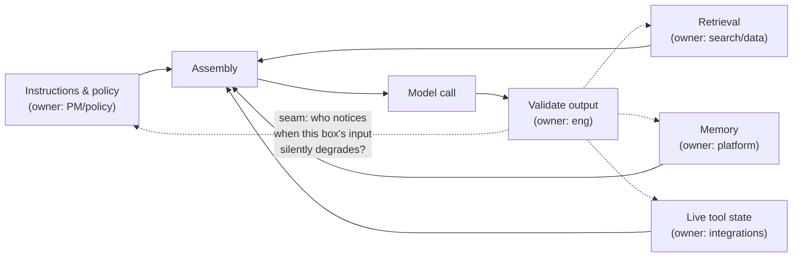

# The anatomy of a context pipeline

*Part of [Context engineering for the product leader](./README.md)*

## TL;DR

The full mechanics of an AI feature's request pipeline — guardrails, retrieval, prompt
assembly, the model call, validation, tools — are already mapped in
[Technical sense for AI systems](../technical-product-sense/technical-sense-for-ai.md).
This lesson takes that same pipeline and asks a different question of it: **who owns
each box, and what happens when nobody does?** A context pipeline isn't one component —
it's an assembly line with several owners, and the most common way it breaks isn't a bug
in any one box. It's a box nobody was accountable for, quietly feeding the model stale,
wrong, or missing input while every individual component reports healthy.

> 🎯 **For the product leader**
>
> **Why it matters** — "It's a black box" is usually false. The pipeline has named,
> auditable stages; the actual problem is that no single person has been asked to own
> all of them together.
>
> **What it changes in your decisions** — You assign an owner to each stage of the
> context pipeline the way you'd assign an owner to each stage of a checkout flow — not
> because any one stage is complex, but because an unowned handoff is where quality
> quietly leaks.
>
> **Ask yourself** — *"If our AI feature gave a wrong answer today, do I know which named
> stage of the pipeline I'd check first — and who I'd ask?"*
>
> **Risk if ignored** — A quality regression that takes weeks to diagnose because five
> different engineers each own one box and nobody owns the seams between them.

## The mental model: an assembly line, not a black box

Each box already has an owner on a typical team. The seams between boxes usually don't —
and a seam failure looks identical to a model failure from the outside: a wrong answer,
with every individual component's dashboard reporting green.

## The four sources, and where each one silently breaks

Using the four context types from [the previous lesson](./what-is-context-engineering.md):

- **Instructions & policy** breaks quietly when the policy changes (a new refund rule,
  a new compliance requirement) and nobody updates the instruction that encodes it — the
  model keeps confidently applying last quarter's rule.
- **Retrieval** breaks when the underlying corpus goes stale, gets reorganized, or a
  reranking change quietly demotes the document that used to answer a common question —
  see [RAG architecture](../content/03-rag/rag-architecture.md) for the full retrieval
  mechanics.
- **Memory** breaks along the lines covered in
  [When memory goes wrong](../memory-and-context/when-memory-goes-wrong.md): staleness,
  leakage across a boundary, or no way for a user to correct what's stored.
- **Live tool state** breaks when an integration goes down or returns cached data
  silently — the model answers fluently about a system state that stopped being true an
  hour ago.

## Auditing a pipeline you didn't build

You don't need to read the code to audit the pipeline. Three questions expose most gaps
in a working session with the engineering lead:

1. **"Walk me through what the model actually saw the last time this feature answered a
   question wrong."** If nobody can produce this — not the code, the actual assembled
   input — that's the finding, before you even get to the failure itself.
2. **"Which of the four boxes above changed most recently, and who signed off on it?"**
   A retrieval reranking tweak or a policy update that shipped without anyone connecting
   it to "this feeds the AI feature" is the single most common root cause of a sudden
   quality drop.
3. **"If this box went stale silently, how would we find out?"** — asked once per box.
   An "I don't know" here is a monitoring gap, not a hypothetical.

## Failure modes

- **The unowned seam** — every box has an owner, but the handoffs between them don't, so
  a quality regression takes weeks to trace because it's nobody's first place to look.
- **Silent staleness** — a context source (policy, retrieval corpus, live state) goes
  out of date with no alert, and the pipeline keeps serving it as current.
- **Debugging the model first** — escalating to "is the model getting worse?" before
  checking what the model was actually shown, because the pipeline was never treated as
  auditable.

## Practitioner checklist

- [ ] Does every stage of my AI feature's pipeline have a named owner — not just an
      engineering team, a person?
- [ ] Can I produce the exact assembled input behind a real past failure, not just the
      final output?
- [ ] Is there an alert for staleness on each context source, or would we only find out
      from a user complaint?

## Related lessons

- [What is context engineering, for a product leader?](./what-is-context-engineering.md)
- [Technical sense for AI systems (full pipeline mechanics)](../technical-product-sense/technical-sense-for-ai.md)
- [When memory goes wrong](../memory-and-context/when-memory-goes-wrong.md)
- [Context as a spec-able requirement](./context-as-a-spec-able-requirement.md)
