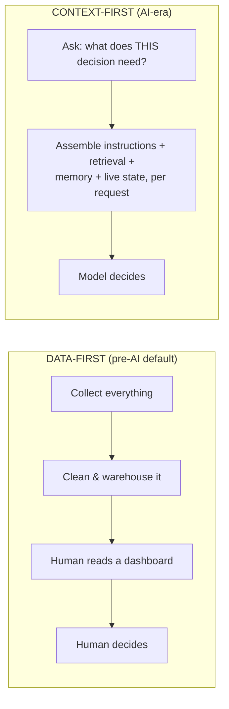

# What is context engineering, for a product leader?

*Part of [Context engineering for the product leader](./README.md)*

## TL;DR

For a decade, the default product question was "what data do we have?" — collect it,
clean it, put it on a dashboard, let a human decide. AI features break that pattern: the
model already has access to more raw text than any team could read, and it still gets
the decision wrong. What it lacked wasn't data. It was the right slice of it, assembled
for the moment. **Context engineering** is the discipline of deciding what a model sees
at the instant it has to act — instructions, retrieved facts, memory of what happened
before, live state from tools — so the decision is grounded, not just fluent. The
sharper question a product leader asks isn't "what data do we have," it's **"what does
the model need to know, right now, to make this specific decision meaningful?"**

> 🎯 **For the product leader**
>
> **Why it matters** — Every AI feature that "hallucinates," contradicts itself, or gives
> a technically-fluent-but-wrong answer is usually a context failure wearing a model
> failure's clothes. Fixing the model rarely helps; fixing what it was shown does.
>
> **What it changes in your decisions** — You stop asking engineering to "make the model
> smarter" and start asking what context a decision actually requires — the same rigor
> you'd apply to a feature spec, not an afterthought you leave to whoever wrote the
> prompt.
>
> **Ask yourself** — *"For our riskiest AI feature, could I list — right now, off the top
> of my head — everything the model is shown before it answers?"*
>
> **Risk if ignored** — A team ships bigger prompts and newer models chasing a quality
> problem that was never about either one, while the actual fix — better context — sits
> unbuilt.

## A note on scope

This curriculum already covers context in real engineering depth in two places:
[Context engineering](../content/00-foundations/context-engineering.md) (the context
window as a scarce, ordered resource) and [Context & memory](../agentic-ai/context-and-memory.md)
(an agent's working-memory hierarchy). [Memory & context](../memory-and-context/README.md)
covers memory specifically as a product-trust decision. This module sits one level up
from all three: it's the **strategic and operating argument** for context engineering as
a product leader's discipline — not the mechanics of fitting things in a window, and not
memory specifically, but the full question of what any AI decision needs to see, how you
spec that requirement, and how you know when it's missing. Follow the spokes into those
three lessons for the engineering depth behind every mechanic this module names.

## The mental model: data-first vs. context-first

Data-first optimizes for *volume, collected once*: gather as much as you can, store it,
let a human filter at read time. Context-first optimizes for *relevance, assembled every
time*: a model makes a fresh decision on every call, so the filtering has to happen
*before* the call, on purpose, by something — usually your product, not the model. The
volume of data your company holds stopped being the constraint. What's scarce now is the
judgment about which slice of it belongs in front of the model for this one decision.

## The four things "context" actually means

When a PM says "give the model more context," it's rarely obvious which of four
different things they mean:

- **Instructions & policy** — what the model is told to do and the constraints it
  operates under. Static per feature, but still a product decision: whose voice, which
  guardrails, what's out of scope.
- **Retrieved knowledge** — facts fetched at the moment of the request, usually via
  [RAG](../content/03-rag/rag-architecture.md): documents, records, prior tickets. This
  is where "the model doesn't know our data" actually gets fixed.
- **Memory** — what's carried forward from earlier in this session, from this user's
  history, or from the organization. Scoped in full in
  [Memory & context](../memory-and-context/README.md).
- **Live tool & environment state** — what's true *right now*: an account balance, a
  calendar, a system status, another tool's output. Stale live state produces
  confidently wrong answers about the present.

Naming which of the four is missing turns a vague "the AI seems dumb" complaint into a
specific, buildable fix. Most quality escalations are exactly one of these four things,
mislabeled as a model problem.

## Why this needed a name at all

Before this discipline had a name, teams reached for **prompt engineering**: write a
clever instruction, ship it, move on. It's fast, and it's the right first move for a
prototype — but it conflates all four inputs above into one string, decided once, and it
breaks down at exactly the moment a product has to survive contact with real users and
real scale. [The next lesson](./why-prompt-engineering-doesnt-scale.md) is the diagnostic
for exactly how and where it breaks.

## Failure modes

- **The bigger-model reflex** — treating every quality miss as a reason to upgrade the
  model, when the model was never shown what it needed to answer correctly.
- **Data-first hangover** — building a beautiful analytics pipeline for humans, then
  wiring the same warehouse straight into a prompt with no filtering, and calling that
  "giving the model context."
- **The unnamed input** — a team that can't say which of the four context types a
  feature depends on, so nobody notices when one of them silently breaks.

## Practitioner checklist

- [ ] For my highest-stakes AI feature, can I name what instructions, retrieval, memory,
      and live state it depends on — separately?
- [ ] The last time this feature gave a wrong answer, did we check what it was shown
      before assuming the model was at fault?
- [ ] Have I asked "what does this decision need to see?" instead of "what data do we
      have?" in the last planning conversation about this feature?

## Related lessons

- [Why prompt engineering doesn't scale](./why-prompt-engineering-doesnt-scale.md)
- [Context engineering (engineering depth)](../content/00-foundations/context-engineering.md)
- [Memory & context for the product leader](../memory-and-context/README.md)
- [TPM for AI products](../technical-product-management/tpm-for-ai-products.md)
