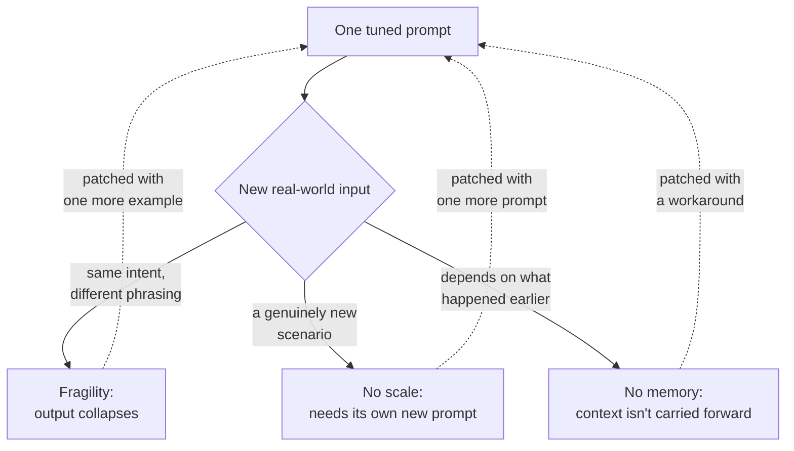

# Why prompt engineering doesn't scale

*Part of [Context engineering for the product leader](./README.md)*

## TL;DR

A clever prompt is the fastest way to a working demo, and that speed is exactly what
makes it dangerous: it disguises three structural weaknesses that don't show up until
production. **Fragility** — a small change in phrasing breaks an output tuned on a
handful of examples. **No scale across use cases** — every new scenario earns its own
bespoke string, and the team ends up maintaining a library of brittle prompts instead of
one adaptive system. **No memory** — a prompt answers in isolation unless something else
explicitly carries context forward, so the same assistant can contradict itself between
one call and the next. None of these are model problems. They're the predictable result
of treating an architecture decision as a wording exercise.

> 🎯 **For the product leader**
>
> **Why it matters** — "The prompt broke" is the single most common AI-quality
> escalation, and it recurs because the underlying diagnosis — a system problem disguised
> as a wording problem — never gets fixed, only patched with one more example.
>
> **What it changes in your decisions** — You budget engineering time for context
> infrastructure (retrieval, memory, validation) instead of budgeting PM time for prompt
> tweaking, once a feature has more than a handful of real-world scenarios.
>
> **Ask yourself** — *"How many of our 'prompt fixes' this quarter were actually patches
> for a missing piece of context — a fact the model was never given?"*
>
> **Risk if ignored** — A growing pile of one-off prompt patches, each fixing yesterday's
> complaint while quietly breaking a case that used to work — the classic sign of a
> string doing a system's job.

## The mental model: three ways a prompt-only system breaks

Every patch loops back into the same prompt, and the loop is the tell: each fix makes
the next fix more likely, because the underlying gap — no system, just a string — never
closes.

## The three failure patterns, in practice

- **Fragility.** A prompt tuned on "how do I request a refund?" breaks on "can I get my
  money back if I cancel mid-cycle?" — same intent, different words, no output. Real
  inputs are never as clean as the five examples a prompt was tuned against, and a
  fragile feature degrades exactly when volume (and scrutiny) is highest.
- **No scale across use cases.** Every new scenario — drafting a PRD, summarizing a
  competitor, answering a niche support question — gets its own hand-tuned prompt. That
  library of bespoke strings is operational debt with a name attached: someone has to
  remember which prompt does what, and update all of them when the underlying policy
  changes.
- **No memory.** A prompt answers in isolation unless something else supplies history.
  Without it, an AI roadmap assistant can recommend the SMB segment on Monday and
  enterprise-only on Tuesday, because nothing told it what was decided last week. This is
  a context-engineering problem, not a memory *feature* problem — see
  [Memory & context](../memory-and-context/README.md) for how to scope memory once you've
  decided you need it.

## The diagnostic: is this a prompt problem or a context problem?

Before rewriting a prompt again, ask which of these it actually is:

1. **Is the model missing a fact it needs?** That's retrieval — fetch it, don't ask the
   model to guess it or memorize it in the instructions.
2. **Is the model missing what happened earlier?** That's memory — decide, as a product
   choice, what should carry forward and for whom.
3. **Is the model missing live state?** That's a tool call — the answer changes based on
   something true right now, not something in the prompt.
4. **Is the wording itself actually ambiguous?** Only *this* one is a genuine prompt
   problem, and it's usually the smallest of the four in practice.

Most "prompt is broken" tickets are actually 1, 2, or 3, mislabeled — which is exactly
why rewording the prompt one more time so rarely holds.

## Failure modes

- **Prompt spaghetti** — a growing, undocumented library of one-off prompts, each
  tuned for a specific complaint, with no one able to say what happens if two of them
  interact.
- **Whack-a-mole tuning** — fixing today's failing example breaks yesterday's passing
  one, because the "fix" is a wording change with no test suite behind it.
- **Mistaking memory for context in general** — treating "add memory" as the answer to
  every "the AI seems inconsistent" complaint, when the actual gap is retrieval or live
  state.

## Practitioner checklist

- [ ] For our last three "prompt fix" tickets: run each through the four-question
      diagnostic above — how many were actually a retrieval, memory, or tool-state gap?
- [ ] Do we have an inventory of every prompt in production, or does "how many prompts do
      we have" require asking an engineer to go look?
- [ ] Is there a test suite that catches a prompt change breaking a previously-passing
      case, or does regression get caught by users first?

## Related lessons

- [What is context engineering, for a product leader?](./what-is-context-engineering.md)
- [The anatomy of a context pipeline](./the-anatomy-of-a-context-pipeline.md)
- [Memory & context for the product leader](../memory-and-context/README.md)
