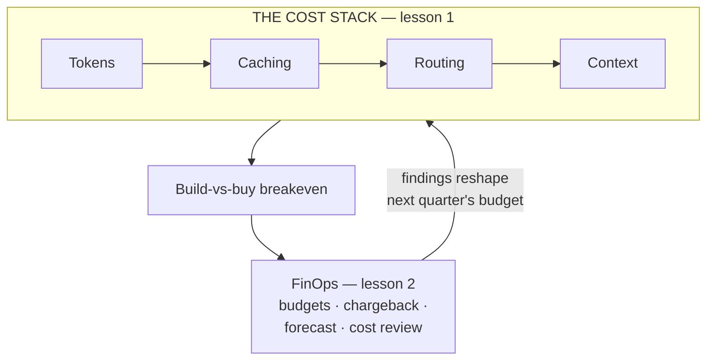

# Cost optimization for the product leader

*Part of the [Generative AI family](../GENERATIVE_AI_ROADMAP.md).*

Every AI feature has a cost of goods sold hiding in the model call, and it's usually
invisible at demo scale and decisive at production scale. Optimizing it looks, at first,
like a grab-bag of unrelated tricks — cache this, route that, shrink the prompt — until
you see the shape underneath: a handful of levers, a build-vs-buy decision most teams
never run the numbers on, and a governance practice that decides where spend goes next
instead of just reporting where it went.

**A note on scope.** This is the most exhaustively covered topic in the curriculum from
a mechanics standpoint. [Prefill vs. decode](../content/01-inference-internals/prefill-vs-decode.md)
and [Continuous batching & paged attention](../content/01-inference-internals/batching-and-paged-attention.md)
already develop token economics in full engineering depth.
[Prompt vs. semantic caching](../content/01-inference-internals/prompt-vs-semantic-caching.md),
[Model routing](../content/02-reliable-outputs/model-routing.md), and
[Cost attribution](../content/04-evals-observability/cost-attribution.md) already develop
caching, routing, and instrumentation in full. [Context engineering](../content/00-foundations/context-engineering.md)
and [Agentic AI as a product](../agentic-ai/agentic-ai-as-a-product.md) already develop
context cost and unit economics. Re-deriving any of that here would only restate it. This
module exists to answer what those deep-dives don't lead with: a map of which lever
attacks which cost driver, the build-vs-buy breakeven done as arithmetic, and the FinOps
practice — budgets, chargeback, forecasting, a recurring cost review — that turns
attribution into governance. That is why this module is two lessons, not six.

## The knowledge graph

Read it as one argument in two parts. **The cost stack**: four levers, each with a full
existing deep-dive, mapped onto one diagnosis so a cost complaint gets a specific fix
instead of a vague mandate to "optimize" — plus the build-vs-buy math nobody had priced
yet. **FinOps**: attribution tells you where the money went; this is the practice that
decides where it goes next, before the invoice instead of after.

## The lessons

- [**The cost stack, and the build-vs-buy breakeven**](./the-cost-stack-and-the-build-vs-buy-breakeven.md)
  — which lever fixes which cost driver, and the crossover volume where self-hosting
  starts beating a metered API.
- [**FinOps for AI: budgets, forecasting & the cost review**](./finops-budgets-forecasting-and-the-cost-review.md)
  — enforced budgets, chargeback vs. showback, forecasting two curves moving in opposite
  directions, and the recurring review that catches drift before the invoice does.

Each lesson pairs the product framing with a **🎯 For the product leader** briefing — why
it matters, the decision it changes, the question to ask your team, and the risk if
ignored — plus a diagram. For the engineering depth behind every mechanic mentioned here,
follow the spokes into
[Prefill vs. decode](../content/01-inference-internals/prefill-vs-decode.md),
[Prompt vs. semantic caching](../content/01-inference-internals/prompt-vs-semantic-caching.md),
[Model routing](../content/02-reliable-outputs/model-routing.md), and
[Cost attribution](../content/04-evals-observability/cost-attribution.md).

**📌 Close out the module:** [Recap & real-world examples](./recap.md).

This completes the eleven-module [Generative AI family](../GENERATIVE_AI_ROADMAP.md).
