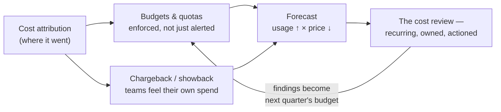

# FinOps for AI: budgets, forecasting & the cost review

*Part of [Cost optimization for the product leader](./README.md)*

## TL;DR

[Cost attribution](../content/04-evals-observability/cost-attribution.md) tells you
where the money went, after it's gone. **FinOps** is the operating discipline that
decides where it goes *next* — before the invoice, not after. Four practices make it
real: **budgets and quotas** enforced in code, not just watched on a dashboard;
**chargeback or showback** so a team feels the cost of what it builds, instead of every
AI feature drawing from one undifferentiated pool; a **forecast** that accounts for two
curves moving in opposite directions at once — usage climbing, token prices falling — and
a naive extrapolation of last month's bill gets both wrong; and a recurring **cost
review**, structured like a postmortem, that catches drift before it becomes a headline
number on a board slide.

> 🎯 **For the product leader**
>
> **Why it matters** — Attribution without governance is a very detailed receipt. FinOps
> is what turns "we can see where the money went" into "we decided where it should go."
>
> **What it changes in your decisions** — Budgets get enforced, not just alerted on.
> Teams see their own AI spend, not a shared line item nobody owns. Forecasts account for
> both usage growth and falling per-token prices instead of naively projecting one line.
>
> **Ask your eng team** — *"If a feature's spend doubled overnight, would anything stop
> it automatically, or would we find out from the invoice?"*
>
> **Risk if ignored** — A quietly runaway feature burns budget for weeks before anyone
> notices, or a forecast built on last month's per-token price is wrong by the time this
> quarter's board deck ships.

## From attribution to governance

## Budgets and quotas — enforced, not watched

A dashboard that shows spend rising is attribution. A **budget** is attribution with
teeth: a per-tenant or per-feature cap that does something automatically when it's hit —
throttles, degrades to a cheaper model, or pages a human — rather than a number a person
has to notice and act on manually. The distinction matters because the failure mode of a
watched-only budget is specific and common: a runaway agent loop, a cache-busting change,
or a viral feature can burn a month's allocated spend in a day, and a dashboard nobody
was staring at in real time catches it only after the money is gone.

- **Hard caps** for anything where "run out and stop" is safe — a free tier, an internal
  tool, a feature where degrading gracefully costs nothing.
- **Soft budgets with escalation** for anything where stopping outright breaks a paying
  customer's workflow — alert a human at 80%, and again at 100%, rather than cutting them
  off mid-task.
- **Per-tenant and per-feature**, not just aggregate — an aggregate budget can be healthy
  while one tenant is quietly destroying margin underneath it, invisible until someone
  slices the number the way [cost attribution](../content/04-evals-observability/cost-attribution.md)
  already knows how to.

## Chargeback and showback — who feels the cost

Both practices route attributed cost back to the team that generated it. They differ in
what happens next. **Chargeback** actually debits the owning team's budget — the cost is
real money out of their P&L, and it changes incentives immediately: a team that pays for
its own token spend starts asking whether every feature needs the biggest model.
**Showback** only makes the number visible, with no financial consequence — cheaper to
implement, and often the right first step, but it relies on teams caring about a number
that doesn't touch their budget. The tradeoff is real: chargeback creates sharper
incentives and more friction (billing disputes, contested attribution when a shared
service's cost gets split); showback creates less friction and weaker incentives. Most
organizations start with showback to build the attribution muscle, then move to
chargeback once the data is trusted enough that a team won't dispute the number it's
being charged.

## Forecasting two curves that move in opposite directions

A naive AI cost forecast takes current spend and multiplies by expected user growth. It's
wrong twice over, because two forces are moving simultaneously and in opposite
directions:

- **Usage grows** — more users, more requests per user as a feature matures, longer
  average context as conversations and documents grow. This pushes cost up.
- **Per-token prices fall** — model providers have cut prices steeply and repeatedly
  since the category began, and a well-run serving stack's marginal cost per token
  [falls further as batching and paged attention mature](../content/01-inference-internals/batching-and-paged-attention.md).
  This pushes cost down.

A forecast that only tracks usage overshoots, sometimes badly enough to justify a
self-hosting decision or a price increase that a more honest number wouldn't support. A
forecast that only tracks falling prices undershoots, and a team gets blindsided when a
successful launch's volume outpaces the price relief it was counting on. The discipline
is modeling both curves explicitly, with their own separate assumptions, rather than
collapsing them into one trend line drawn through last month's invoice.

## The cost review — a recurring ritual, not a fire drill

The practice that makes the other three durable: a standing, cross-functional review —
engineering, product, finance — on a fixed cadence, structured the way
[technical product management](../technical-product-management/incidents-and-postmortems.md)
structures an incident postmortem. Look at spend against budget per tenant and feature,
check whether the forecast's two curves are tracking reality, revisit the
[build-vs-buy breakeven](./the-cost-stack-and-the-build-vs-buy-breakeven.md) if volume has
moved meaningfully, and — the step that's easiest to skip — assign an owner and a date to
whatever the review finds, the same discipline that keeps a postmortem's action items from
dying in a document nobody reopens. A cost review that only produces a slide with numbers
on it, and no owned action items, is theater with a spreadsheet attached.

## A worked pass: the forecast that was wrong in both directions

A team forecasts next year's AI infrastructure cost by taking this month's per-user
spend and multiplying by projected user growth — a single line, no separate treatment of
price and volume. Actual costs come in lower than forecast for the first two quarters,
because the model provider cut prices twice in that window, and the team congratulates
itself on efficiency gains it didn't actually make. In quarter three, a popular new
feature pushes average conversation length up sharply, volume grows faster than the
original forecast assumed, and per-token prices stop falling as fast — the same single
line now *understates* cost, and a budget conversation that should have started in
quarter two happens under pressure in quarter three instead. Both misses trace to the
same root cause: one line trying to represent two curves that move independently. A
forecast that modeled usage growth and price decline as separate assumptions would have
caught the shift in either direction with two quarters of runway, instead of being
surprised twice by the same conflated number.

## Failure modes

- **Watched, not enforced** — a budget dashboard exists, but nothing automatic happens
  when a number crosses it, so the catch depends on someone noticing in time.
- **Showback with no teeth, forever** — a team never feels its own spend, so no incentive
  ever changes, and showback becomes a report nobody acts on.
- **One-line forecasting** — usage growth and price decline get collapsed into a single
  trend, producing a number that's confidently wrong in whichever direction the two
  curves diverge fastest.
- **The cost review that never happens twice** — a review gets run once, produces a good
  slide, and never recurs, so the next quarter's drift goes uncaught until the invoice.
- **Action items with no owner** — the review correctly identifies a problem, and nothing
  changes, because no one was assigned to fix it by a date.

## Practitioner checklist

- [ ] Do our budgets actually do something automatic when breached, or only alert a human
      who might not be watching?
- [ ] Can each team see — or better, feel — its own AI spend, not just an aggregate
      number nobody owns?
- [ ] Does our forecast model usage growth and price decline as two separate curves, or
      one naive extrapolation?
- [ ] Is there a recurring, cross-functional cost review on the calendar — and does it
      produce owned action items, not just a slide?
- [ ] When did we last revisit the build-vs-buy breakeven against current volume and
      current prices?

## Related lessons

- [The cost stack, and the build-vs-buy breakeven](./the-cost-stack-and-the-build-vs-buy-breakeven.md)
- [Cost attribution](../content/04-evals-observability/cost-attribution.md)
- [Incidents & postmortems](../technical-product-management/incidents-and-postmortems.md)
  — the ritual structure this lesson's cost review borrows.
- [The economics of infrastructure](../technical-product-sense/economics-of-infrastructure.md)
