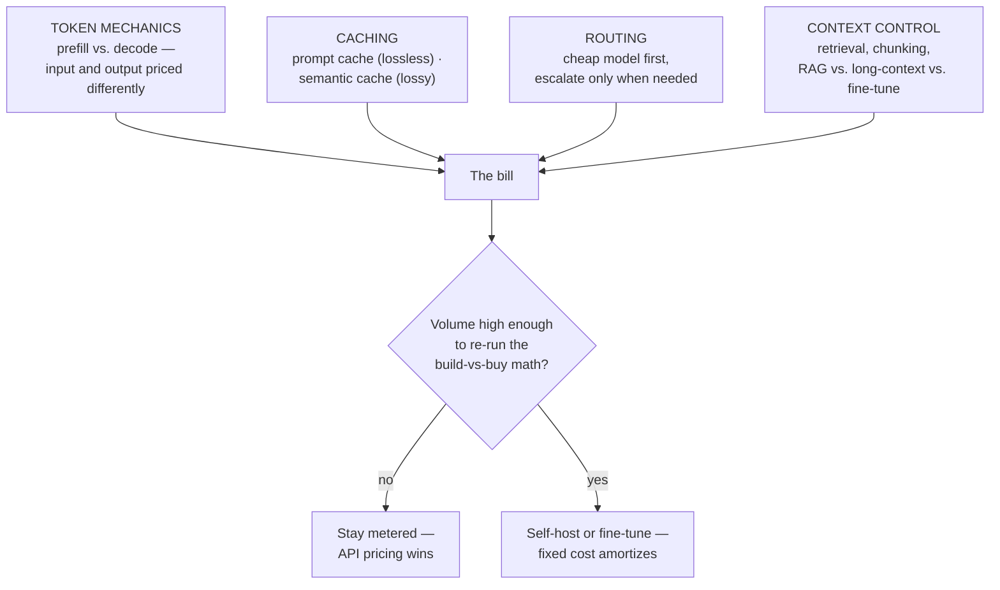

# The cost stack, and the build-vs-buy breakeven

*Part of [Cost optimization for the product leader](./README.md)*

## TL;DR

AI cost optimization looks like a grab-bag of unrelated tactics — cache this, route that,
trim the prompt — until you see that every tactic attacks one of four points on the
request path. **Token mechanics** set the floor price of a single call. **Caching**
skips work the system already did. **Routing** sends the call to the cheapest model that
can still do the job. **Context control** shrinks what you pay for in the first place.
Naming which lever fixes which driver is what turns "our AI bill is too high" into a
specific, assignable fix instead of a vague mandate to "optimize." Underneath all four
sits one decision this family hasn't priced yet: at what volume does running your own
model beat paying a provider per token — the **build-vs-buy breakeven**, done as
arithmetic instead of a gut call.

> 🎯 **For the product leader**
>
> **Why it matters** — "Make it cheaper" isn't a roadmap item until it names which of the
> four levers is actually slack, and self-hosting is a real, quantifiable option most
> teams evaluate on vibes instead of a number.
>
> **What it changes in your decisions** — You diagnose a cost problem to one of four
> categories before proposing a fix, and you calculate — not guess — the volume at which
> build starts beating buy.
>
> **Ask your eng team** — *"Of tokens, caching, routing, and context, which one is
> actually our biggest lever right now — and have we run the self-host breakeven math, or
> are we assuming the answer?"*
>
> **Risk if ignored** — A team optimizes the lever that's easiest to talk about instead of
> the one that's actually expensive, and a self-hosting decision gets made — or avoided —
> on intuition at a volume where the arithmetic would have said the opposite.

## The cost stack

Each layer already has a full, deep treatment elsewhere in this curriculum, developed at
exactly this product-decision altitude. This lesson doesn't re-derive any of it — it maps
the terrain so a team knows which door to open.

- **Token mechanics** — input tokens (prefill) and output tokens (decode) are computed
  differently and priced differently, which is why "shorten the output" and "shorten the
  input" are different optimizations with different payoffs. Fully developed in
  [Prefill vs. decode](../content/01-inference-internals/prefill-vs-decode.md) and
  [Continuous batching & paged attention](../content/01-inference-internals/batching-and-paged-attention.md),
  which also covers why serving many users at once — not just one clever prompt — is the
  biggest lever on cost-per-token for anyone running their own inference.
- **Caching** — a prompt cache skips recomputation for an identical prefix, losslessly. A
  semantic cache skips the model call entirely for a *similar* query, at the risk of
  serving a wrong or stale answer. Fully developed in
  [Prompt vs. semantic caching](../content/01-inference-internals/prompt-vs-semantic-caching.md).
- **Routing** — send easy requests to a cheap model and escalate only the hard ones,
  instead of running every request through the most capable (and most expensive) model
  available. Fully developed in
  [Model routing](../content/02-reliable-outputs/model-routing.md).
- **Context control** — every token you feed the model, you pay for, so what you retrieve
  and how much of it you keep is a cost decision as much as a quality one. Fully developed
  in [Context engineering](../content/00-foundations/context-engineering.md) and
  [RAG vs. long-context vs. fine-tuning](../rag-vector-databases/rag-vs-long-context-vs-finetuning.md).

The move this lesson makes that those four don't: once you can see all four levers on one
map, a cost complaint stops being "everything is expensive" and becomes "which of these
four is actually the slack one, this quarter, for this feature" — a question
[cost attribution](../content/04-evals-observability/cost-attribution.md) is built to
answer with data instead of guesses.

## The build-vs-buy breakeven

Every team renting a frontier model's API eventually asks: *should we run this
ourselves?* The honest answer is arithmetic, not instinct — a crossover volume where a
provider's per-token price, multiplied by your usage, exceeds the fixed and variable cost
of serving it yourself.

**The metered side** scales linearly with volume: `tokens/month × price/token`. It has
no fixed cost, and it falls automatically whenever the provider cuts prices — which,
historically, has been often and steeply.

**The self-hosted side** has a large fixed cost (GPU capacity, whether reserved or
committed) plus a much smaller marginal cost per token once that capacity is running.
[Continuous batching and paged attention](../content/01-inference-internals/batching-and-paged-attention.md)
are exactly what determine how low that marginal cost goes — a well-tuned serving stack
extracts far more tokens per dollar of GPU than a naive one, which shifts the whole
crossover point.

The two lines cross at a specific volume: below it, metered API pricing wins because
you're not using enough of the fixed capacity to justify owning it. Above it,
self-hosting wins because the fixed cost is now spread across enough tokens that the
marginal cost per token undercuts the provider's price. The crossover volume isn't a
constant — it moves whenever token prices drop (pushing it higher, favoring "stay
metered") or your serving efficiency improves (pushing it lower, favoring "self-host
sooner"). A team that calculates this once and never rechecks it is optimizing against a
number that's already stale, in one direction or the other, within a quarter.

**Fine-tuning a smaller model** is the same math with a different fixed cost: not GPU
capacity, but the fine-tuning run and the ongoing work of keeping a smaller, specialized
model current. It clears the bar when the task is narrow enough that a smaller model
reaches acceptable quality — the same scoping judgment
[technical sense for AI systems](../technical-product-sense/technical-sense-for-ai.md)
develops for the reliable frontier, applied to cost instead of capability.

## A worked pass: the self-hosting decision nobody re-ran

A support-automation product launches on a frontier model's API. At 2 million tokens a
month, the bill is a rounding error next to the eng team's own salaries, and self-hosting
is obviously not worth the operational burden — nobody runs the numbers because the
answer is visibly "stay metered." Eighteen months later, volume has grown 40x to 80
million tokens a month, the API bill is now a material line on the P&L, and the team is
still on the same provider, because the original "not worth it" conclusion was never
revisited. When someone finally runs the crossover math, self-hosting a well-tuned
open-weight model clears breakeven at roughly a third of current volume — the team has
been overpaying for over a year. The lesson isn't "always self-host." It's that the
build-vs-buy answer has an expiration date tied to volume, and the failure mode is never
checking it again after the first, correct call.

## Failure modes

- **Random-lever optimization** — a team caches aggressively while the real driver is an
  unrouted flood of easy requests hitting the most expensive model, because nobody
  diagnosed which of the four levers was actually slack.
- **Build-vs-buy decided once, never re-run** — a "stay metered" call made at low volume
  is treated as permanent, while usage grows past the crossover point unnoticed.
- **Ignoring the moving crossover** — the breakeven volume shifts with every provider
  price cut and every serving-efficiency gain, and a team that calculated it once treats
  the number as fixed.
- **Self-hosting without the serving-stack investment** — running your own model without
  continuous batching and paged attention lands nowhere near the marginal cost the
  breakeven math assumed, so the crossover that looked favorable on paper never
  materializes in practice.

## Practitioner checklist

- [ ] For the current cost complaint, can I name which of the four levers — tokens,
      caching, routing, context — is actually the slack one, with data behind it?
- [ ] Have we calculated the self-host or fine-tune breakeven volume with real numbers,
      not intuition?
- [ ] When did we last recheck that calculation against current token prices and current
      usage?
- [ ] If we're self-hosting, is the serving stack (batching, paged attention) actually
      tuned to the marginal cost the breakeven math assumed?

## Related lessons

- [FinOps for AI: budgets, forecasting & the cost review](./finops-budgets-forecasting-and-the-cost-review.md)
- [Cost attribution](../content/04-evals-observability/cost-attribution.md)
- [Model routing](../content/02-reliable-outputs/model-routing.md)
- [Prompt vs. semantic caching](../content/01-inference-internals/prompt-vs-semantic-caching.md)
- [The economics of infrastructure](../technical-product-sense/economics-of-infrastructure.md)
  — the general unit-economics napkin this lesson's breakeven specializes for the
  build-vs-buy decision.
