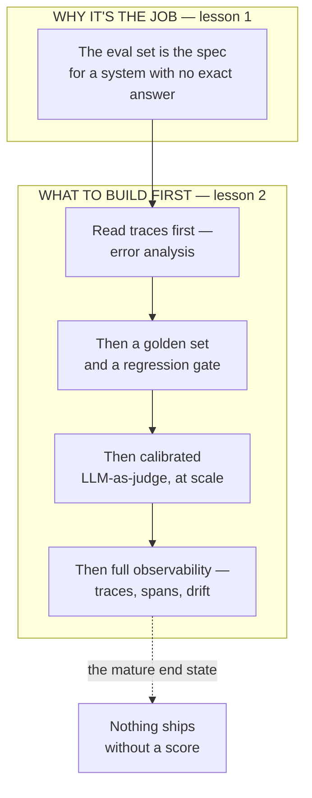

# Evaluation & observability for the product leader

*Part of the [Generative AI family](../GENERATIVE_AI_ROADMAP.md).*

An AI system fails silently. A wrong answer looks exactly like a right one, and quality
can quietly regress with no code change at all — a model update behind an API, a prompt
tweak with a side effect nobody predicted, a corpus that aged out from under a retrieval
system. Evals and observability are the only real defense: evals tell you whether the
system is correct before it ships, and observability tells you whether it's actually
working once real traffic hits it. Neither is optional infrastructure to add later —
teams that skip them don't ship faster, they ship blind, and find out about regressions
from users instead of dashboards.

**A note on scope.** This is the most exhaustively covered topic in this entire
curriculum. [Evals](../content/04-evals-observability/evals.md) and
[Observability](../content/04-evals-observability/observability.md) already develop
golden sets, regression tests, adversarial tests, LLM-as-judge, error analysis, traces,
spans, and drift detection in full engineering depth.
[Reliability & evals](../agentic-ai/reliability-and-evals.md) already develops
trajectory evals for agents. [TPM for AI products](../technical-product-management/tpm-for-ai-products.md)
already develops eval-driven development as an operating discipline. Re-deriving any of
that here would only restate it a fifth time. This module exists to answer the two
questions those deep-dive lessons don't lead with: why this investment is worth making
before a team feels ready for it, and in what order to actually build it. That is why it
is two lessons, not seven — the honest amount of genuinely new ground, once four existing
sources are accounted for, is two lessons' worth.

## The knowledge graph

Read it as two questions in sequence. **Why**: an AI system can't be spec'd the way
ordinary software is, so the eval set has to do that job instead — which makes it a
decision a product leader should insist on, not a technical nicety to negotiate away.
**What to build first**: the eval stack has a real build order, and skipping straight to
dashboards before anyone has read the actual traces is the most common way teams
over-invest in tooling and under-invest in the judgment that makes it useful.

## The lessons

- [**Why eval investment is the job**](./why-eval-investment-is-the-job.md) — the case
  for treating measurement as the product spec for a non-deterministic system, and what
  skipping it actually costs.
- [**Building the eval stack in the right order**](./building-the-eval-stack-in-the-right-order.md)
  — the sequence that turns a handful of read traces into a full eval and observability
  practice, without over-building before anyone needs it.

Each lesson pairs the product framing with a **🎯 For the product leader** briefing —
why it matters, the decision it changes, the question to ask your team, and the risk if
ignored — plus a diagram. For the engineering depth behind every mechanic mentioned here,
follow the spokes into
[Evals](../content/04-evals-observability/evals.md),
[Observability](../content/04-evals-observability/observability.md), and
[Reliability & evals](../agentic-ai/reliability-and-evals.md).

**📌 Close out the module:** [Recap & real-world examples](./recap.md).
