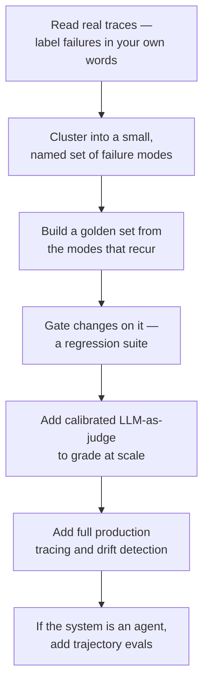

# Building the eval stack in the right order

*Part of [Evaluation & observability for the product leader](./README.md)*

## TL;DR

The full eval and observability stack — golden sets, regression gates, calibrated
LLM-as-judge grading, full production tracing, drift detection, trajectory evals for
agents — is a lot to build at once, and trying to build all of it before shipping
anything is its own kind of failure. There's a real order to this, and it starts smaller
than most roadmaps assume: read real traces before building anything to grade them
automatically, turn the recurring failures you find into a small golden set, gate changes
on it, then add calibrated automated judging to scale past what a human can review by
hand, and only then invest in full production observability as the system's traffic and
stakes grow. Each stage earns the next one. Skipping ahead produces expensive tooling
nobody trusts, because nobody did the reading that would have told them what to measure.

> 🎯 **For the product leader**
>
> **Why it matters** — Most eval investments fail not because the techniques don't work,
> but because they were built in the wrong order — sophisticated scoring infrastructure
> for failure modes nobody had actually identified yet.
>
> **What it changes in your decisions** — Where the team spends its first weeks of eval
> investment, and what "we have evals" is actually allowed to mean at each stage of a
> feature's maturity.
>
> **Ask yourself** — *"Has anyone on this team actually read fifty real traces end to
> end, or did we go straight to building a scoring pipeline?"*
>
> **Risk if ignored** — A team builds an impressive-looking eval dashboard that measures
> the wrong things, because nobody did the unglamorous work of reading real failures
> before deciding what to score.

## The mental model: each stage earns the next

Each box only pays off once the one before it exists. A golden set built without first
reading real traces measures whatever the team guessed mattered, not what actually fails.
A calibrated judge built before a golden set has nothing representative to calibrate
against. Full production observability, built before anyone has a working regression
gate, produces a beautiful dashboard tracking a system nobody can yet tell is regressing
or improving. The order is the discipline — not any single stage in isolation.

## Where to actually start: reading, not scoring

The first real step is qualitative, not a metrics project: pull real traces — a random
sample, plus anything a user flagged — and read them one by one, labeling what went wrong
in plain language, in the team's own words, without forcing the labels into a taxonomy
yet. Only once a pile of these free-form labels exists does clustering them into a
handful of named, recurring failure modes make sense. This unglamorous reading is what
tells a team what's actually worth building an automated evaluator for, and it's also the
step most commonly skipped in the rush to have a dashboard to show. The full method —
what the discipline calls open coding and axial coding — is developed in complete depth
in [Evals](../content/04-evals-observability/evals.md).

## Growing from a golden set to a full production practice

Once a handful of recurring failure modes are named, they become a small, version-
controlled golden set: real inputs, paired with what a good output looks like, that a
team can run before every change ships and gate the release on. From there, the stack
grows to match the system's stakes and scale, not before it: LLM-as-judge grading takes
over from all-human review once volume outgrows what people can read by hand, calibrated
against those same human judgments so it can be trusted; full tracing and drift detection
earn their cost once the system is live and quality can decay in ways no single deploy
caused; and if the system is agentic, trajectory evals — grading the path a run took, not
just its final answer — become necessary once a single mistake early in a long run can
compound into a failure that only shows up at the end. All of this is developed in
complete engineering depth in
[Observability](../content/04-evals-observability/observability.md) and
[Reliability & evals](../agentic-ai/reliability-and-evals.md). The mature end state —
where no change ships without a score, because the eval set has effectively become the
spec — is the operating discipline developed in
[TPM for AI products](../technical-product-management/tpm-for-ai-products.md).

## Failure modes

- **Dashboards before reading** — investing in scoring infrastructure before anyone spent
  the hours reading real traces that would have revealed what to measure.
- **A judge with nothing to calibrate against** — standing up automated LLM grading
  before a human-reviewed golden set exists to check it against.
- **Observability before a working gate** — full production tracing built before there's
  even a regression suite to tell whether a change should have shipped.
- **Trajectory evals skipped on an agentic system** — grading only a long-running agent's
  final answer, missing the early step that actually caused the failure.

## Practitioner checklist

- [ ] Has the team read real production traces and labeled failures in plain language,
      before building anything to score them automatically?
- [ ] Does a golden set exist that came from those real failure modes, not from a guess
      at what might matter?
- [ ] Is any automated judge calibrated against human-labeled examples before it's
      trusted to grade at scale?
- [ ] If the system is agentic, does anything grade the path a run took, not just
      whether it reached the right answer?

## Related lessons

- [Why eval investment is the job](./why-eval-investment-is-the-job.md) — the case for
  making this investment before a team feels ready for it.
- [Evals](../content/04-evals-observability/evals.md) — the full depth on error analysis,
  golden sets, regression tests, and LLM-as-judge.
- [Observability](../content/04-evals-observability/observability.md) — the full depth on
  traces, spans, and drift detection in production.
- [Reliability & evals](../agentic-ai/reliability-and-evals.md) — the full depth on
  trajectory evals for agents.
