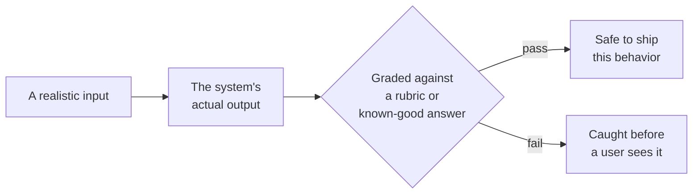

# Why eval investment is the job

*Part of [Evaluation & observability for the product leader](./README.md)*

## TL;DR

Ordinary software has a spec you can check against: given this input, the function
returns that output, exactly. An AI feature doesn't have that — its outputs vary, and
"correct" is often a matter of degree, not an exact match. Evals exist to solve exactly
this problem: a curated set of realistic inputs, graded against a rubric, becomes the
closest thing the feature has to a spec. Skipping this isn't a shortcut that ships
faster — it's a decision to fly blind, where every prompt tweak, every model swap, and
every quiet upstream change becomes a coin flip that nobody can measure until users start
complaining. Treating eval investment as optional, or as something to add once the
feature is "working," gets the sequence backwards: without it, a team can't actually tell
whether the feature is working at all.

> 🎯 **For the product leader**
>
> **Why it matters** — For an AI feature, the eval set effectively *is* the product spec.
> It's the only artifact that encodes what "good" actually means for this feature, in a
> form that survives contact with the next change.
>
> **What it changes in your decisions** — Whether a launch or a change ships on "it feels
> better" or on a number the team agreed on in advance — and whether that number gates
> the release or just gets checked afterward.
>
> **Ask yourself** — *"If we shipped a change today that quietly made 5% of cases worse,
> would we find out from a dashboard, or from a customer?"*
>
> **Risk if ignored** — A model update, a prompt edit, or an infrastructure change
> silently regresses part of the feature, and the team learns about it from churn instead
> of from the system that was supposed to catch it.

## The mental model: a spec for a system with no exact answer

Ordinary tests check `f(x) == expected`. An AI system's output is open-ended enough that
exact equality rarely applies, so the eval set replaces that check with something that
still does the same job: a representative sample of inputs, each with a way to grade
whether the output is acceptable. Once that exists, "did this change make things better
or worse" stops being a feeling and becomes a number a team can gate a release on. The
full mechanics of building that — golden sets, regression tests, adversarial cases, and
calibrated LLM-as-judge grading — are developed in complete depth in
[Evals](../content/04-evals-observability/evals.md).

## What skipping this actually costs

A team that ships without a real eval set isn't skipping overhead — it's giving up the
ability to know, in any reliable way, whether its own changes are improvements. Every
prompt edit, every model upgrade, every retrieval or infrastructure change becomes a bet
made on vibes, evaluated only by whichever handful of examples someone happened to try
before shipping. The cost doesn't show up immediately. It shows up weeks later, as a slow
quality drift nobody can point to a cause for, or as a single sharp regression that a
demo-sized manual check would never have caught. By the time it's visible to users, it's
already an incident — the eval set that would have caught it in a code review didn't
exist yet.

## The minimum viable version is smaller than most teams assume

The bar for starting is much lower than "build a metrics dashboard." A spreadsheet of
real production traces, a pass/fail label on each one, and a note on why it failed
already beats a scoring infrastructure nobody has validated against real behavior yet.
The habit that actually matters is reading the traces before building anything to grade
them automatically — most teams over-invest in scoring tooling and under-invest in the
hours of looking at real transcripts that reveal what's actually worth measuring. That
sequencing question — what to build first, and in what order to grow it — is the subject
of the next lesson in this module.

## Failure modes

- **"We'll add evals once it's working"** — treating measurement as a post-launch nicety,
  when the eval set is the only reliable way to know whether the feature is actually
  working in the first place.
- **Shipping on vibes** — a change goes out because it "felt better" in a handful of
  manual tries, with no representative check behind that impression.
- **Scoring infrastructure before anyone read a trace** — a polished dashboard built
  before anyone spent the hours understanding what real failures actually look like.
- **No regression gate** — evals exist, but nothing stops a change from shipping when the
  score drops, which makes them a report instead of a safeguard.

## Practitioner checklist

- [ ] Is there an eval set a team can point to as "the spec" for this AI feature's
      quality, or is quality still a matter of individual judgment?
- [ ] Does the team have a real answer for "how would we know if this regressed 5% of
      cases," or would the answer come from users first?
- [ ] Has anyone actually spent hours reading real production traces before building a
      grading pipeline?
- [ ] Do evals gate the release, or are they a report that gets checked after the fact?

## Related lessons

- [Building the eval stack in the right order](./building-the-eval-stack-in-the-right-order.md)
  — the sequence for turning this investment into a real practice without over-building.
- [Evals](../content/04-evals-observability/evals.md) — the full depth on golden sets,
  regression tests, adversarial tests, and LLM-as-judge grading.
- [Eval-driven development](../technical-product-management/tpm-for-ai-products.md) — the
  operating discipline this lesson's argument leads to at full maturity.
