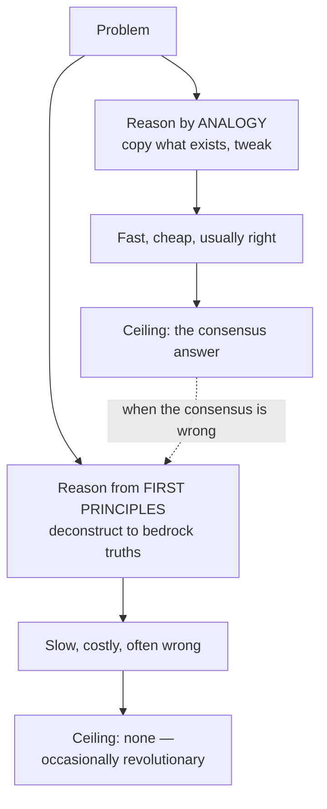

# What first-principles thinking actually is

*Part of [First Principles & the Polymath Mind](./README.md)*

## TL;DR

A **first principle** is something that must be true on its own terms — not because an
authority said so, not because everyone does it that way, but because it can't be reduced
any further without leaving reality. **First-principles thinking** is the discipline of
deconstructing a problem down to those bedrock truths and reasoning back up from them,
instead of **reasoning by analogy** (copying what already exists with small tweaks).
Analogy is fast and usually right; first principles is slow and occasionally
*revolutionary*. The skill is knowing which one a situation deserves.

> 🎯 **For the builder**
>
> **Why it matters** — Almost every default you inherit — a price, an architecture, a
> process, "the way it's done" — is an analogy to someone else's situation, not a law of
> nature. If you can't tell which constraints are real and which are merely conventional,
> you can't tell which ones you're allowed to break.
>
> **What it changes in your decisions** — You stop asking "what do competitors do?" as the
> *first* question and start asking "what is actually true here, and what does that
> permit?" — which is the only path to a non-consensus, non-obvious answer.
>
> **Ask yourself** — *"Is this constraint a law of physics, or just a habit nobody has
> re-derived?"*
>
> **Risk if ignored** — You inherit other people's ceilings. Every conclusion you reach is
> a slightly-worse copy of the conclusion you copied it from.

## Two ways to reason

Almost all everyday reasoning is **reasoning by analogy**: this new thing is *like* that
known thing, so treat it the same way. It's a brilliant shortcut. You don't re-derive how
a door works at every doorway; you pattern-match "door → handle → push/pull." Civilization
runs on analogy, and most of the time you should too — re-deriving everything from scratch
is paralyzing and arrogant.

**Reasoning from first principles** is the opposite move. You refuse to accept the
inherited package and instead break the problem into parts you can independently verify,
then rebuild. Aristotle called a first principle "the first basis from which a thing is
known." The modern shorthand is owed to Elon Musk's often-quoted framing:

> "I think it's important to reason from first principles rather than by analogy. The
> normal way we conduct our lives is we reason by analogy… \[with first principles] you
> boil things down to the most fundamental truths and then reason up from there."

The classic worked example is battery cost. The analogy argument says: *battery packs cost
~$600/kWh and always have, so they always will.* The first-principles argument asks: *what
is a battery actually made of?* — cobalt, nickel, aluminum, carbon, some polymers, a steel
can. Price those raw materials on the commodity market and the floor is a small fraction of
$600/kWh. The gap between the material floor and the market price is not a law of nature —
it's an **opportunity**, but only visible to someone who decomposed the thing instead of
quoting its current price.

## What counts as a "fundamental"?

A first principle is a claim you can't dissolve further by asking "why is *that* true?"
without bottoming out in:

- **Physical law or arithmetic** — conservation of energy, the speed of light, the cost of
  raw materials, the number of seconds in a day. Non-negotiable.
- **A definition or goal you actually chose** — "we are trying to reduce time-to-value,"
  "the user's real job is X." These are first principles *for your problem* once you commit
  to them.
- **Directly observed fact** — what users actually do (not what they say), the measured
  latency, the real failure rate.

Everything *else* — best practices, benchmarks, "industry standard," the existing
architecture, the price something currently sells for — is a **derived** claim. It was true
for some context that may not be yours. The work of first-principles thinking is sorting
the bedrock from the borrowed.

## Why it's rare (and therefore valuable)

If first principles produces better answers, why doesn't everyone do it all the time?

- **It's expensive.** Decomposition is slow and effortful; analogy is nearly free. Under
  time pressure, the brain defaults to the cheap operation. (See
  [learning how to learn](./learning-how-to-learn.md) on why effort feels like failure.)
- **It's socially risky.** Re-deriving a "settled" question looks like arrogance or
  naïveté until you're proven right. Most people would rather be conventionally wrong than
  unconventionally embarrassed.
- **Assumptions are invisible.** You can't question a constraint you don't notice you're
  obeying. Inherited assumptions feel like reality, not like choices. The whole next
  lesson, [the method](./the-method.md), is machinery for *surfacing* them.

That cost is exactly why first-principles reasoning is a source of edge: **the answer
everyone copies is, by definition, available to everyone.** A genuinely better answer
almost always requires going back to something more fundamental than the thing being
copied.

## When NOT to use it

First-principles thinking is a power tool, not a personality. Reaching for it everywhere is
its own failure mode (the subject of [traps & limits](./traps-and-limits.md)):

- For **solved, low-stakes problems**, analogy wins. Don't re-derive how to format a date.
- When **the cost of being wrong is low and the cost of analysis is high**, ship the
  conventional answer and move on.
- When you **lack the fundamentals** to decompose honestly, "first principles" becomes a
  license to ignore hard-won expertise — confident reinvention of a worse wheel.

The decision itself is a tradeoff, which is why this module sits next to
[Module 06 · Strategy & Tradeoffs](../content/06-strategy-tradeoffs/README.md): *how much to
decompose* is a cost/benefit call, not a virtue.

## Analogy vs. first principles, side by side

| | Reasoning by analogy | Reasoning from first principles |
| --- | --- | --- |
| **Speed** | Fast, cheap | Slow, effortful |
| **Source of the answer** | Existing examples | Fundamental truths + logic |
| **Best for** | Solved, common, low-stakes | Novel, high-stakes, stuck |
| **Typical result** | A safe variation on the norm | A possibly non-obvious answer |
| **Failure mode** | Inherits hidden, wrong constraints | Reinvents a solved wheel, slowly |

## Failure modes

- **Analogy in disguise** — you *think* you decomposed, but you stopped at someone else's
  conclusion and called it a fundamental ("the API has to be REST"). Pseudo-decomposition.
- **Bottomless decomposition** — refusing to accept any premise, so you never get to act.
  First principles needs a *floor*; pick one and build.
- **Ignoring real expertise** — treating decades of accumulated knowledge as "just
  convention" to be cleared away. Sometimes the convention *is* the hard-won first
  principle.

## Practitioner checklist

- [ ] For the claim in front of you, can you name *why* it's true — and does the "why"
      bottom out in physics, arithmetic, a chosen goal, or observed fact?
- [ ] Have you separated the **real constraints** from the **conventional** ones in this
      specific problem?
- [ ] Is this a problem that actually *deserves* first-principles effort, or should analogy
      handle it?
- [ ] If you're decomposing, have you committed to a floor — premises you'll treat as
      bedrock — so you can reason back *up*?

## Related lessons

- [The method: deconstruct, challenge, reconstruct](./the-method.md)
- [A latticework of mental models](./mental-models-latticework.md)
- [Traps & limits](./traps-and-limits.md)
- [Strategy & tradeoffs](../content/06-strategy-tradeoffs/README.md)
