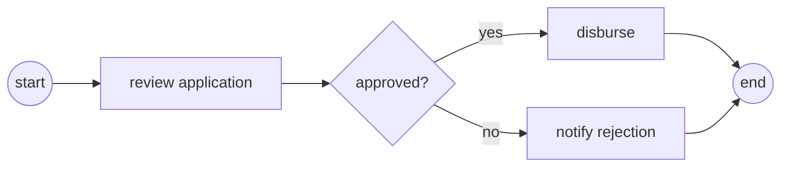

# Authoring a lesson

Every lesson in *Flowable from Scratch* has the **same shape**, so readers never
re-learn the navigation and the build script can parse it.

## Folder structure

```
phases/<NN>-<phase-name>/<NN>-<lesson-name>/
├── code/      runnable implementations (Python; Java/XML where the point is Flowable)
├── docs/
│   └── en.md  the lesson narrative (required). Translations: zh.md, ja.md, …
└── outputs/   the reusable artifact this lesson ships
```

## The six beats (every `en.md`)

```markdown
# Lesson Title

> **Motto** — the core idea in one quotable sentence.

## The Problem
A concrete pain. What can't you do, or what breaks, without this?

## The Concept
Intuition first. **Lead with a diagram** (see below). Code comes after.
Link to the matching section in `foundations/` when one exists.
This beat must stand alone for the PM/architect reader — no code required to follow it.

## Build It
Implement the semantics from scratch — Python standard library only, no engine.
Small and complete (~80–150 lines). Every snippet must actually run.
(Concept-type lessons skip this beat.)

## Use It
Do the same thing with the real Flowable engine — REST against
`flowable/flowable-rest` in Docker, or a Spring Boot snippet where the lesson
is about embedding. (Concept-type lessons skip this beat.)

## Ship It
The artifact this lesson produces, saved under `outputs/`:
a process model (.bpmn20.xml) · decision table (.dmn) · module · client · decision guide.

## Check Yourself
3–5 questions (see Quiz format). End with one **challenge** exercise.
```

## Diagrams — lead with a picture

Use **Mermaid** for process flows and architecture, **tables** for comparisons. At
minimum, the Concept beat should open with a diagram:

````markdown

````

ASCII diagrams are acceptable inside code blocks when a mental model is simpler shown
as text.

## Quiz format (Check Yourself)

Each question is multiple choice, 3–4 options, exactly one correct, with the answer in
a collapsed block so readers self-test first:

```markdown
**Q1.** A token reaches a user task. What does the engine do?

- A) blocks a thread until the task is completed
- B) persists the execution state and returns; nothing runs until someone completes the task
- C) polls the task service every few seconds
- D) fails after a timeout

<details><summary>Answer</summary>B — a user task is a wait state; the engine stores
the token's position in the database and goes idle. Completion is a new transaction.</details>
```

## Ship-It artifact formats

```markdown
---
name: artifact-name
description: what it does
kind: process-model | decision-table | module | client | decision-guide | settings
phase: 01
lesson: 01
---
```

## Strict-format rules (the build script depends on these)

- Phase headers in `ROADMAP.md`: `## Phase N — Name \`X lessons\` <glyph>`
- Lesson tables keep the column shape `| # | Lesson | Type | Lang | Ships |`
  (capstone: `| # | Project | Combines | Lang | Ships |`).
- Status glyphs are the exact characters `✅ 🚧 ⬚` — never replace with text.
- `Type` is `Build`, `Use`, or `Concept`. `Lang` is plain text (`Python`, `Java`,
  `XML`, or `—` for Concept lessons).
