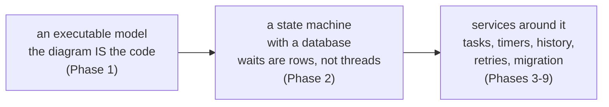

# What is a process engine, and when do you want one

> **Motto** — You want a process engine when your problem is *long-running, stateful,
> auditable coordination of humans, systems, and time* — and not one minute before.

*Part of Phase 00 — Orientation & setup. Concept lesson — no code required. Concept
reading: [Principle 10](../../../../foundations/process-automation-principles.md).*

## The Problem

"Should we use a workflow engine?" is usually asked backwards — after someone saw a
demo, not after diagnosing the pain. The pain that actually justifies one looks like
this: a business flow spanning days or months; state tracked in a `status` column
that five services mutate; deadlines enforced by cron jobs that drift; "where is
case X stuck?" answered by a SQL archaeologist; and an auditor asking which rules
version decided a case. If you have most of that list, an engine converts it into a
diagram, rows, timers, and history. If you don't, an engine converts a simple
system into a distributed one with extra ceremony.

## The Concept

A process engine is three commitments in one runtime (the whole course in one
diagram):

The diagnostic, as a table — count your yes-answers:

| Question | Engine says |
| :-- | :-- |
| Does the flow *wait* — for people, documents, deadlines — for days+? | wait states are its core trick |
| Do humans and systems interleave (review → API call → approval)? | task + service orchestration |
| Do deadlines/SLAs/expiries drive behaviour? | timers, versioned with the flow |
| Will audit/compliance ask "what happened and under which rules"? | history + definition pinning |
| Does the business change the flow more often than you deploy? | model + DMN redeploys |
| ≥ 4 yes | strong engine case |
| ≤ 2 yes | see the alternatives below |

And the honest alternatives, because most flows *shouldn't* be on an engine:

- **A `status` column + a queue** — short, fully automated, rarely-changing flows.
  Three states and one retry policy don't need BPMN.
- **A saga/durable-execution runtime (Temporal-style)** — code-first orchestration
  for engineers, no diagram, no business-facing model (lesson 04 compares
  properly).
- **Event choreography** — services reacting to each other's events, no central
  coordinator: maximal autonomy, but "where is case X?" has no single answer —
  the exact question an engine exists to answer.

## Ship It

This lesson ships
[`outputs/engine-fit-checklist.md`](../outputs/engine-fit-checklist.md) — the
diagnostic plus the alternatives table, for the next "should we use a workflow
engine?" meeting.

## Check Yourself

**Q1.** Which flow is the *weakest* engine candidate?

- A) loan origination: humans, bureaus, offers expiring in 30 days
- B) image thumbnailing: 3 automated steps, seconds long, never changes
- C) vendor onboarding: documents, approvals, compliance audit trail
- D) claims handling: adjusters, deadlines, regulators

Answer
B — no waits, no humans, no time, no audit
pressure. A queue and a worker do it with less machinery.

**Q2.** The strongest single signal *for* an engine is…

- A) many microservices
- B) flows that wait on humans/time for days while requiring a queryable, auditable position ("where is case X, under which rules?")
- C) high throughput
- D) a team that knows Java

Answer
B — durable waiting + accountability is the
combination nothing else provides as cheaply.

**Q3.** Event choreography loses to orchestration precisely when…

- A) throughput is high
- B) someone must answer "where is this case and what happens next?" — choreography has no single place that knows
- C) services are polyglot
- D) events are JSON

Answer
B — central state is orchestration's cost *and*
its product. Buy it when that question matters.

**Challenge.** Run the diagnostic on three real flows in your organisation. For the
highest scorer, write the one-paragraph pitch *against* using an engine — if you
can't steelman the alternative, you haven't finished the analysis.

## Related

- Next: [The Flowable platform map](../../02-platform-map/docs/en.md)
- The full comparison: [lesson 04](../../04-landscape/docs/en.md)
