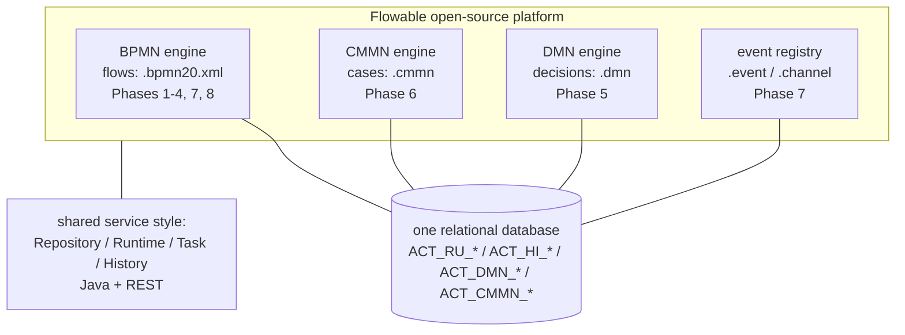

# The Flowable platform map: BPMN, CMMN, DMN, event registry

> **Motto** — Flowable is four engines sharing one database and one API family:
> flows, cases, decisions, and events — each with its own model file, each
> deployable alone.

*Part of Phase 00 — Orientation & setup. Concept lesson — no code required.*

## The Problem

"Flowable" names a platform, not a single engine — and newcomers conflate the
parts: modelling a decision as gateway spaghetti because they never met DMN,
forcing ad-hoc casework into BPMN because CMMN was invisible, or hand-rolling a
Kafka consumer the event registry would have replaced (all mistakes this course
spends whole phases undoing). One map up front prevents most of them — and
explains what you inherited from the project's history as a 2016 fork of Activiti,
built by that engine's original authors.

## The Concept

What the map buys you in practice:

1. **One artifact type per question.** *What order do things happen?* → BPMN.
   *What work is available, human decides order?* → CMMN. *Which answer given
   these inputs?* → DMN. *What outside signal starts/continues work?* → event
   registry. Modelling smells (script-task rules, gateway policy constants,
   consumer glue services) are usually a question in the wrong engine.
2. **Cross-references, not imports.** A BPMN decision task references a DMN key
   (Phase 5); a CMMN process task references a BPMN key (Phase 6); an event
   definition triggers either. Each artifact versions independently (Phase 8) —
   that independence is the governance story.
3. **One operational surface.** Same database, same history split, same job
   executor family, same REST idioms — Phase 2 and Phase 9 apply to all four
   engines, which is why this course teaches the machinery once via BPMN.
4. **Editions, briefly** (Phase 10 covers the decision): everything above is the
   open-source core. *Flowable Work/Design* is the commercial layer — modelers,
   task UIs, admin consoles — on the same engines. Course rule: learn on the
   core; evaluate the paid layer for the UIs, never for engine features.

## Ship It

This lesson ships [`outputs/platform-map.md`](../outputs/platform-map.md) — the
map, the artifact table, and the "which engine answers this question" router.

## Check Yourself

**Q1.** Eligibility rules keep growing inside gateway conditions. The platform-map
answer is…

- A) more gateways
- B) move them to a DMN decision table; the gateway routes on the result (Phase 5)
- C) a script task
- D) CMMN

Answer
B — "which answer given inputs" is DMN's
question. Gateways route; tables decide.

**Q2.** A BPMN process uses a DMN table. When the table changes…

- A) the process redeploys too
- B) only the .dmn redeploys — cross-references by key keep lifecycles independent
- C) both must version-match
- D) the engine migrates instances

Answer
B — reference-by-key is the platform's decoupling
mechanism, and the reason Phase 5's governance works.

**Q3.** The four engines share…

- A) nothing — separate products
- B) the database, the runtime/history split, the job machinery, and the API idioms — learn them once
- C) only the modeler
- D) a message bus

Answer
B — one operational education covers the
platform; that's why this course teaches internals through BPMN alone.

**Challenge.** Take the capstone and label every artifact with its engine (process,
decision table, event pair — and the hypothetical fraud-investigation case from
Phase 6). Then find one thing in *your* organisation's workflow landscape that's
currently in the wrong column.

## Related

- Next: [Run Flowable locally](../../03-run-locally/docs/en.md)
- Previous: [When do you want an engine](../../01-when-do-you-want-an-engine/docs/en.md)
