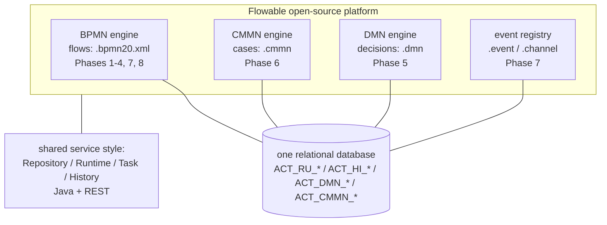

# The Flowable platform map: BPMN, CMMN, DMN, event registry

> **Motto** — Flowable is four engines sharing one database and one API family:
> flows, cases, decisions, and events — each with its own model file, each
> deployable alone.

*Part of Phase 00 — Orientation & setup. Concept lesson — no code required.*

## The Problem

"Flowable" names a platform, not a single engine, and newcomers conflate the
parts. They model a decision as gateway spaghetti because they never met DMN.
They force ad-hoc casework into BPMN because CMMN was invisible to them. Or they
hand-roll a Kafka consumer that the event registry would have replaced. This
course spends whole phases undoing these mistakes. One map up front prevents most
of them, and explains what you inherited from the project's history: Flowable is
a 2016 fork of Activiti, built by that engine's original authors.

## The Concept

```mermaid
flowchart TB
  subgraph platform ["Flowable open-source platform"]
    B["BPMN engine<br/>flows: .bpmn20.xml<br/>Phases 1-4, 7, 8"]
    C["CMMN engine<br/>cases: .cmmn<br/>Phase 6"]
    D["DMN engine<br/>decisions: .dmn<br/>Phase 5"]
    EV["event registry<br/>.event / .channel<br/>Phase 7"]
  end
  DB[("one relational database<br/>ACT_RU_* / ACT_HI_* / ACT_DMN_* / ACT_CMMN_*")]
  API["shared service style:<br/>Repository / Runtime / Task / History<br/>Java + REST"]
  B --- DB
  C --- DB
  D --- DB
  EV --- DB
  platform --- API
```

Here is what the map buys you in practice:

1. **One artifact type per question.** *What order do things happen?* → BPMN.
   *What work is available, human decides order?* → CMMN. *Which answer given
   these inputs?* → DMN. *What outside signal starts/continues work?* → event
   registry. A modelling smell (script-task rules, gateway policy constants,
   consumer glue services) usually means the question is in the wrong engine.
2. **Cross-references, not imports.** A BPMN decision task references a DMN key
   (Phase 5). A CMMN process task references a BPMN key (Phase 6). An event
   definition triggers either. Each artifact versions independently (Phase 8) —
   that independence is the governance story.
3. **One operational surface.** All four engines share the same database, the
   same history split, the same job executor family, and the same REST idioms.
   Phase 2 and Phase 9 apply to all four, which is why this course teaches the
   machinery once, through BPMN.
4. **Editions, briefly** (Phase 10 covers the decision in full). Everything
   above is the open-source core. *Flowable Work/Design* is the commercial
   layer — modelers, task UIs, admin consoles — on the same engines. Course
   rule: learn on the core, and evaluate the paid layer for its UIs, never for
   engine features.

## Ship It

This lesson ships [`outputs/platform-map.md`](../outputs/platform-map.md) — the
map, the artifact table, and the "which engine answers this question" router.

## Check Yourself

**Q1.** Eligibility rules keep growing inside gateway conditions. The platform-map
answer is…

- A) more gateways
- B) move them to a DMN decision table; the gateway routes on the result (Phase 5)
- C) a script task
- D) CMMN

Answer
B — "which answer given inputs" is DMN's
question. Gateways route, and tables decide.

**Q2.** A BPMN process uses a DMN table. When the table changes…

- A) the process redeploys too
- B) only the .dmn redeploys — cross-references by key keep lifecycles independent
- C) both must version-match
- D) the engine migrates instances

Answer
B — reference-by-key is the platform's decoupling
mechanism. It's the reason Phase 5's governance works.

**Q3.** The four engines share…

- A) nothing — separate products
- B) the database, the runtime/history split, the job machinery, and the API idioms — learn them once
- C) only the modeler
- D) a message bus

Answer
B — one operational education covers the whole
platform, which is why this course teaches internals through BPMN alone.

**Challenge.** Take the capstone and label every artifact with its engine (process,
decision table, event pair, and the hypothetical fraud-investigation case from
Phase 6). Then find one thing in *your* organisation's workflow landscape that's
currently in the wrong column.

## Related

- Next: [Run Flowable locally](../../03-run-locally/docs/en.md)
- Previous: [When do you want an engine](../../01-when-do-you-want-an-engine/docs/en.md)
