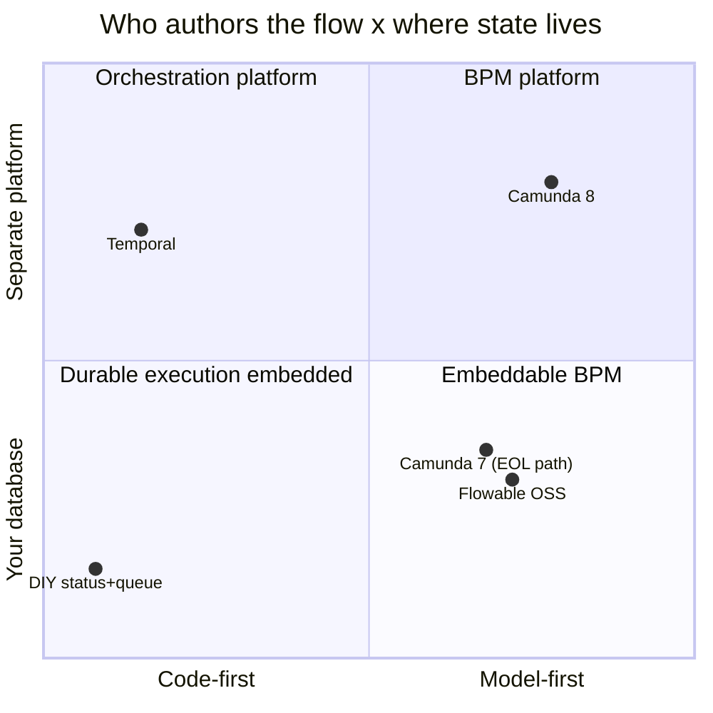

# The landscape: Flowable vs Camunda 7/8 vs Temporal vs DIY

> **Motto** — These tools don't compete on features; they compete on *who authors the
> flow* — business-readable models, or engineers' code — and that one axis decides
> most evaluations.

*Part of Phase 00 — Orientation & setup. Concept lesson — no code required. Phase 10,
lesson 05 revisits this with commercial depth once you've built everything.*

## The Problem

Every engine evaluation drowns in feature matrices — fifty rows of checkmarks that
all look the same — while the real differences sit on two axes the matrices don't
show: who authors and reads the flow (business-facing model vs engineer-only code),
and where state lives (your database vs a platform you operate/rent). Getting those
two right makes the shortlist obvious; getting them wrong produces the classic
mis-buys — Temporal for a maker-checker back office, or a BPM suite for pure
service orchestration no human will ever read.

## The Concept

The five, honestly:

| | Model | State | Its home turf | Its tax |
| :-- | :-- | :-- | :-- | :-- |
| **Flowable OSS** | BPMN/CMMN/DMN, business-readable | your RDBMS, embedded or standalone (Ph. 2, 10) | JVM shops wanting full BPM + audit in their own DB, no license | you operate it; UIs are commercial (Work) or yours |
| **Camunda 7** | BPMN/DMN | your RDBMS, embedded | same niche as Flowable — shared Activiti ancestry | end-of-life path; new work steers to 8 |
| **Camunda 8** | BPMN/DMN | **Zeebe** — its own log-based platform, SaaS or self-hosted cluster | high-throughput orchestration with BPMN visibility | separate stateful platform to run/rent; no embedded mode; exporter-based history |
| **Temporal** | none — workflows *are* code (Java/Go/TS/Python) | its own cluster/cloud | engineer-only orchestration: sagas, retries, infra workflows, polyglot teams | no business-facing artifact: no diagram to review, no DMN, human-task layer is DIY |
| **DIY** | none | your tables | 3-state flows that never change | every Phase 2–9 concern, rebuilt badly, later |

Three evaluation rules that survive contact with vendors:

1. **Author axis first.** If compliance, ops, or product must *read* the flow —
   maker-checker, regulated lending, claims — you need the model-first column;
   Temporal isn't a weaker candidate there, it's a category error (and vice versa
   for pure service sagas nobody non-technical will read).
2. **State axis = operational identity.** Flowable/Camunda 7 ride the database
   you already run, back up, and audit (Phases 2, 9 were *about* that). Camunda 8
   and Temporal are additional stateful platforms with their own ops story —
   sometimes worth it, never free.
3. **Everything in this course transfers.** Tokens, wait states, transactions,
   jobs, correlation, versioning — Camunda 7 shares the lineage outright; Camunda
   8 keeps the BPMN semantics on a different substrate; even Temporal's
   durable-execution model is Phase 2's bet expressed in code. You evaluated
   engines by *building one*; that's the durable advantage.

## Ship It

This lesson ships
[`outputs/landscape-comparison.md`](../outputs/landscape-comparison.md) — the two-
axis map, the five-way table, and the three rules as an evaluation worksheet.

## Check Yourself

**Q1.** Pure service-to-service saga, engineers only, polyglot stack. Strongest
fit?

- A) Flowable — it can do it
- B) Temporal — code-first durable execution is exactly its turf; a BPMN diagram nobody reads is ceremony
- C) Camunda 8
- D) DIY

Answer
B — rule 1 in reverse. Model-first tools earn
their keep only when someone non-technical reads the model.

**Q2.** Camunda 8's biggest operational difference from Flowable is…

- A) BPMN dialect
- B) state lives in Zeebe, its own log-based platform — a second stateful system to run or rent, vs riding your existing RDBMS
- C) pricing only
- D) no DMN

Answer
B — the state axis. Feature lists blur; *where
the rows live* changes your on-call rota.

**Q3.** Regulated lending flow, humans throughout, audit trail mandatory, JVM
team, state must stay in the bank's own PostgreSQL. The shortlist is…

- A) Temporal vs DIY
- B) Flowable OSS (vs Camunda 7's legacy niche) — model-first + your-database is that exact cell
- C) Camunda 8 only
- D) any of them

Answer
B — both axes point at the embeddable-BPM cell,
which is the cell this whole course happens to live in.

**Challenge.** Take the capstone's requirements (humans, timers, DMN, audit, your
DB) and write the two-paragraph "why not Temporal / why not Camunda 8" memo an
architecture review would demand. Then invert it: change two requirements until
Temporal *wins*. Knowing the flip conditions is what makes the evaluation yours.

## Related

- Phase README: [Orientation & setup](../../README.md)
- The commercial-depth rematch: Phase 10, lesson 05 (see [`ROADMAP.md`](../../../../ROADMAP.md))
