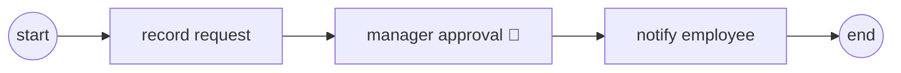

# Tokens & sequence flow: a process engine in 100 lines

> **Motto** — A process is a graph; executing it means moving tokens along the edges
> until they're consumed.

*Part of Phase 01 — BPMN & the token model. Concept reading:
[Principles 1 & 3](../../../../foundations/process-automation-principles.md).*

## The Problem

Your leave-approval flow lives in code: a controller sets `status = "PENDING"`, a
different service checks it, someone adds an `if` for the escalation case, and within a
year nobody can say what the actual process is without reading four repositories. The
business asks "where is Priya's request stuck?" and the answer is a database query and a
shrug.

A process engine's first promise is that the flow is *explicit*: a graph you can draw,
deploy, and interrogate — "the token is sitting at Manager Approval, and has been for
three days." Before Flowable's version of that can feel obvious rather than magical, you
need to build the execution model it rests on. It's smaller than you think.

## The Concept

A BPMN model, stripped of its notation, is a directed graph. Nodes are events, tasks,
and gateways; edges are **sequence flows**. Execution is a **token**: born at the start
event, moved along flows, consumed at an end event. The instance is complete when no
tokens remain.



Two node behaviours matter today:

1. **Automatic nodes** (start, service tasks, end): the engine executes them and moves
   the token on immediately — it never stops on its own account.
2. **Wait states** (the user task 👤): the token *stops*. The engine has done all it
   can; the world must act — a human completes the task — before the token moves again.

Everything a process engine does is one of two operations: **advance tokens until every
one is asleep or consumed**, and **wake a specific token when the world provides what it
was waiting for**.

## Build It

No engine, no XML — plain Python, so the semantics are undeniable.
[`code/token_engine.py`](../code/token_engine.py), the heart of it:

```python
def advance(inst):
    """Move every token forward until it reaches a wait state or is consumed."""
    progressed = True
    while progressed:
        progressed = False
        surviving = []
        for at in inst.tokens:
            node = inst.process.nodes[at]
            if node.kind == "user":
                surviving.append(at)                 # wait state: token sleeps
            elif node.kind == "end":
                progressed = True                    # token consumed
            else:
                if node.kind == "service" and node.handler:
                    node.handler(inst.variables)
                surviving.append(inst.process.next_of(at)[0])
                progressed = True
        inst.tokens = surviving
```

And the wake-up half:

```python
def complete_user_task(inst, name, variables=None):
    assert name in inst.tokens, f"no token waiting at {name!r}"
    inst.variables.update(variables or {})
    inst.tokens[inst.tokens.index(name)] = inst.process.next_of(name)[0]
    advance(inst)
```

Run it:

```
$ python3 token_engine.py
tokens after start: ['approve']     ← the engine slept at the user task
tokens after approval: []           ← complete; the log shows every step
```

Note what `start()` did **not** do: it did not block a thread waiting for the manager.
It advanced as far as it could and returned. That single design choice — covered
properly in [Phase 2](../../../02-the-engine-state-and-transactions/01-wait-states-and-persistence/docs/en.md) —
is why an engine can hold a million in-flight instances on one box.

## Use It

In Flowable, the same two operations have names you'll use constantly:

```java
// advance-until-asleep, from the start event:
runtimeService.startProcessInstanceByKey("leaveRequest", variables);

// wake a specific token:
taskService.complete(taskId, Map.of("approved", true));
```

Ask the engine where the tokens are:

```java
runtimeService.createExecutionQuery()
    .processInstanceId(id).list();   // executions ≈ our tokens list
```

You'll run exactly this over REST in
[lesson 04](../../04-run-it-on-flowable/docs/en.md), against a model you write by hand
in [lesson 03](../../03-bpmn-xml-by-hand/docs/en.md).

## Ship It

This lesson ships [`outputs/token_engine.py`](../outputs/token_engine.py) — the toy
engine as a reusable module. Phase 2 extends it with persistence, and the gateway
lesson next door teaches it to fork.

## Check Yourself

**Q1.** A token reaches a user task. What does the engine do?

- A) blocks a thread until the task is completed
- B) persists the token's position and returns; nothing runs until the task is completed
- C) polls the assignee every few seconds
- D) fails after a timeout

<details><summary>Answer</summary>B — a user task is a wait state. The engine advances
as far as it can, then sleeps. Completion is a separate, later interaction.</details>

**Q2.** When is a process instance complete?

- A) when the token reaches the last task
- B) when every token has been consumed by an end event
- C) after a configurable timeout
- D) when the start event is re-triggered

<details><summary>Answer</summary>B — no tokens, no instance. With parallel branches
(lesson 02) there can be several tokens, and *all* must be consumed.</details>

**Q3.** In the Build It engine, what distinguishes a service task from a user task?

- A) service tasks have handlers; user tasks are wait states the engine won't cross on its own
- B) service tasks run in a thread pool
- C) user tasks can't read variables
- D) nothing — they're interchangeable

<details><summary>Answer</summary>A — the engine executes a service task's handler and
moves on immediately; a user task parks the token until `complete_user_task` is
called.</details>

**Challenge.** Add a `script` node kind that evaluates a Python expression against the
variables and stores the result — you've just rebuilt BPMN's script task. Then make
`advance` raise a clear error when a node has *zero* outgoing flows and isn't an end
event: you've just rebuilt model validation.

## Related

- Next: [Gateways: exclusive, parallel, inclusive](../../02-gateways/docs/en.md)
- Concept: [Principle 1 — a process is a graph](../../../../foundations/process-automation-principles.md)
