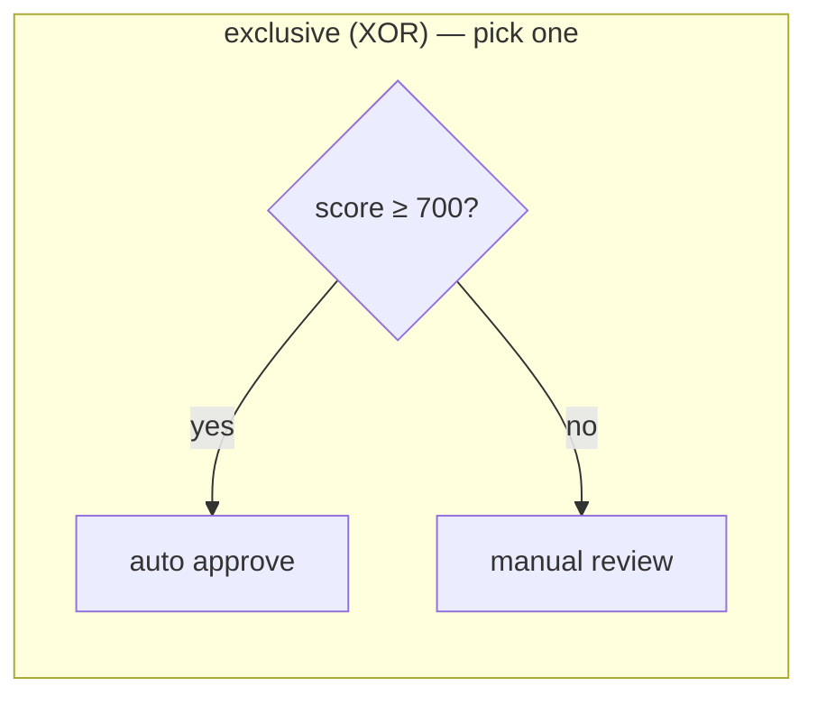
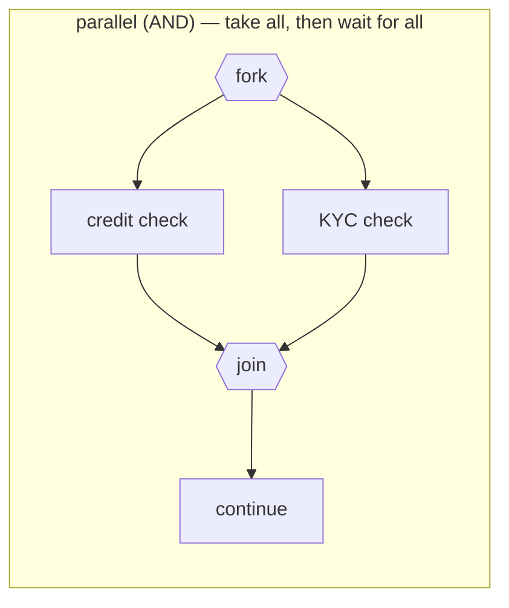

# Gateways: exclusive, parallel, inclusive

> **Motto** — Gateways don't do work; they route tokens — choose one path, take all
> paths, or wait for paths to come back together.

*Part of Phase 01 — BPMN & the token model. Concept reading:
[Principle 1](../../../../foundations/process-automation-principles.md).*

## The Problem

Yesterday's engine could only walk a straight line. Real processes branch — "auto-approve
if the score clears 700, otherwise send to manual review" — and they parallelise — "run
the credit check and the KYC check at the same time, then continue when *both* are
done." Model either of those with single-outgoing-flow nodes and you can't: branching is
ambiguous (which flow does the token take?) and joining is impossible (how do you know
both branches finished?).

## The Concept

BPMN's answer is a small family of routing nodes. The three you'll actually use:





| Gateway | Split behaviour | Join behaviour | Token count |
| :-- | :-- | :-- | :-- |
| **Exclusive (XOR)** | first flow whose condition is true (else the default flow) | pass-through — any arriving token continues | unchanged |
| **Parallel (AND)** | one token per outgoing flow, no conditions | wait until a token has arrived on *every* incoming flow, merge to one | 1 → n, then n → 1 |
| **Inclusive (OR)** | one token per *true* condition (1..n paths) | wait for every token that could still arrive | 1 → k, then k → 1 |

Two rules save you hours of debugging:

1. **Conditions live on the flows, not in the gateway.** The exclusive gateway is just
   the point where flow guards are evaluated, in order, with one flow marked as the
   guardless default. No matching flow and no default = a dead instance.
2. **A parallel join is a counter.** It fires when the number of tokens that arrived
   equals the number of incoming flows. Draw a parallel fork with three branches into a
   join with two incoming flows and you've built a process that never completes —
   the most common modelling bug in BPMN.

## Build It

Flows grow a guard — `(source, target, guard)` — and the engine grows two routing
functions. [`code/gateways.py`](../code/gateways.py):

```python
def take_exclusive(inst, node):
    """Exactly one way out: first flow whose guard passes; guardless flow = default."""
    conditional = [(t, g) for t, g in inst.process.outgoing(node.name) if g]
    default = [t for t, g in inst.process.outgoing(node.name) if g is None]
    for target, guard in conditional:
        if guard(inst.variables):
            return [target]
    assert default, f"{node.name}: no condition matched and no default flow"
    return [default[0]]

def take_parallel(inst, node):
    """Fork: token per outgoing flow. Join: wait until all incoming tokens arrive."""
    arrived = inst.tokens.count(node.name)
    if arrived < inst.process.incoming_count(node.name):
        return None                                   # join still waiting
    for _ in range(arrived - 1):                      # merge: n tokens become 1
        inst.tokens.remove(node.name)
    return [t for t, _ in inst.process.outgoing(node.name)]
```

The demo is a loan triage: parallel credit + KYC checks, join, then an exclusive route
on the score:

```
$ python3 gateways.py
score 720 -> auto-approved
score 640 -> waiting at ['review']
after review -> manually-approved
```

Watch the token count in the log: 1 token forks to 2, the join merges 2 back to 1.
"Parallel" here means *both branches will be walked before the join fires* — not
threads. Real engines are the same: parallel gateways are about token bookkeeping, and
actual concurrency only appears with async continuations
([Phase 2, lesson 03](../../../02-the-engine-state-and-transactions/03-transactions-and-async/docs/en.md)).

## Use It

The same loan triage in Flowable's XML dialect — conditions are
[UEL](https://www.flowable.com/open-source/docs/bpmn/ch04-API#expressions) expressions
on the flows, and the default flow is an attribute on the gateway:

```xml
<exclusiveGateway id="route" default="toReview"/>
<sequenceFlow id="toAuto" sourceRef="route" targetRef="auto">
  <conditionExpression xsi:type="tFormalExpression">${score >= 700}</conditionExpression>
</sequenceFlow>
<sequenceFlow id="toReview" sourceRef="route" targetRef="review"/>

<parallelGateway id="fork"/>
<parallelGateway id="join"/>
```

You'll write a full deployable model with exactly this shape in
[lesson 03](../../03-bpmn-xml-by-hand/docs/en.md).

## Ship It

This lesson ships the gateway-aware engine as a module:
[`code/gateways.py`](../code/gateways.py) — drop-in successor to lesson 01's
`token_engine.py`; Phase 2 builds persistence on top of it.

## Check Yourself

**Q1.** An exclusive gateway has three conditional flows; none of their conditions is
true and no default flow is set. What happens?

- A) the token takes the first flow anyway
- B) the token takes all three flows
- C) the instance is stuck/errors — there is no legal way forward
- D) the instance completes

<details><summary>Answer</summary>C — no matching condition and no default means the
token has nowhere to go. Flowable throws; our toy engine asserts. Always model a
default flow.</details>

**Q2.** A parallel join has 2 incoming flows. One branch's token has arrived; the other
branch is parked at a user task. The join…

- A) fires with the one token after a timeout
- B) waits — it fires only when tokens have arrived on all incoming flows
- C) cancels the other branch
- D) duplicates the arrived token

<details><summary>Answer</summary>B — a parallel join is a counter over incoming flows.
Until every branch delivers its token, the arrived ones sleep at the join.</details>

**Q3.** How many tokens exist right after a parallel fork with 3 outgoing flows?

- A) 1
- B) 2
- C) 3
- D) depends on conditions

<details><summary>Answer</summary>C — one per outgoing flow, unconditionally. (An
*inclusive* gateway is the one that forks per true condition.)</details>

**Challenge.** Implement the inclusive gateway: fork a token per *true* guard, and make
the join wait only for the branches that were actually taken. You'll need to remember
at fork time how many tokens the join should expect — which is exactly why inclusive
joins are the hairiest code in every real BPM engine.

## Related

- Next: [BPMN 2.0 XML by hand](../../03-bpmn-xml-by-hand/docs/en.md)
- Previous: [Tokens & sequence flow](../../01-tokens-and-sequence-flow/docs/en.md)
