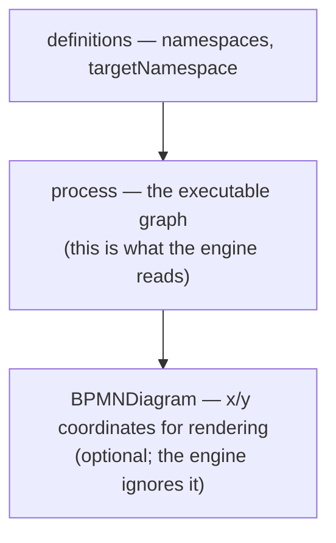

# BPMN 2.0 XML by hand

> **Motto** — The diagram is the code: what you deploy to the engine *is* the XML, and
> once you've written one by hand, no modeler tool can hide anything from you.

*Part of Phase 01 — BPMN & the token model. Concept reading:
[Principle 2 — the diagram is the code](../../../../foundations/process-automation-principles.md).*

## The Problem

Modeler tools (Flowable Design, bpmn.io, Camunda Modeler) are how you'll author real
models — but if you've only ever dragged boxes, the XML underneath is a black box.
Then a deploy fails with `Errors while parsing: no default flow for exclusive gateway`,
or a diff of two model versions lands in code review as 400 lines of XML, and you're
blind. Writing one deployable model by hand — once — makes every future model
transparent.

## The Concept

A BPMN file is three things stacked in one XML document:



The engine only cares about the `<process>` block, and the process block is *exactly*
the graph you built in lessons 01–02: nodes as elements (`startEvent`, `userTask`,
`serviceTask`, `exclusiveGateway`, `parallelGateway`, `endEvent`) and edges as
`<sequenceFlow>` elements with `sourceRef`/`targetRef`. Everything vendor-specific —
task assignment, expressions — arrives via the `flowable:` namespace, which is why the
same file deploys on any BPMN 2.0 engine but runs *best* on the one whose extensions
you used.

## Build It

The loan triage from lesson 02, now as a real deployable model —
[`outputs/loan-triage.bpmn20.xml`](../outputs/loan-triage.bpmn20.xml). The load-bearing
parts:

```xml
<definitions
    xmlns="http://www.omg.org/spec/BPMN/20100524/MODEL"
    xmlns:xsi="http://www.w3.org/2001/XMLSchema-instance"
    xmlns:flowable="http://flowable.org/bpmn"
    targetNamespace="http://flowable.org/examples">

  <process id="loanTriage" name="Loan triage" isExecutable="true">
```

- `process id` is the **process definition key** — the stable name you start instances
  by. Redeploying the same key creates version 2, 3, … (Phase 8).
- `isExecutable="true"` — without it the engine parses the model but refuses to run it.

Nodes map one-to-one to our toy engine's kinds:

```xml
<userTask id="manualReview" name="Manual credit review"
    flowable:candidateGroups="credit-ops"/>

<serviceTask id="autoApprove" name="Auto approve"
    flowable:expression="${execution.setVariable('decision', 'auto-approved')}"/>
```

The service task uses a `flowable:expression` instead of a Java class so the model
deploys to a stock REST container with zero custom code. And the routing you built
yesterday, verbatim:

```xml
<exclusiveGateway id="route" default="toReview"/>
<sequenceFlow id="toAuto" sourceRef="route" targetRef="autoApprove">
  <conditionExpression xsi:type="tFormalExpression">${score &gt;= 700}</conditionExpression>
</sequenceFlow>
<sequenceFlow id="toReview" sourceRef="route" targetRef="manualReview"/>
```

Note `&gt;=` — you're in XML, so `>=` must be escaped inside the condition. This one
character is a rite of passage.

Sanity-check the file parses before ever touching an engine:

```bash
python3 -c "import xml.dom.minidom, sys; xml.dom.minidom.parse(sys.argv[1]); print('well-formed')" \
  flowable/phases/01-bpmn-and-the-token-model/03-bpmn-xml-by-hand/outputs/loan-triage.bpmn20.xml
```

## Use It

Open the same file in any BPMN modeler — [bpmn.io's demo](https://demo.bpmn.io) is the
zero-install option — and it renders as the diagram (the tool auto-lays-out models that
lack the `BPMNDiagram` section). Round-trip it: move a box, save, and diff — you'll see
the tool only touched the coordinates block, never your process logic. That's the
property that makes hand-review of model diffs feasible.

Deployment to a live engine is the whole next lesson.

## Ship It

This lesson ships
[`outputs/loan-triage.bpmn20.xml`](../outputs/loan-triage.bpmn20.xml) — a deployable
process model, reused by lesson 04's REST client and the Phase 11 capstone as a
starting point.

## Check Yourself

**Q1.** What does the `process id` (`loanTriage`) become at runtime?

- A) the instance ID
- B) the process definition key you start instances by — stable across redeploys
- C) a display label only
- D) the database table name

<details><summary>Answer</summary>B — instances are started by key
(`start by key loanTriage`), and each redeploy of the same key produces a new
*version* of that definition.</details>

**Q2.** Why does the condition read `${score &gt;= 700}` instead of `${score >= 700}`?

- A) UEL doesn't support `>=`
- B) Flowable requires HTML entities
- C) the file is XML — a raw `>` sequence inside element text must be escaped
- D) it's a style convention

<details><summary>Answer</summary>C — pure XML mechanics, nothing to do with the
expression language. Modeler tools escape it for you, which is why you've never
noticed.</details>

**Q3.** A model without `isExecutable="true"` is deployed. What happens?

- A) it deploys and runs normally
- B) deployment fails
- C) it parses as documentation only — you can't start instances of it
- D) the engine sets the flag automatically

<details><summary>Answer</summary>C — BPMN files can carry non-executable
"documentation" processes; the flag is what marks a process as runnable.</details>

**Challenge.** Add a second end event `rejected` and route `manualReview` to it via a
new exclusive gateway on `${approved == false}`. Re-run the well-formedness check.
Then load the file in bpmn.io and verify the tool draws your change correctly.

## Related

- Next: [Use It: deploy & run on Flowable over REST](../../04-run-it-on-flowable/docs/en.md)
- Previous: [Gateways](../../02-gateways/docs/en.md)
