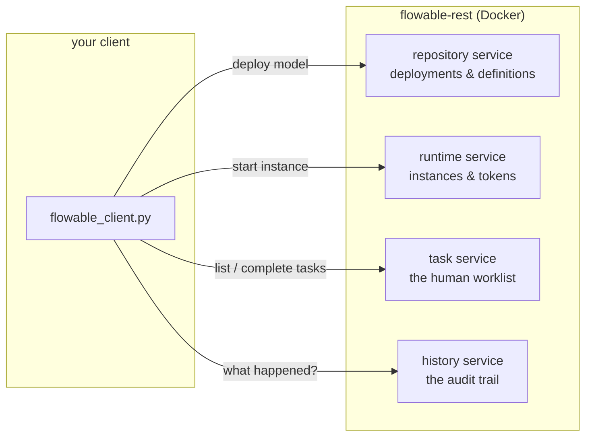

# Use It: deploy & run on Flowable over REST

> **Motto** — Everything you built by hand — start, sleep, wake, audit — is four HTTP
> calls against a real engine.

*Part of Phase 01 — BPMN & the token model. This is the phase's **Use It** lesson: the
toy engine's semantics, now on production machinery.*

## The Problem

You have a token engine in your head and a deployable model on disk. What you don't yet
have is proof that the real engine behaves like your mental model — that starting an
instance advances tokens until they sleep, that a user task really is a wait state, and
that the engine remembers everything it did. The fastest way to that proof is the REST
API: no Java, no build, just HTTP against a Docker container.

## The Concept

Flowable's REST API is organised around the same services you'd meet in the Java API,
and each maps to a piece of the toy engine you already wrote:



| REST call | Toy-engine equivalent |
| :-- | :-- |
| `POST /repository/deployments` | constructing the `Process` graph |
| `POST /runtime/process-instances` | `start()` — advance until asleep |
| `GET /runtime/tasks` | reading `inst.tokens` |
| `POST /runtime/tasks/{id}` (complete) | `complete_user_task()` |
| `GET /history/historic-activity-instances` | reading `inst.log` |

One idea is new: **deployment is separate from execution**. You deploy a *definition*
once; you start many *instances* of it. The engine versions definitions on every
redeploy of the same key — which is what makes Phase 8 (migration) a topic at all.

## Build It

Start the engine:

```bash
docker run -p 8080:8080 flowable/flowable-rest
# REST base: http://localhost:8080/flowable-rest/service   (rest-admin / test)
```

The client is stdlib-only — [`code/flowable_client.py`](../code/flowable_client.py).
The two calls that matter most:

```python
def start_instance(key, variables):
    return call("POST", "/runtime/process-instances", {
        "processDefinitionKey": key,
        "variables": [{"name": k, "value": v} for k, v in variables.items()],
    })

def complete_task(task_id, variables):
    call("POST", f"/runtime/tasks/{task_id}", {
        "action": "complete",
        "variables": [{"name": k, "value": v} for k, v in variables.items()],
    })
```

Run it and read the output against your lesson-02 expectations:

```
$ python3 flowable_client.py
deployed: 2501 loan-triage.bpmn20.xml
score 720 -> ended: True          ← no wait state on the path: instance completed
                                     inside the start call, exactly like the toy engine
score 640 -> ended: False         ← the token is asleep at manual review
waiting at: [('Manual credit review', '5012')]
after review -> open tasks: []
audit trail: ['applicationReceived', 'fork', 'creditCheck', 'kycCheck', 'join',
              'route', 'manualReview', 'decided']
```

The `ended: True` on the first instance is the deepest lesson here: when no wait state
lies on the path, **the whole process runs synchronously inside your HTTP call** and
the instance is already gone by the time you get the response. The engine only
persists and returns early when it hits a wait state. Phase 2 is entirely about the
machinery behind that sentence.

## Use It

This lesson *is* the Use It. For completeness, the same lifecycle in the embedded Java
API — recognise every line:

```java
repositoryService.createDeployment()
    .addClasspathResource("loan-triage.bpmn20.xml").deploy();
ProcessInstance pi = runtimeService
    .startProcessInstanceByKey("loanTriage", Map.of("score", 640));
Task task = taskService.createTaskQuery()
    .processInstanceId(pi.getId()).singleResult();
taskService.complete(task.getId(), Map.of("decision", "manually-approved"));
```

## Ship It

This lesson ships [`outputs/flowable_client.py`](../outputs/flowable_client.py) — a
dependency-free REST client covering deploy / start / tasks / complete / history. The
Phase 11 capstone driver grows out of this file.

## Check Yourself

**Q1.** `start_instance` returns `"ended": true`. What does that tell you?

- A) the request timed out
- B) no wait state lay on the executed path — the instance ran to completion inside the call
- C) the engine rejected the variables
- D) the instance was cancelled

<details><summary>Answer</summary>B — the engine advances synchronously until tokens
sleep or die. No wait state means the instance completes before the HTTP response is
written.</details>

**Q2.** Where do completed instances live?

- A) nowhere — they're deleted
- B) in the runtime tables, flagged as done
- C) in the history tables — runtime rows are removed when the instance ends
- D) in a log file

<details><summary>Answer</summary>C — runtime tables hold only live state (that's what
keeps them fast); history tables keep the audit trail. The split is Phase 9's opening
topic.</details>

**Q3.** You redeploy `loan-triage.bpmn20.xml` with a changed gateway condition. Running
instances started before the redeploy…

- A) switch to the new logic immediately
- B) keep executing their original definition version
- C) are cancelled
- D) fail at the gateway

<details><summary>Answer</summary>B — definitions are versioned; instances pin the
version they started on. Moving them is *migration*, Phase 8.</details>

**Challenge.** Add a `cancel_instance(instance_id, reason)` function
(`DELETE /runtime/process-instances/{id}`), start a third instance, cancel it, and
check what history says about it. Then start twenty instances with random scores and
write a five-line "ops dashboard": how many completed, how many waiting, oldest waiting
task.

## Related

- Next: [User tasks vs service tasks](../../05-human-and-service-tasks/docs/en.md)
- Previous: [BPMN 2.0 XML by hand](../../03-bpmn-xml-by-hand/docs/en.md)
- Deep dive on wait states: [Phase 2, lesson 01](../../../02-the-engine-state-and-transactions/01-wait-states-and-persistence/docs/en.md)
