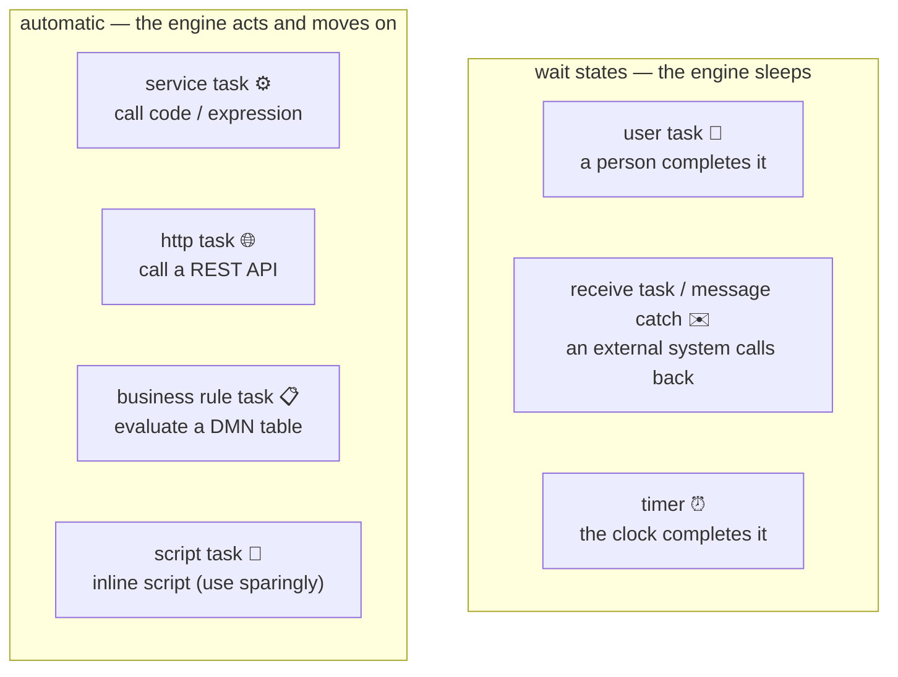

# User tasks vs service tasks: where humans and systems meet

> **Motto** — Every box in your process is a promise about *who* does the work and *how
> long the engine will wait* — choose the task type by the promise, not the icon.

*Part of Phase 01 — BPMN & the token model. Concept lesson — no code required.
Concept reading: [Principle 6 — separate the flow from the work](../../../../foundations/process-automation-principles.md).*

## The Problem

Every real process is a braid of human judgment and system calls: an ops analyst
reviews the file, a bureau API returns a score, a rules engine decides, a customer
uploads a document. Model a human step as a service task and the process crashes
looking for code that doesn't exist; model an API call as a user task and it sits in
somebody's inbox forever. Task-type choices are the requirements document of your
process — and they're the thing PMs and engineers most often get wrong together.

## The Concept

The BPMN task family, sorted by *who acts* and *whether the engine waits*:

| Task type | Who acts | Wait state? | Typical fintech use |
| :-- | :-- | :-- | :-- |
| **User task** | a person (assignee / candidate group) | yes | manual credit review, maker-checker approval |
| **Receive / message** | an external system, later | yes | "wait for bureau callback", "wait for e-sign webhook" |
| **Service task** | your code, now | no | write-off posting, notification dispatch |
| **HTTP task** | a REST API, now (synchronously) | no | fetch CIBIL score inline |
| **Business rule task** | a DMN decision table | no | eligibility, pricing grid |
| **Script task** | inline script in the model | no | tiny glue only — real logic belongs in services |

Three decision rules cover 95% of modelling calls:

1. **"Does the flow stop until someone/something outside the engine acts?"** Yes → you
   need a wait state (user task, receive task, timer). No → an automatic task.
2. **"Is the external call fast and reliable enough to hold a transaction open?"**
   A sub-second internal API can be a synchronous service task. A bureau that takes 30
   seconds and fails at month-end must be an async call: fire a service task, then park
   at a message catch until the callback — or mark the task async
   ([Phase 2, lesson 03](../../../02-the-engine-state-and-transactions/03-transactions-and-async/docs/en.md)).
3. **"Would the business want to change this logic without a release?"** Yes → it's not
   a script task, it's a DMN business rule task (Phase 5).

The anti-pattern to police in model reviews: **script tasks accumulating business
logic**. A script task is invisible to code review tooling, untestable in isolation,
and versioned only with the model. Two lines of glue, fine; an eligibility rule, never.

## Ship It

This lesson ships
[`outputs/task-type-guide.md`](../outputs/task-type-guide.md) — a one-page decision
guide you can paste into your team's modelling conventions doc and use in model
reviews.

## Check Yourself

**Q1.** The bureau API takes 5–40 seconds and is flaky at month-end. Best model?

- A) synchronous service task calling it inline
- B) user task assigned to ops, who query the bureau manually
- C) fire the request, then wait at a message catch for the callback (or async service task with retries)
- D) script task with a retry loop

Answer
C — slow or unreliable externals must not hold the
engine's transaction open. Fire-and-wait (or async + job retries) keeps the instance
durable across the flakiness.

**Q2.** A maker-checker approval where any of five supervisors may act is best
modelled as…

- A) five parallel user tasks, one per supervisor
- B) one user task with a candidate group; whoever claims it, completes it
- C) a service task that emails all five
- D) a script task

Answer
B — candidate groups are exactly this: one task,
many eligible claimants, first claim wins. Five parallel tasks would require all five
to act.

**Q3.** Business asks to tweak the auto-approval threshold monthly. Where should that
logic live?

- A) a gateway condition in the BPMN model
- B) a script task
- C) a DMN decision table called from a business rule task
- D) hard-coded in the service layer

Answer
C — logic the business wants to change on its own
cadence belongs in a decision table, deployable independently of process and
code.

**Challenge.** Take one real process from your domain (loan disbursal, vendor
onboarding, refund approval). List every step, and for each write: who acts, does the
engine wait, and what task type follows from rules 1–3. Where you hesitate, that's
where your requirements are actually unclear — which is the point.

## Related

- Phase README: [BPMN & the token model](../../README.md)
- Next phase: [The engine: state & transactions](../../../02-the-engine-state-and-transactions/README.md)
