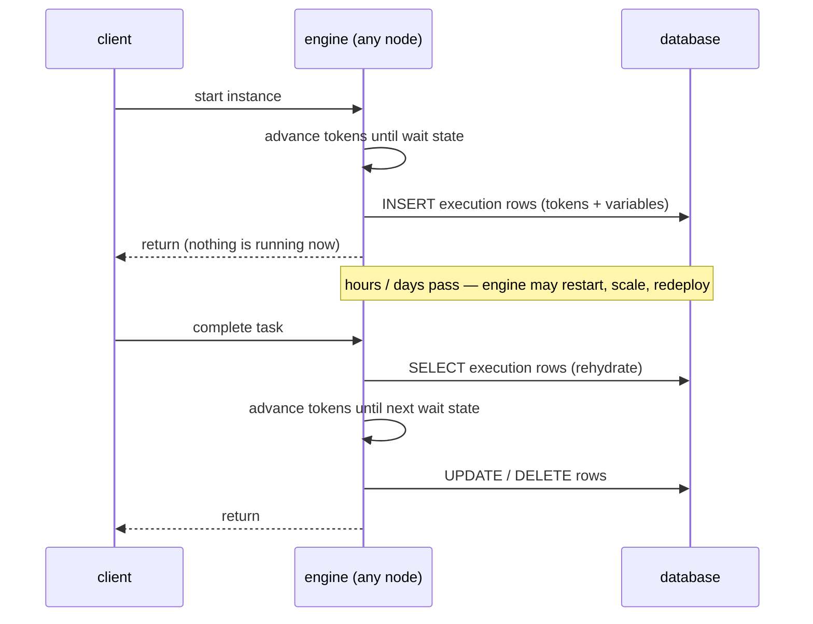

# Wait states & persistence: why the engine sleeps

> **Motto** — A process engine's superpower is not running things; it's *stopping* —
> durably, cheaply, for months — and picking up exactly where it left off.

*Part of Phase 02 — The engine: state & transactions. Concept reading:
[Principle 3 — a state machine with a database](../../../../foundations/process-automation-principles.md).*

## The Problem

Phase 1's engine sleeps politely at user tasks — in RAM. Restart the Python process and
every in-flight leave request evaporates. Real processes wait for days (document
upload), weeks (manager on leave), months (mortgage). No thread, no in-memory object,
no single server can be trusted to live that long. If the waiting state isn't in a
database, you don't have a process engine; you have a demo.

## The Concept

The fix is a discipline, not a feature: **between wait states, the instance exists only
in the database.**



Consequences, all of which you'll rely on later:

- **Restart-safety for free.** Nothing in memory matters between calls, so crashes and
  deploys lose nothing.
- **Any node can serve any instance.** State lives in shared tables → a cluster is just
  several engines pointing at one schema. (What stops two nodes grabbing the same
  timer job is the job executor's locking — lesson 04.)
- **A million in-flight instances ≈ a million rows**, not a million threads. Waiting
  is the cheapest thing the engine does.
- **Completed instances vanish from runtime tables.** Live state stays small and fast;
  the audit trail lives in separate history tables (Phase 9).

In Flowable these rows are the `ACT_RU_*` tables (`RU` = runtime): `ACT_RU_EXECUTION`
(our tokens), `ACT_RU_TASK` (open user tasks), `ACT_RU_VARIABLE` (variables),
`ACT_RU_JOB` (lesson 04's jobs).

## Build It

[`code/persistent_engine.py`](../code/persistent_engine.py) adds a SQLite store to the
Phase-1 engine. The whole idea is in the save/load pair plus one rule — *save on every
sleep, delete on completion*:

```python
def _save(self, inst_id, key, tokens, variables):
    if tokens:
        self.conn.execute(
            "INSERT OR REPLACE INTO instances VALUES (?,?,?,?)",
            (inst_id, key, json.dumps(tokens), json.dumps(variables)))
    else:   # complete: runtime rows are deleted (history is Phase 9)
        self.conn.execute("DELETE FROM instances WHERE id=?", (inst_id,))
    self.conn.commit()
```

And `complete_task` is rehydrate → advance → sleep again:

```python
def complete_task(self, inst_id, task, extra_vars=None):
    key, tokens, variables = self._load(inst_id)          # rehydrate
    ...
    tokens, variables = self._advance(process, tokens, variables)
    self._save(inst_id, key, tokens, variables)           # sleep again (or finish)
```

The demo stages a server death between start and approval:

```
$ python3 persistent_engine.py
started 5b9c63b3 - sleeping at ['approve']
        ← engine_a deleted here: the "crash"
after approval: instance complete      ← engine_b, a fresh object, resumed it
runtime rows remaining: 0              ← completed instances leave no runtime state
```

`engine_b` never saw the start call. It didn't need to — the database *is* the
instance.

## Use It

Flowable's version of the demo, no code required: start the Docker engine, start a
`loanTriage` instance with a low score (it parks at manual review), then
`docker restart` the container. The task is still there:

```bash
docker restart <container>
curl -u rest-admin:test \
  "http://localhost:8080/flowable-rest/service/runtime/tasks"
# → Manual credit review, exactly where it was
```

If you point the container at a real PostgreSQL instead of its default in-container DB,
you can even destroy the container entirely and start a new one — instances survive,
because instances are rows.

## Ship It

This lesson ships the persistent engine as a module:
[`code/persistent_engine.py`](../code/persistent_engine.py) — lesson 04's job executor
builds directly on its store.

## Check Yourself

**Q1.** Between a token arriving at a user task and someone completing it, what is the
engine doing for that instance?

- A) holding a lightweight virtual thread
- B) polling the task table
- C) nothing — the instance exists only as database rows
- D) heartbeating to keep the instance alive

<details><summary>Answer</summary>C — this is the whole point. Waiting consumes zero
compute; the instance is rows in `ACT_RU_*` until the next stimulus.</details>

**Q2.** Two engine nodes share one database. Node A started an instance; node B gets
the complete-task call. What happens?

- A) node B proxies the call to node A
- B) node B rehydrates the instance from the shared tables and advances it — normal operation
- C) an error: instances are pinned to their starting node
- D) the instance is migrated first

<details><summary>Answer</summary>B — state in shared tables means no node affinity.
This is why "clustering Flowable" is mostly "point engines at the same schema".</details>

**Q3.** Why does completing the last task *delete* the runtime row instead of flagging
it done?

- A) to save disk
- B) runtime tables must stay small and hot — finished instances belong to history tables
- C) regulatory requirement
- D) it doesn't; rows are kept forever

<details><summary>Answer</summary>B — the runtime/history split keeps the tables the
engine touches on every step small. Audit questions go to history (Phase 9).</details>

**Challenge.** Add optimistic locking: a `revision` column incremented on every save,
with `UPDATE ... WHERE id=? AND revision=?` failing if another transaction got there
first. Simulate two racing `complete_task` calls and watch one lose. You've just
rebuilt Flowable's `ACT_RU_EXECUTION.REV_` column and its
`FlowableOptimisticLockingException`.

## Related

- Next: [Process variables & scope](../../02-process-variables/docs/en.md)
- Concept: [Principle 3](../../../../foundations/process-automation-principles.md)
