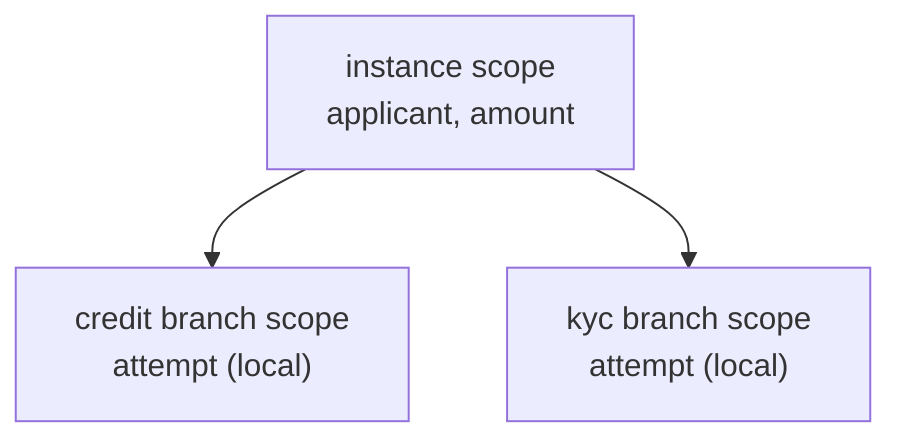

# Process variables & scope

> **Motto** — Variables are the instance's working memory, and scope decides which
> branch of the process can see — and silently overwrite — what.

*Part of Phase 02 — The engine: state & transactions.*

## The Problem

So far our variables were one flat dict per instance. That works until the process
forks: two parallel branches both keep an `attempt` counter, or both write their result
to `result`, and the last writer silently wins. In a loan process that can mean the KYC
branch's status overwrites the credit branch's — a bug that shows up as "sometimes
approvals have the wrong reason code" and takes a week to trace, because nothing
errored.

## The Concept

Engines solve this the way programming languages do: **lexical scoping over the
execution tree**. Every token/execution is a scope with a parent; the process instance
is the root.



Three rules, identical in the toy build and in Flowable:

1. **Read**: walk up the chain; nearest declaration wins.
2. **Write** (`setVariable`): update the scope that declares the name; if none does,
   declare it at the **root** — so results written from a branch survive the join.
3. **Local write** (`setVariableLocal`): pin the name to the current scope; siblings
   can't see it and it dies when the branch joins.

Rule 2 is the sharp edge: because undeclared writes float to the root, *two parallel
branches writing the same name overwrite each other silently*. The discipline that
prevents it: branch-internal working state is always local; only distinctly-named
results go instance-level.

Two Flowable-specific facts worth knowing early:

- **Variables are typed rows** (`ACT_RU_VARIABLE`): strings, numbers, dates natively;
  anything else serialises (JSON or Java serialization). Big blobs in variables are a
  classic performance smell — store a reference (document ID), not the document.
- **Transient variables** exist for exactly that: pass a payload to the next few steps
  without ever persisting it. They live only until the next wait state.

## Build It

[`code/variables.py`](../code/variables.py) — a parent-chained scope in ~40 lines. The
whole semantics is in `set`:

```python
def set(self, key, value):
    scope = self
    while scope:
        if key in scope.vars:
            scope.vars[key] = value
            return
        if scope.parent is None:
            scope.vars[key] = value       # new variable -> process instance level
            return
        scope = scope.parent
```

The demo builds the fork above and walks straight into the classic bug:

```
$ python3 variables.py
instance sees result = kyc-ok  <- last writer won
instance variables: {'applicant': 'meera', 'amount': 500000, 'score': 720, ...}
```

## Use It

The same three operations in Flowable's API — same semantics you just built:

```java
runtimeService.setVariable(executionId, "score", 720);        // walks up, roots if new
runtimeService.setVariableLocal(executionId, "attempt", 1);   // pinned to this execution
runtimeService.getVariable(executionId, "score");             // walks up

// and in a delegate:
execution.setTransientVariable("bureauPayload", bigJson);     // never persisted
```

Over REST, task completion writes instance-level variables by default; add
`"scope": "local"` per variable to pin them:

```json
{"action": "complete",
 "variables": [{"name": "attempt", "value": 2, "scope": "local"}]}
```

## Ship It

This lesson ships the scope chain as a module:
[`code/variables.py`](../code/variables.py) — reused mentally every time you read a
Flowable stack trace containing `VariableScopeImpl`.

## Check Yourself

**Q1.** A parallel branch calls `setVariable("status", "ok")` and no scope declares
`status`. Where does it land?

- A) the branch's local scope
- B) the process instance (root) scope
- C) it errors — undeclared variable
- D) a random scope

<details><summary>Answer</summary>B — undeclared writes float to the root. Useful for
returning results past the join; dangerous when two branches pick the same
name.</details>

**Q2.** Two parallel branches each need a retry counter. Correct pattern?

- A) `setVariable("attempt", n)` in both
- B) `setVariableLocal("attempt", n)` in each branch
- C) one shared counter with a prefix
- D) store it in a database table outside the engine

<details><summary>Answer</summary>B — branch-internal working state is exactly what
local scope is for; the counters can't clobber each other and vanish at the
join.</details>

**Q3.** You need to pass a 2 MB bureau response from one service task to the next, and
never want it in the database. Use…

- A) a normal variable
- B) a local variable
- C) a transient variable
- D) a file on disk

<details><summary>Answer</summary>C — transient variables live only until the next
wait state and are never persisted. (Even better: store the document elsewhere and
pass its ID.)</details>

**Challenge.** Extend the toy `Scope` with `destroy()`: when a branch scope dies at a
join, its local variables vanish but anything it wrote to the root survives. Then write
the failing test first: both branches `set("result", ...)`, join, and assert the root
holds *both* results — watch it fail, then fix the model (not the engine) by renaming.

## Related

- Next: [Transaction boundaries & async continuations](../../03-transactions-and-async/docs/en.md)
- Previous: [Wait states & persistence](../../01-wait-states-and-persistence/docs/en.md)
