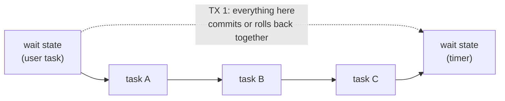
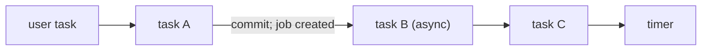

# Transaction boundaries & async continuations

> **Motto** — Everything between two wait states is one transaction: know where those
> boundaries are and incidents become mechanical; guess, and "the engine re-ran my
> payment" becomes your war story.

*Part of Phase 02 — The engine: state & transactions. Concept lesson — no code
required. Concept reading:
[Principle 4](../../../../foundations/process-automation-principles.md).*

## The Problem

A process executes: service task A (reserve funds) → service task B (call the
disbursal API) → service task C (write the ledger entry). C throws. What happened to A
and B?

If you don't know the answer *precisely*, you can't write safe service tasks. The
answer is: **A and B roll back too** — the token returns to the previous wait state as
if none of the three ever ran — *except* the disbursal API was really called, because
an external HTTP call can't be rolled back by your database transaction. Congratulations:
money moved and your process has no record of it. This lesson is about never being
surprised by that again.

## The Concept

The engine advances tokens synchronously, in the caller's thread and transaction, until
it hits a wait state — then commits. The unit of atomicity is therefore *the segment
between wait states*, not the individual task:

- C throws → TX 1 rolls back → the token is back at W1; A's and B's *engine-side*
  effects (variables, state) are undone. The client that completed W1's task gets the
  exception.
- Any effect that escaped the transaction (an HTTP call, an email) is **not** undone.

**Async continuations** let you cut this segment. Marking a task
`flowable:async="true"` inserts a boundary *before* it: the engine commits the token's
position as a **job** and returns; the job executor (next lesson) picks it up in a new
transaction.

Now B failing rolls back only B and C; A's completion is safely committed, and the job
retries B without re-running A. Async is how you get:

1. **Fault isolation** — flaky externals retry alone instead of dragging the whole
   segment back.
2. **Fast API responses** — the user's "submit" returns after the commit instead of
   after the slow bureau call.
3. **Real parallelism** — parallel branches actually run concurrently only if the
   branches are async (otherwise Phase 1's truth holds: one thread walks both).

The cost: after an async boundary, failures no longer surface to the caller — they
become **failed jobs** (dead-letter after retries), which means you need the
job-executor operational story from lesson 04 and Phase 9's monitoring.

Rules of thumb for placing boundaries:

| Situation | Boundary? |
| :-- | :-- |
| Calling any third-party / flaky / slow system | `async="true"` on that task |
| Non-idempotent external effect (payment!) | async **and** idempotency key in the call — retries must be safe |
| Heavy computation after a user submit | async right after the user task |
| Chain of quick internal steps | no boundary — one transaction is simpler and atomic |
| Parallel branches that must truly overlap | async on the first task of each branch |

## Ship It

This lesson ships
[`outputs/async-flags-cheatsheet.md`](../outputs/async-flags-cheatsheet.md) — the
one-pager for model reviews: what each flag does, where boundaries fall, and the
payment-safety checklist.

## Check Yourself

**Q1.** Tasks A → B → C run after a user task, no async flags. C throws. The engine
state is…

- A) A and B committed, C pending
- B) everything rolled back to the user task; the completer sees the exception
- C) the instance is dead-lettered
- D) C retries automatically

Answer
B — one segment, one transaction. Without an async
boundary there are no retries; the failure propagates to whoever triggered the
segment.

**Q2.** Task B calls a payment API and is marked async. What *must* also be true?

- A) nothing; async makes it safe
- B) the call carries an idempotency key, because the job executor will re-run B on failure
- C) B must be the last task
- D) the process needs a second engine

Answer
B — async means retries, retries mean the call can
fire twice. Only idempotency on the receiving side makes that safe. Async without
idempotency is how double payments happen.

**Q3.** Two parallel branches of synchronous service tasks: do they run concurrently?

- A) yes, the engine spawns threads per branch
- B) no — one thread walks both branches sequentially; concurrency requires async tasks
- C) only on a cluster
- D) only with more than two branches

Answer
B — parallel gateways are token bookkeeping, not
threads. True overlap needs async boundaries so the job executor can run branches on
its own threads.

**Challenge.** Take the loan-triage model from Phase 1 and decide — on paper — where
async boundaries belong if `creditCheck` calls a real bureau (slow, flaky, but
idempotent) and `autoApprove` posts to a core-banking API (fast, but *not*
idempotent). Write down what the failure of each task now does, and what you'd need to
monitor. Check your answer against the cheat sheet.

## Related

- Next: [The job executor](../../04-job-executor/docs/en.md) — the machinery that runs
  everything you just made async
- Concept: [Principle 4](../../../../foundations/process-automation-principles.md)
