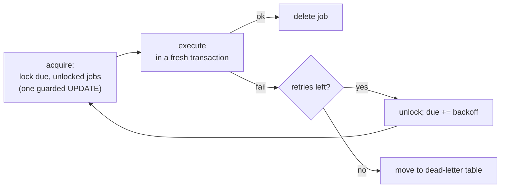

# The job executor: timers, retries, async work

> **Motto** — Every "later" in your process — timers, retries, async steps — is a row
> in a jobs table, and the executor is just a loop that locks due rows and runs them.

*Part of Phase 02 — The engine: state & transactions. Concept reading:
[Principle 5 — time is a first-class citizen](../../../../foundations/process-automation-principles.md).*

## The Problem

Lesson 03 ended with promises: async tasks "get picked up in a new transaction",
timers "fire in three days", failures "retry with backoff". Some component has to keep
those promises — across restarts, across a cluster, without firing the same timer
twice from two nodes. That component is the **job executor**, and when something in
production "just didn't happen" (a reminder never sent, an async step stuck), the job
executor's tables are where you'll be looking. Better to have built one first.

## The Concept

A job is durable work-to-do: *what* (continue this execution / fire this timer),
*when* (`due`), *how many attempts remain* (`retries`), and *who's working on it*
(`locked_by`, `lock_until`). The executor loop:



The whole cluster story is inside **acquire**: locking is a conditional `UPDATE`, and
because the database serialises updates, two nodes can run the same query
simultaneously and each job is still acquired exactly once. Locks carry a timeout
(`lock_until`) so a node that dies mid-job doesn't strand its work — the lock expires
and another node picks it up. (Corollary: job handlers must tolerate the rare
double-run — idempotency again.)

Flowable's tables map one-to-one:

| Table | Holds |
| :-- | :-- |
| `ACT_RU_JOB` | async continuations ready to run |
| `ACT_RU_TIMER_JOB` | timers waiting for their due date |
| `ACT_RU_SUSPENDED_JOB` | jobs of suspended instances |
| `ACT_RU_DEADLETTER_JOB` | out of retries — **needs a human** |

Dead letters are the operational contract: after the last retry the engine stops
trying and files the job where nothing runs it again. If nobody watches that table,
failed async work is silently frozen — Phase 9 makes it an alert.

## Build It

[`code/job_executor.py`](../code/job_executor.py). Acquisition — the cluster-safety
core — in full:

```python
def acquire(self, node, limit=10):
    """In SQL this is one guarded UPDATE:
    UPDATE job SET locked_by=?, lock_until=? WHERE due<=now
      AND (locked_by IS NULL OR lock_until<now) LIMIT ?"""
    now, got = self.clock(), []
    for job in self.jobs:
        if len(got) == limit:
            break
        if job.due <= now and (job.locked_by is None or job.lock_until < now):
            job.locked_by, job.lock_until = node, now + LOCK_SECONDS
            got.append(job)
    return got
```

The demo schedules a timer, a flaky bureau call (fails twice, then succeeds), and a
misconfigured job — then runs ticks from two nodes on a fake clock:

```
t=0: both async jobs due, timer is not
  [node-A] job 2 failed (bureau 502 (attempt 1)); retry in 10s (2 left)
  [node-A] job 3 failed (bad config); retry in 10s (2 left)
t=+10s:
  [node-B] job 2 failed (bureau 502 (attempt 2)); retry in 60s (1 left)
  ...
t=+70s:
      -> bureau responded, token advances
  [node-B] job 2 (async) done
  [node-B] job 3 DEAD-LETTERED: bad config
t=+370s:
      -> reminder sent
dead letters: [(3, 'async')]
```

Note node-B's silence at t=0: it ran, found everything locked by node-A, and acquired
nothing. That non-event *is* the cluster correctness property.

## Use It

In Flowable the executor is on by default in Spring Boot
(`flowable.async-executor-activate=true`). Timers come straight from the model:

```xml
<boundaryEvent id="offerExpiry" attachedToRef="acceptOffer" cancelActivity="true">
  <timerEventDefinition>
    <timeDuration>P30D</timeDuration>   <!-- ISO-8601: 30 days -->
  </timerEventDefinition>
</boundaryEvent>
```

Retries default to 3; customise per task
(`flowable:failedJobRetryTimeCycle="R5/PT10M"` — 5 retries, 10 minutes apart). Inspect
and revive dead letters over REST:

```bash
curl -u rest-admin:test ".../management/deadletter-jobs"
curl -u rest-admin:test -X POST ".../management/deadletter-jobs/{id}" \
  -H 'Content-Type: application/json' -d '{"action": "move"}'   # back to the job table
```

Tuning threads, acquisition size, and lock times is Phase 9, lesson 03.

## Ship It

This lesson ships the executor as a module:
[`code/job_executor.py`](../code/job_executor.py) — store, acquisition, backoff, and
dead-lettering in ~100 lines you can reason about during a production incident.

## Check Yourself

**Q1.** Two nodes poll the jobs table at the same instant. Why doesn't a job run twice?

- A) nodes coordinate over the network
- B) acquisition is a conditional UPDATE — the database serialises it, so only one node's lock sticks
- C) jobs are sharded by node
- D) it does run twice, harmlessly

<details><summary>Answer</summary>B — no messaging, no leader election; the database's
own update semantics are the mutual exclusion. (Lock timeouts mean a *rare* double-run
is still possible after a node death — handlers should be idempotent.)</details>

**Q2.** A job's retries hit zero. The engine…

- A) deletes it
- B) retries forever with growing backoff
- C) moves it to the dead-letter table, where nothing runs it until a human (or automation) moves it back
- D) rolls back the whole instance

<details><summary>Answer</summary>C — dead letters are the "stop and ask a human"
state. Unmonitored, they are silently stuck processes — alert on that table.</details>

**Q3.** Why does a crashed node not strand the jobs it had locked?

- A) the OS releases them
- B) locks carry `lock_until`; once expired, other nodes may acquire the job
- C) a supervisor reassigns them
- D) it does strand them until restart

<details><summary>Answer</summary>B — time-limited locks make crash recovery automatic
at the cost of the rare duplicate execution.</details>

**Challenge.** Add priority: jobs get a `priority` int, acquisition takes highest
first, and starvation is prevented by boosting priority with age. Then simulate a
burst of 100 low-priority jobs plus one urgent timer and verify the timer still fires
on time — you've just met every queue-tuning trade-off Phase 9 discusses.

## Related

- Next: [Use It: the embedded engine in Spring Boot](../../05-embedded-engine-spring-boot/docs/en.md)
- Previous: [Transactions & async](../../03-transactions-and-async/docs/en.md)
- Other tracks: [Reliability & failure](../../../../../technical-product-sense/reliability-and-failure.md) · [Production failure modes](../../../../../content/06-strategy-tradeoffs/production-failure-modes.md) · [The agent loop from scratch](../../../../../harness-engineering/phases/02-the-agent-loop/01-agent-loop/docs/en.md) — the same durable execute-retry loop in other engines.
