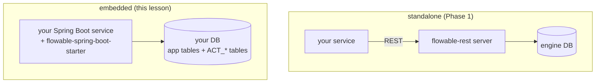

# Use It: the embedded engine in Spring Boot

> **Motto** — "Embedded" means the engine is a library inside your service — same JVM,
> same datasource, same transaction — and that one fact decides most of your
> architecture.

*Part of Phase 02 — The engine: state & transactions. This is the phase's **Use It**
lesson. Concept reading:
[Principle 10](../../../../foundations/process-automation-principles.md).*

## The Problem

Phase 1 drove Flowable as a separate server over REST. That's one topology. The other —
and the more common one inside product teams — is the engine **embedded** in your own
Spring Boot service: no second deployment, process state in *your* database, service
tasks calling *your* beans directly, and — the part that changes everything — engine
operations joining *your* transactions. You need to have seen both to make the Phase 10
topology decision consciously rather than by default.

## The Concept



| | Embedded | Standalone (REST) |
| :-- | :-- | :-- |
| Deployment | one artifact — yours | separate engine service |
| Transactions | engine joins your `@Transactional` — process state and domain writes commit **atomically** | two systems, eventual consistency between them |
| Service tasks | direct calls to Spring beans | expressions/HTTP only, or engine-side JARs |
| Polyglot callers | JVM only | any language |
| Upgrades / scaling | coupled to your service | independent |
| Best for | one product team, JVM shop, transactional integrity matters | many consumers, non-JVM callers, central platform team |

The atomic-commit property is the headline: an embedded service task writing to your
domain tables and the engine advancing the token are **one** database transaction.
Lesson 03's rollback rules now span your business data too — a failed segment rolls
back your domain writes along with the token. Over REST you must engineer that
consistency yourself.

## Use It

Everything Spring needs is one starter dependency —
`org.flowable:flowable-spring-boot-starter-process` — which auto-configures the engine
against your datasource and auto-deploys every model in
`src/main/resources/processes/`. The full app is
[`code/LoanApplication.java`](../code/LoanApplication.java); the two pieces that matter:

A service task as a Spring bean (compare: the toy engine's `handler` lambda):

```java
@Component("creditCheckDelegate")
public static class CreditCheckDelegate implements JavaDelegate {
    @Override
    public void execute(DelegateExecution execution) {
        long amount = (Long) execution.getVariable("amount");
        execution.setVariable("score", amount < 1_000_000 ? 720 : 640);
    }
}
```

wired in the model with
`<serviceTask id="creditCheck" flowable:delegateExpression="${creditCheckDelegate}"/>`
— and because it's a normal bean, it can inject your repositories, and it runs inside
the engine's transaction.

Driving an instance — the same two operations you built in Phase 1 and persisted in
lesson 01:

```java
String id = runtimeService.startProcessInstanceByKey(
        "loanTriage", Map.of("applicant", "meera", "amount", 2_000_000L)).getId();
Task review = taskService.createTaskQuery().processInstanceId(id).singleResult();
taskService.complete(review.getId(), Map.of("decision", "approved"));
```

Settings live in [`outputs/application.properties`](../outputs/application.properties) —
datasource, schema auto-update, the async executor toggle (lesson 04), and the history
level (Phase 9).

Run it the standard Spring way:

```bash
mvn spring-boot:run
# waiting at: Manual credit review
# instance ended: true
```

## Ship It

This lesson ships a starter you can copy into any Spring Boot service:
[`code/LoanApplication.java`](../code/LoanApplication.java) +
[`outputs/application.properties`](../outputs/application.properties).

## Check Yourself

**Q1.** In an embedded setup, a delegate writes a row to your `disbursals` table, and a
later task in the same segment throws. Your row is…

- A) committed — it was a separate concern
- B) rolled back — delegate writes share the engine's transaction
- C) moved to a staging table
- D) undefined

<details><summary>Answer</summary>B — one datasource, one transaction. This atomicity
is embedded mode's biggest gift, and the thing you must consciously replace if you
move to standalone.</details>

**Q2.** Your platform must serve process starts from Python and Node services. Which
topology fits with least friction?

- A) embedded in each service
- B) standalone engine consumed over REST
- C) embedded in one Java service that proxies for the others
- D) no engine

<details><summary>Answer</summary>B — embedded is JVM-only. (C is a real pattern too,
but it makes one team's service everyone's bottleneck — that's a Phase 10
discussion.)</details>

**Q3.** Where do the engine's tables live in embedded mode?

- A) an internal H2 the engine hides from you
- B) in your application's datasource, alongside your domain tables
- C) in files
- D) in memory only

<details><summary>Answer</summary>B — `ACT_*` tables in your schema. Your DBA will
have opinions; Phase 9 gives you the answers.</details>

**Challenge.** Wire lesson 03's `loan-triage.bpmn20.xml` into
`src/main/resources/processes/`, replace the expression-based `creditCheck` with the
delegate above, and make the delegate throw for amounts over ₹50 lakh. Observe: does
the start call fail, or does a job dead-letter? Explain the answer using lesson 03's
boundary rules, then add `flowable:async="true"` and watch the behaviour flip.

## Related

- Phase README: [The engine: state & transactions](../../README.md)
- Topology decision in depth: Phase 10, lesson 01 (see [`ROADMAP.md`](../../../../ROADMAP.md))
