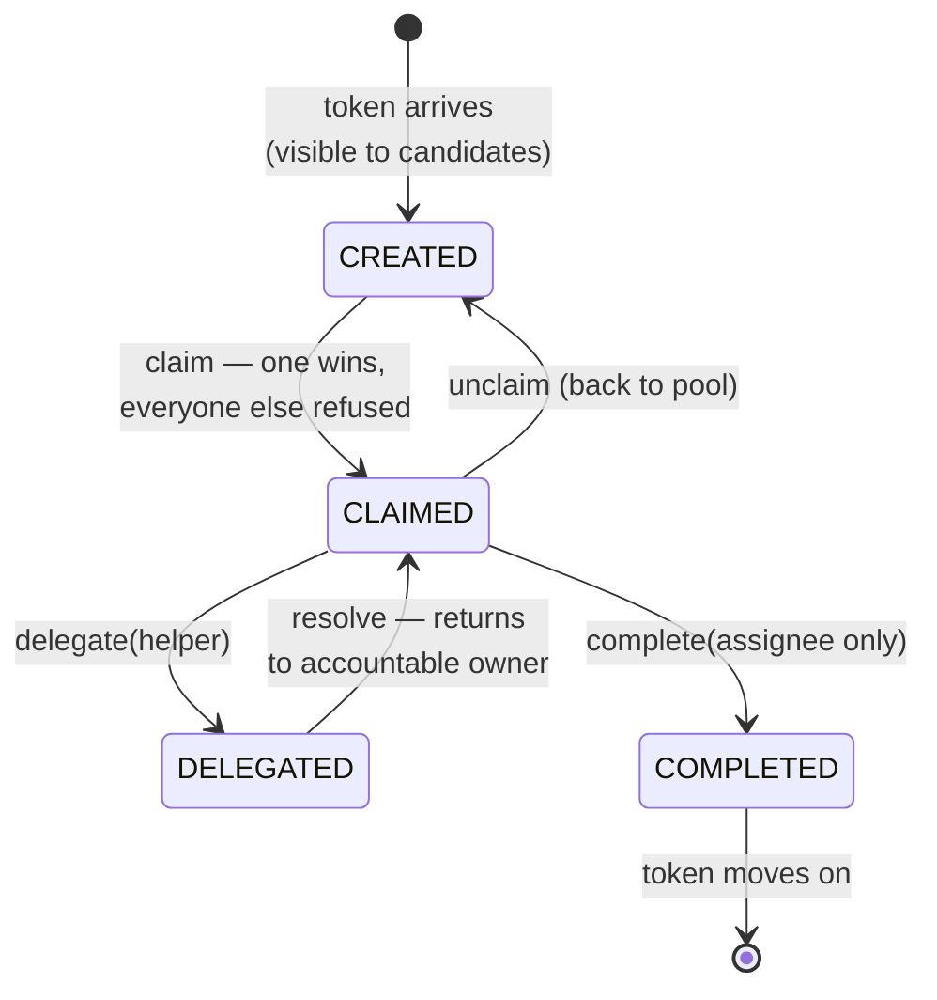

# The task lifecycle: created → assigned → completed

> **Motto** — A user task is a state machine with sharp edges: claim makes one person
> accountable, and every refused transition is a double-payment that didn't happen.

*Part of Phase 03 — User tasks, identity & forms.*

## The Problem

Phase 1 treated a user task as "a token sleeping until someone completes it". Put five
credit analysts in front of fifty applications and "someone" becomes the problem: two
analysts open the same case, both spend twenty minutes, one submits — the other's work
is lost or, worse, *both* submit and the second overwrites the first. Inboxes need an
ownership protocol, and it has to be enforced by the engine, not by team etiquette.

## The Concept



The rules that carry the weight:

1. **CREATED is a pool, CLAIMED is a person.** An unclaimed task is visible to every
   candidate; *claim* is an atomic race that exactly one wins (in Flowable it's an
   optimistic-locked update — Phase 2's revision column doing this exact job).
2. **Only the assignee completes.** Not "anyone in the group" — the person who
   claimed. Between claim and complete, everyone else's claim attempts are refused
   with a reason.
3. **Delegation preserves accountability.** Delegate hands the *work* to a helper but
   records the original assignee as `owner`; *resolve* hands it back. The audit trail
   shows both — which is what your maker-checker policy actually requires.
4. **Every transition is logged.** "Who claimed, when, who delegated to whom" is the
   evidence an ops dispute or an audit needs, and it exists because the lifecycle is
   explicit rather than a `status` column three services write to.

## Build It

[`code/task_lifecycle.py`](../code/task_lifecycle.py) — the machine is a dataclass
and five methods, each opening with its precondition:

```python
def claim(self, user, groups):
    self._check(self.state == "CREATED", f"cannot claim in state {self.state}"
                + (f" (held by {self.assignee})" if self.assignee else ""))
    self._check(self.visible_to(user, groups),
                f"{user} is not a candidate ({self.candidate_groups})")
    self.assignee, self.state = user, "CLAIMED"
```

The demo stages the claim race and the delegation round-trip:

```
$ python3 task_lifecycle.py
refused : Manual credit review: cannot claim in state CLAIMED (held by asha)
refused : Manual credit review: cannot claim in state CLAIMED (held by asha)
refused : Manual credit review: ravi is not the assignee

audit trail:
  - claimed by asha
  - asha delegated to meera
  - resolved by meera; back with asha
  - completed by asha
```

Note what the refusals protect: not data integrity in the abstract, but twenty
minutes of a second analyst's attention and the ambiguity of two submitted decisions.

## Use It

The same transitions over Flowable's task API — one call each:

```java
taskService.claim(taskId, "asha");          // TransitionError -> FlowableTaskAlreadyClaimedException
taskService.unclaim(taskId);
taskService.delegateTask(taskId, "meera");  // owner=asha, assignee=meera
taskService.resolveTask(taskId);            // back to asha, DelegationState.RESOLVED
taskService.complete(taskId, variables);
```

Over REST it's the single task endpoint with an `action` field —
`{"action": "claim", "assignee": "asha"}`, `{"action": "delegate", ...}`,
`{"action": "resolve"}`, `{"action": "complete", "variables": [...]}` — which the
next lesson's client drives end to end.

## Ship It

This lesson ships [`code/task_lifecycle.py`](../code/task_lifecycle.py) — the
lifecycle as an executable reference, including the refusal messages a good task API
owes its users.

## Check Yourself

**Q1.** Two analysts click "claim" on the same task within a millisecond. The engine
guarantees…

- A) both get it; last completer wins
- B) exactly one claim succeeds; the other receives an already-claimed error
- C) the task duplicates
- D) whoever has more permissions wins

<details><summary>Answer</summary>B — claim is an atomic, optimistic-locked
transition. The refused analyst lost a click, not twenty minutes of work.</details>

**Q2.** Asha delegates her review to Meera. Who completes the task, and what does
resolve do?

- A) Meera completes it directly
- B) Meera resolves it back to Asha, who completes — delegation lends the work, not the accountability
- C) either may complete
- D) the task returns to the group pool

<details><summary>Answer</summary>B — owner/assignee split exists precisely so the
sign-off stays with the person your policy holds accountable.</details>

**Q3.** Why does completing an unclaimed group task get refused?

- A) performance
- B) with no assignee there is no accountable person — the audit trail would say a group decided
- C) it isn't refused
- D) variables can't be written without an assignee

<details><summary>Answer</summary>B — claim-before-complete is the accountability
protocol. (Flowable technically allows assignee-less completion via API — teams that
care about audit lock it down.)</details>

**Challenge.** Add `escalate(to_group)`: a claimed task past its due date returns to
a *different* pool (the supervisors'), recording the original assignee. Then decide —
and defend — whether escalation should be allowed from DELEGATED, and what happens to
the owner field if so. You've just designed the policy questions Phase 7's
escalation timers will trigger.

## Related

- Next: [Assignment: assignee, candidate users, candidate groups](../../02-assignment/docs/en.md)
- The wait state underneath: [Phase 1, lesson 01](../../../01-bpmn-and-the-token-model/01-tokens-and-sequence-flow/docs/en.md)
