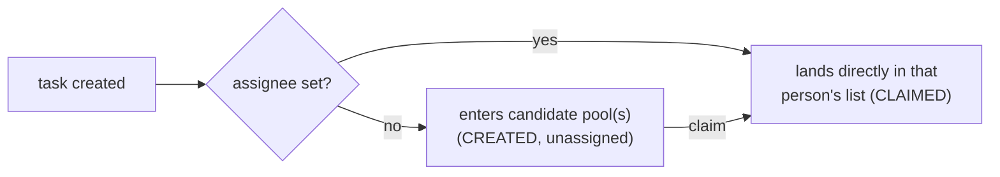

# Assignment: assignee, candidate users, candidate groups

> **Motto** — Assign roles, not people: `assignee="ravi"` is an outage waiting for
> Ravi's resignation letter; `candidateGroups="credit-ops"` survives every org chart.

*Part of Phase 03 — User tasks, identity & forms.*

## The Problem

Every user task must answer "whose inbox does this land in?" — and the answer is
written in the model, which means a bad answer is *deployed*. The classic failure is
hard-coding a person: the task `flowable:assignee="ravi"` works until Ravi is on
leave, transferred, or gone, at which point live instances sit in the inbox of someone
who will never come back, and fixing it means migrating instances or editing task
state by hand. Assignment is a modelling decision with operational blast radius.

## The Concept

Three attributes, in order of preference — *later in this list = more fragile*:

| Attribute | Semantics | Use when |
| :-- | :-- | :-- |
| `flowable:candidateGroups` | task enters the group's **pool**; any member may claim | the default — teams own queues |
| `flowable:candidateUsers` | pool limited to named individuals | rare: a fixed pair of signatories |
| `flowable:assignee` | pre-claimed, skips the pool entirely | truly personal work ("the applicant uploads *their* documents") — and then almost always an **expression**, not a literal |



Two refinements that keep models clean:

1. **Expressions over literals, always.** `flowable:assignee="${applicant}"` (the
   instance knows who applied), `flowable:candidateGroups="${region}-credit-ops"`
   (routing by data). The model states the *rule*; identity data supplies the names
   at runtime.
2. **Pools compose with the lifecycle.** A claimed task leaves the pool queries
   (lesson 01's race, visible in the API); unclaim returns it. The pool *is* the
   backlog view, which is why lesson 05 builds the whole inbox on two queries.

## Use It

[`code/assignment_client.py`](../code/assignment_client.py) drives the protocol
against Phase 1's `loanTriage` (whose review task declares
`flowable:candidateGroups="credit-ops"`). The two queries that matter:

```python
def group_pool(group):
    """The unclaimed pool for a group: candidate tasks with no assignee yet."""
    return call("POST", "/query/tasks", {
        "candidateGroup": group, "unassigned": True, "size": 50,
    }).get("data", [])

def my_tasks(user):
    return call("POST", "/query/tasks", {"assignee": user, "size": 50}).get("data", [])
```

And the run shows the race from lesson 01, now with HTTP semantics:

```
$ python3 assignment_client.py
credit-ops pool: [('Manual credit review', '7512')]
asha claimed 7512
ravi refused: HTTP 409 (already claimed)
asha's list : ['7512']
pool now    : []
completed; instance ended: True
```

The 409 is lesson 01's `TransitionError` on the wire — same guarantee, same reason.

## Ship It

This lesson ships
[`outputs/assignment_client.py`](../outputs/assignment_client.py) — pool/claim/
complete as reusable functions; lesson 05's inbox builds on the same two queries.

## Check Yourself

**Q1.** Why is `flowable:assignee="ravi"` (a literal) a deployment risk?

- A) it's slower than groups
- B) instances created while it's deployed are pinned to Ravi personally — leave, transfer, or exit strands them
- C) Ravi gets too many emails
- D) literals aren't allowed

<details><summary>Answer</summary>B — the model outlives the org chart. Rules
(groups, expressions) age well; names don't.</details>

**Q2.** A claimed task no longer appears in `group_pool("credit-ops")` because…

- A) it was deleted
- B) the pool query filters `unassigned: true` — claiming set an assignee, moving it from the pool view to the person's list
- C) REST caches aggressively
- D) the group was removed

<details><summary>Answer</summary>B — pool and personal list are two filters over
the same task table; the claim transition is what moves rows between them.</details>

**Q3.** "The customer's own relationship manager reviews the file." Best modelling?

- A) `assignee="priya"` — she's the RM today
- B) `assignee="${relationshipManager}"` with the RM resolved into a variable at intake
- C) candidate group `rms`
- D) a service task that emails someone

<details><summary>Answer</summary>B — genuinely personal work is the assignee case,
but the *name* comes from data, not the model. (C would let any RM claim it —
different policy.)</details>

**Challenge.** Extend the client with `reassign_orphans(from_user, to_group)`: find
every task assigned to a departed user (`assignee=from_user`), unclaim each back to
the pool, and print the audit line. That script is the standard "Ravi resigned"
runbook — better to have written it before you need it.

## Related

- Next: [Identity management](../../03-identity-management/docs/en.md)
- Previous: [The task lifecycle](../../01-task-lifecycle/docs/en.md)
