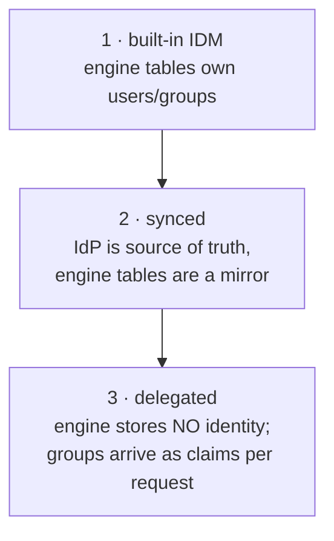

# Identity management: users, groups, and external IdPs

> **Motto** — The engine needs to know *who may act*; it should almost never be the
> system that decides *who exists* — that's your IdP's job.

*Part of Phase 03 — User tasks, identity & forms. Concept lesson — no code required.*

## The Problem

Candidate groups (lesson 02) quietly assumed somebody maintains the answer to "who is
in credit-ops?" Flowable ships a built-in identity store — user and group tables,
membership, even passwords — and the demo-grade temptation is to use it: create users
over REST, done. Six months later HR moves three analysts, nobody updates the engine's
tables, tasks route to ex-members, and security asks why a workflow engine is storing
password hashes outside the corporate IdP. Identity is a *boundary* decision, and the
default should be: the engine consumes identity, it doesn't own it.

## The Concept

Three architectures, in ascending order of seriousness:



| | Built-in IDM | Synced | Delegated (recommended) |
| :-- | :-- | :-- | :-- |
| Source of truth | the engine | IdP (AD/Keycloak/Okta) | IdP |
| Engine stores | users, groups, passwords | mirrored users/groups | nothing (or key-only) |
| Membership change | manual API calls | sync-lag dependent | immediate — next request carries new claims |
| Auth | engine verifies passwords | IdP authenticates, engine authorizes | IdP issues tokens; your API layer maps claims → candidate groups |
| Honest use | demos, tests, this course's Docker image | legacy setups already invested | production |

The delegated pattern deserves spelling out because it's the one that surprises
people: **the engine never looks membership up**. Task queries take the group list as
an *input* — `candidateGroup in (...)` — so your API layer extracts groups from the
caller's token (OIDC claims) and passes them in per request:

```
JWT claims: { sub: "asha", groups: ["credit-ops", "mumbai"] }
        ↓ your API layer
taskService.createTaskQuery().taskCandidateGroupIn(List.of("credit-ops", "mumbai"))
```

Membership changes in the IdP take effect on the next request — no sync job, no
stale mirror, no password storage. The engine's identity tables stay empty; what it
*does* keep is history: "claimed by asha" as an opaque string, joined back to a real
person by the IdP when the auditor asks.

Two design consequences:

1. **Group names become an API contract** between IdP and models.
   `flowable:candidateGroups="credit-ops"` must match a claim the IdP emits —
   version and review group renames like the breaking changes they are.
2. **Authorization lives at your API layer**, not in the engine. The engine enforces
   task-level rules (only the assignee completes — lesson 01); *which tasks a caller
   may query at all* is your perimeter. Exposing `flowable-rest` directly to end
   users hands them an admin API; it sits behind your service in every production
   topology (Phase 10).

## Ship It

This lesson ships
[`outputs/identity-architecture-guide.md`](../outputs/identity-architecture-guide.md)
— the three architectures, the claims-to-groups mapping pattern, and a migration
checklist off the built-in store.

## Check Yourself

**Q1.** In the delegated pattern, where does "asha is in credit-ops" live at query
time?

- A) the engine's membership tables
- B) in the request — extracted from her token's claims by your API layer and passed to the task query
- C) a nightly sync
- D) the model

<details><summary>Answer</summary>B — the engine consumes group lists; it never
resolves membership. That inversion is what removes sync lag and password
custody.</details>

**Q2.** The IdP team renames `credit-ops` to `retail-credit-ops`. What breaks?

- A) nothing; names are cosmetic
- B) every deployed model whose candidateGroups references the old name — new tasks enter a pool nobody's claims match
- C) the engine crashes
- D) only new deployments

<details><summary>Answer</summary>B — group names are a cross-system contract.
Treat renames as breaking API changes: coordinate, alias during transition, or
migrate.</details>

**Q3.** What identity data *should* a production engine hold?

- A) users, groups, and hashed passwords
- B) essentially none — opaque user IDs in task/history fields, resolved to people by the IdP when needed
- C) a full LDAP mirror
- D) tokens

<details><summary>Answer</summary>B — the engine's job is workflow state and audit
references, not credential custody. Empty identity tables are a healthy
sign.</details>

**Challenge.** Sketch the claims-to-groups mapping for your own stack: which token
claim carries groups, where the mapping code sits, and what happens to an in-flight
task when its claimer is deactivated in the IdP mid-task (hint: lesson 02's orphan
runbook). If you can't answer the last one, that's the gap to close first.

## Related

- Next: [Forms](../../04-forms/docs/en.md)
- Perimeter topology: Phase 10, lesson 01 (see [`ROADMAP.md`](../../../../ROADMAP.md))
