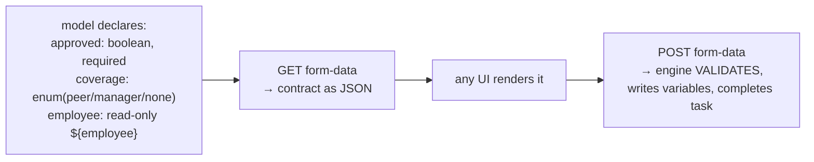

# Forms: form properties, form keys, external form apps

> **Motto** — The engine owns the *contract* of a form — fields, types, required,
> writable; who renders the pixels is a separate decision with three answers.

*Part of Phase 03 — User tasks, identity & forms.*

## The Problem

A task inbox without forms is a list of names: "Approve leave request" — approve
*what*, based on *which* data, answering *which* questions? Every user task implies a
small data contract: show these values, collect those answers, validate them, write
them as variables. Teams that skip modelling this contract end up with UI code that
knows secret variable names ("the frontend sets `apprvd`, stringly-typed") and
processes that break when a form field is renamed — the same drift the diagram was
supposed to prevent, reintroduced at the UI layer.

## The Concept

Three strategies, one axis: *where does the form definition live?*

| Strategy | Definition lives | Rendering | Use when |
| :-- | :-- | :-- | :-- |
| **Form properties** | in the model, on the task (`flowable:formProperty`) | yours — any client that reads the contract | small structured forms; API-first teams; this course |
| **Form key** | `flowable:formKey="kyc-review-v2"` — an opaque pointer | your form app resolves the key to its own screen | rich existing UI; the engine only stores which screen |
| **Flowable Form engine** | separate deployable `.form` JSON artifacts | Flowable's renderer or yours | Flowable Work / all-in platform setups |

Form properties are the instructive one because the *engine* enforces the contract:



Submitting through the form endpoint is the point: type checks, required checks, and
enum membership run **engine-side** before the task completes — the UI can't invent
`apprvd`, skip a mandatory answer, or send `coverage=cousin`. Read-only expression
properties (`expression="${employee}" writable="false"`) cover the "show context,
don't let them change it" half of every form.

The honest scope line: form properties handle flat, structured questions. Multi-step
wizards, conditional sections, file uploads — that's form-key territory, where the
engine stores *which* screen and your form app owns the rest. The failure mode to
avoid is the middle: half the contract in properties, half in UI code, drifting
independently.

## Use It

The model —
[`outputs/leave-request-form.bpmn20.xml`](../outputs/leave-request-form.bpmn20.xml) —
declares the contract on the task:

```xml
<userTask id="approve" name="Approve leave request"
    flowable:candidateGroups="managers">
  <extensionElements>
    <flowable:formProperty id="approved" name="Approve?" type="boolean" required="true"/>
    <flowable:formProperty id="coverage" name="Coverage arranged by" type="enum">
      <flowable:value id="peer" name="A peer"/>
      <flowable:value id="manager" name="The manager"/>
      <flowable:value id="none" name="Not needed"/>
    </flowable:formProperty>
    <flowable:formProperty id="employee" name="Employee" type="string"
        expression="${employee}" writable="false"/>
  </extensionElements>
</userTask>
```

[`code/form_client.py`](../code/form_client.py) deploys it, reads the contract, and
submits through the validating endpoint:

```
$ python3 form_client.py
the task asks for:
  approved (boolean, required)
  comment (string)
  coverage (enum) one of ['peer', 'manager', 'none']
  employee (string)
submitted; task gone: True
```

Change `"approved": "true"` to `"approved": "maybe"` and the submit fails
engine-side — the contract holding against a bad client is the demo's real payload.

## Ship It

This lesson ships both halves of the pattern:
[`leave-request-form.bpmn20.xml`](../outputs/leave-request-form.bpmn20.xml) (the
contract in the model) and [`form_client.py`](../code/form_client.py) (a contract-
driven client any UI team can crib from).

## Check Yourself

**Q1.** What does submitting via `POST /form/form-data` add over completing the task
with raw variables?

- A) nothing; it's an alias
- B) engine-side validation of the declared contract — types, required, enum membership — before completion
- C) it renders HTML
- D) it skips the task lifecycle

<details><summary>Answer</summary>B — the form endpoint is the enforced version of
the contract; raw completion trusts the client.</details>

**Q2.** `flowable:formKey="kyc-review-v2"` means the engine…

- A) renders screen v2
- B) stores an opaque pointer your form application resolves — the engine knows *which* form, not *what's on it*
- C) validates against form v2's fields
- D) rejects tasks without matching variables

<details><summary>Answer</summary>B — form keys delegate everything but the
reference. Contract enforcement becomes your form app's job.</details>

**Q3.** "Show the employee name, don't let the approver edit it" is modelled as…

- A) a comment in the form
- B) a form property with `expression="${employee}"` and `writable="false"`
- C) CSS
- D) a separate read-only task

<details><summary>Answer</summary>B — read-only expression properties are the
display half of the contract, and they keep even *context* out of UI-side variable
name guessing.</details>

**Challenge.** Add a `days` property (`type="long"`, required) and make the client
submit `days: "ten"` — observe the engine-side rejection. Then write the twenty-line
generic renderer: fetch any task's form-data and produce a text-mode form (prompt per
property, enum menus, skip read-only). That renderer working against *both* demo
tasks unmodified is the portability argument for contracts-in-the-model.

## Related

- Next: [Task queries & the inbox pattern](../../05-task-queries-and-inbox/docs/en.md)
- Previous: [Identity management](../../03-identity-management/docs/en.md)
