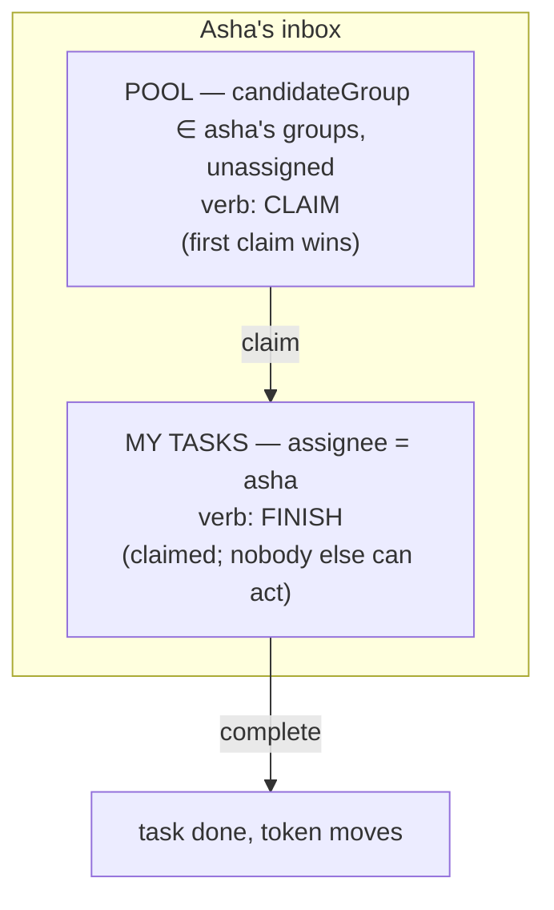

# Task queries & the task inbox pattern

> **Motto** — Every worklist UI is two queries wearing pixels: *my claimed tasks* plus
> *my groups' unclaimed pool* — get the two-list shape right and the rest is styling.

*Part of Phase 03 — User tasks, identity & forms. This is the phase's closing **Use
It** lesson.*

## The Problem

The phase so far gave you tasks with lifecycles, group pools, identity, and form
contracts. The user-facing question remains: *what does Asha see when she opens her
work screen?* Teams overthink this into "workflow portals" with saved searches and
seventeen filters — or underthink it into one flat list where claimed and unclaimed
work blur together, so analysts either hoard (claim everything, work none of it) or
collide (work unclaimed items without claiming — lesson 01's race, reintroduced by
the UI).

## The Concept

The inbox pattern is two lists with different verbs:



Rules the shape encodes:

1. **My-tasks first, always.** A claimed task blocks everyone else (lesson 01), so
   claimed-but-idle work is the most expensive kind. The UI ordering *is* the policy
   "finish what you claimed before taking more".
2. **The pool's verb is claim, not complete.** One click moves it to *my tasks*;
   completion happens there. UIs that offer complete-from-pool re-create the
   collision the lifecycle exists to prevent.
3. **Groups come from identity claims** (lesson 03) — the inbox never asks the
   engine who Asha is; it passes her groups in.
4. **Urgency = due date.** `dueDate` on the task (set in the model or at runtime)
   drives sort order and the OVERDUE flag; Phase 7's escalation timers fire off the
   same field. An inbox sorted by creation date instead of due date quietly
   optimises for staleness.

Query mechanics worth knowing before you need them: the REST query endpoint
(`POST /query/tasks`) supports pagination (`start`/`size` — inboxes over large pools
must page), sorting, and variable filters (`processVariables: [{name, operation,
value}]` — "show only applications above ₹10 lakh"). For dashboards that include
*finished* work, the same query shape exists against history
(`/query/historic-task-instances`) — runtime queries only ever see open tasks
(Phase 2's delete-on-complete rule).

## Use It

[`code/inbox_client.py`](../code/inbox_client.py) is the pattern as a CLI — the merge
de-duplicates tasks visible through several of the user's groups:

```python
def inbox(user, groups):
    mine = query({"assignee": user})
    pool = [t for g in groups for t in query({"candidateGroup": g, "unassigned": True})]
    seen, merged = set(), []                    # de-dupe across shared groups
    ...
```

Run it against whatever tasks your engine holds from earlier lessons:

```
$ python3 inbox_client.py asha credit-ops,mumbai-ops
== asha: my tasks (1) — finish these first
  [OVERDUE ] Manual credit review  (task 7512, instance 7501)
== pool for ['credit-ops', 'mumbai-ops'] (2) — claim to take one
  [due 07-25] Verify documents  (task 7688, instance 7640)
  [        ] Collect documents  (task 7710, instance 7699)
```

Pair it with lesson 02's `claim`/`complete` and lesson 04's form renderer and you
have a functioning ops console in ~200 lines of stdlib Python — which is the point:
the engine carries the state; clients stay thin.

## Ship It

This lesson ships [`code/inbox_client.py`](../code/inbox_client.py) — the two-query
inbox with de-dupe, due-date sort, and overdue flags; the capstone driver reuses it
to show pending work mid-run.

## Check Yourself

**Q1.** Why must the pool query filter `unassigned: true`?

- A) performance
- B) claimed tasks belong to one person — showing them in others' pools invites the collision claiming prevents
- C) the API requires it
- D) unassigned tasks have no candidate groups

<details><summary>Answer</summary>B — the pool is by definition the *claimable* set.
Without the filter, Ravi sees (and mentally queues) work Asha already owns.</details>

**Q2.** A task shows in Asha's inbox via both `credit-ops` and `mumbai-ops`. The
inbox should…

- A) show it twice — it's in two pools
- B) show it once — pools are views over one task table; the de-dupe reflects that there is one task
- C) show it under whichever group is alphabetically first
- D) error

<details><summary>Answer</summary>B — candidate groups are alternative routes to the
same row, not copies of it.</details>

**Q3.** Yesterday's completed reviews belong on a dashboard. Which query serves it?

- A) `/query/tasks` with `state: completed`
- B) the historic task query — runtime tables drop tasks at completion (Phase 2), so finished work lives in history
- C) `/runtime/tasks?includeCompleted=true`
- D) completed tasks are gone forever

<details><summary>Answer</summary>B — the runtime/history split from Phase 2 decides
which endpoint can even see the data.</details>

**Challenge.** Add `--variables amount>1000000` filtering to the client (the query
endpoint's `processVariables` operations), then add a `--summary` mode printing per-
group pool depth and oldest-item age — the two numbers an ops lead actually watches.
You've built the metrics feed Phase 9's dashboard lesson formalises.

## Related

- Phase README: [User tasks, identity & forms](../../README.md)
- Escalation on the same dueDate field: [Phase 7, lesson 01](../../../07-events-timers-and-messaging/01-timer-events/docs/en.md)
