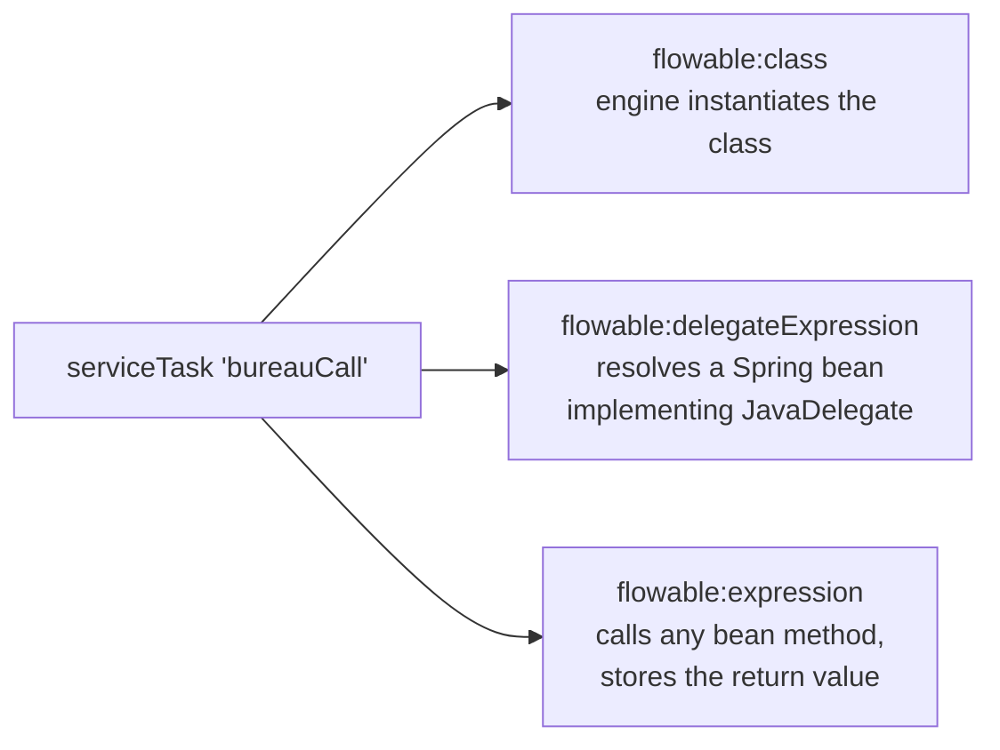

# Service tasks: delegates, expressions, delegate expressions

> **Motto** — A service task is a seam, not a place: the model names *what* happens,
> and one of three wiring styles decides *where* the code lives.

*Part of Phase 04 — Service integration & error handling. Concept reading:
[Principle 6 — separate the flow from the work](../../../../foundations/process-automation-principles.md).*

## The Problem

Phase 1's service tasks used inline expressions
(`${execution.setVariable('decision', ...)}`) — fine for demos, unacceptable for a
bureau call with authentication, timeouts, and logging. That logic belongs in real
classes in your codebase. The question every team then argues about: *how does a box in
the diagram find your Java code?* Flowable gives three answers, and choosing the wrong
one costs you testability or Spring injection.

## The Concept



| Wiring | Gets Spring injection? | Needs JavaDelegate? | Use when |
| :-- | :-- | :-- | :-- |
| `flowable:class` | no — engine calls `new` | yes | plain-engine (non-Spring) setups, simple stateless glue |
| `flowable:delegateExpression` | **yes** — it *is* a bean | yes | the default in Spring Boot apps |
| `flowable:expression` | yes | **no** — any method | wrapping existing services untouched: `${bureauGateway.score(pan)}` |

Whichever style you choose, two contracts hold:

1. **The delegate runs inside the engine's transaction** (Phase 2, lesson 03). Throw,
   and the segment rolls back; mark the task async and the throw becomes a retrying
   job instead.
2. **Failures come in two kinds, and the *type* you throw decides the routing.** A
   `BpmnError` is a *business* outcome the diagram should show (no bureau record →
   reject path) — it's caught by error boundary events (lesson 04). Any other
   exception is a *technical* failure — rollback and retry (lesson 05). Mixing these
   up is the single most common Flowable design bug.

## Use It

All three styles side by side in
[`code/Delegates.java`](../code/Delegates.java). The Spring-bean style you'll use most:

```java
@Component("bureauDelegate")
public static class SpringBureauDelegate implements JavaDelegate {
    private final BureauGateway gateway;

    public SpringBureauDelegate(BureauGateway gateway) {
        this.gateway = gateway;
    }

    @Override
    public void execute(DelegateExecution execution) {
        execution.setVariable("score",
                gateway.score((String) execution.getVariable("pan")));
    }
}
```

wired as `<serviceTask id="bureauCall" flowable:delegateExpression="${bureauDelegate}"/>`.
And the business-vs-technical failure contract, in code:

```java
if (score == -1) {
    throw new BpmnError("NO_BUREAU_RECORD", "PAN has no bureau file");  // route on it
}
// bureau down? just let the IOException/RuntimeException fly -> rollback + retry
```

Testing is the quiet win of the expression style: `${bureauGateway.score(pan)}` calls
a plain method — your existing unit tests already cover it, and the process test only
has to assert the wiring.

## Ship It

This lesson ships [`code/Delegates.java`](../code/Delegates.java) — a reference file
showing all three wirings with the failure contract annotated, ready to copy into a
Spring Boot service alongside Phase 2's starter.

## Check Yourself

**Q1.** Your delegate needs a repository injected. Which wiring?

- A) `flowable:class` — add a setter
- B) `flowable:delegateExpression` — the delegate is a Spring bean with normal injection
- C) `flowable:expression` on a static method
- D) any; injection always works

<details><summary>Answer</summary>B — `flowable:class` bypasses Spring entirely (the
engine calls `new`), so nothing is injected. Delegate-expression resolves a managed
bean.</details>

**Q2.** The bureau returns "no record exists for this PAN". You should…

- A) throw `RuntimeException` so the job retries
- B) return normally and hope a gateway checks
- C) throw `BpmnError("NO_BUREAU_RECORD")` so the model routes it explicitly
- D) log and continue

<details><summary>Answer</summary>C — "no record" is a business outcome, not a
malfunction; retrying won't change it. It belongs on the diagram as an error boundary
path.</details>

**Q3.** A delegate writes a variable, then throws a plain exception. The variable is…

- A) saved — writes are immediate
- B) rolled back with the rest of the transaction segment
- C) saved only if the task was async
- D) moved to history

<details><summary>Answer</summary>B — Phase 2's rules apply: the delegate runs inside
the segment's transaction, and everything in it rolls back together.</details>

**Challenge.** Wrap an existing class you own with the expression style — no
JavaDelegate, no engine imports — and write down what you'd lose versus a delegate
(access to `DelegateExecution`, local variables, BpmnError codes). That trade-off is
the real decision between styles 2 and 3.

## Related

- Next: [The HTTP task](../../02-http-task/docs/en.md)
- Failure routing: [BPMN errors vs technical errors](../../03-bpmn-errors-vs-technical/docs/en.md)
