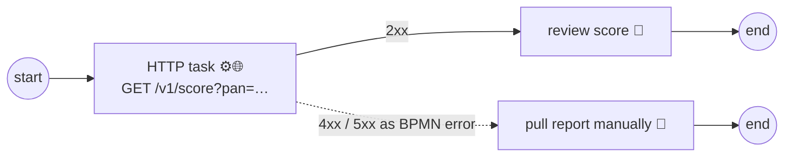

# The HTTP task: calling REST APIs from a process

> **Motto** — Most integrations are one HTTP call; the HTTP task lets the model make it
> declaratively — URL, headers, timeout, and failure routing all visible in the diagram.

*Part of Phase 04 — Service integration & error handling.*

## The Problem

Writing a JavaDelegate for every REST call means a Java class, a deployment, and a code
review for what is essentially configuration: method, URL, headers, timeout. On a
standalone engine (Phase 1's Docker container) you can't even ship delegates without
building a custom image. For plain request/response integrations you want the call *in
the model* — versioned with it, reviewable next to the flow it serves, deployable to a
stock engine.

## The Concept

Setting `flowable:type="http"` on a service task swaps its behaviour for a built-in
HTTP client configured by fields:



The fields that matter, and what each buys you:

| Field | Role |
| :-- | :-- |
| `requestMethod`, `requestUrl`, `requestHeaders`, `requestBody` | the call itself; `${var}` expressions everywhere |
| `requestTimeout` | never let a slow API hold the transaction hostage |
| `resultVariablePrefix` + `saveResponseParameters` | response status/headers/body land as process variables (`bureauResponseStatusCode`, `bureauResponseBody`) |
| `failStatusCodes` / `handleStatusCodes` | which statuses count as failure, and turn them into **catchable BPMN errors** instead of raw exceptions |

That last row is the bridge to the rest of this phase: with `failStatusCodes` set, a
404 from the bureau isn't a stack trace in a log — it's an error event the diagram
routes, exactly like a delegate throwing `BpmnError` (lesson 01). And Phase 2 still
applies unchanged: mark the HTTP task `flowable:async="true"` and slow/flaky calls
retry via the job executor instead of failing the caller's transaction.

When *not* to use it: anything needing OAuth token refresh dances, response parsing
beyond "grab the JSON", idempotency keys, or circuit breakers. That logic belongs in a
delegate or a dedicated gateway service — the HTTP task is for calls that are truly
just calls.

## Use It

The full model is [`outputs/bureau-check.bpmn20.xml`](../outputs/bureau-check.bpmn20.xml) —
deployable to the stock `flowable/flowable-rest` container with zero custom code. Its
core:

```xml
<serviceTask id="fetchScore" name="Fetch bureau score" flowable:type="http">
  <extensionElements>
    <flowable:field name="requestUrl">
      <flowable:expression><![CDATA[https://bureau.example.com/v1/score?pan=${pan}]]></flowable:expression>
    </flowable:field>
    <flowable:field name="requestTimeout">
      <flowable:string><![CDATA[5000]]></flowable:string>
    </flowable:field>
    <flowable:field name="resultVariablePrefix">
      <flowable:string><![CDATA[bureau]]></flowable:string>
    </flowable:field>
    <flowable:field name="failStatusCodes">
      <flowable:string><![CDATA[400, 404, 5XX]]></flowable:string>
    </flowable:field>
  </extensionElements>
</serviceTask>

<boundaryEvent id="bureauFailed" attachedToRef="fetchScore">
  <errorEventDefinition errorRef="HTTP_FAULT"/>
</boundaryEvent>
```

Deploy and drive it with Phase 1's client
([`flowable_client.py`](../../../01-bpmn-and-the-token-model/04-run-it-on-flowable/outputs/flowable_client.py)):
start an instance with a `pan` variable, and — since `bureau.example.com` doesn't
exist — watch the failure path do its job: the boundary event fires and the instance
parks at *Pull bureau report manually* instead of dying. Integration failure as a
designed path, not an incident.

## Ship It

This lesson ships
[`outputs/bureau-check.bpmn20.xml`](../outputs/bureau-check.bpmn20.xml) — a reusable
HTTP-integration pattern: call + timeout + response variables + failure routed to a
human fallback. The capstone's bureau step reuses it.

## Check Yourself

**Q1.** Without `failStatusCodes`, a 500 from the API causes…

- A) the error boundary to fire
- B) a technical exception — rollback, and job retries if the task is async
- C) the response to be stored with status 500
- D) the instance to complete

<details><summary>Answer</summary>B — by default non-2xx is a technical failure like
any thrown exception. `failStatusCodes` (+ handling) is what promotes chosen statuses
to catchable BPMN errors.</details>

**Q2.** Where does the response body end up with `resultVariablePrefix` = `bureau`?

- A) discarded
- B) in `bureauResponseBody` (plus status/headers variables) on the instance
- C) in the history tables only
- D) in a file

<details><summary>Answer</summary>B — the prefix + `saveResponseParameters` maps the
whole response into process variables the next tasks can read.</details>

**Q3.** The bureau call needs an OAuth refresh flow and a circuit breaker. Best home?

- A) more HTTP-task fields
- B) a script task
- C) a delegate (or a gateway service the HTTP task calls internally)
- D) the process can't do this

<details><summary>Answer</summary>C — the HTTP task is deliberately dumb. Protocol
logic belongs in code; keep the task for calls that are just calls.</details>

**Challenge.** Point `requestUrl` at a real public API (e.g. a status endpoint you
trust), deploy to your local engine, and run it twice: once against the real URL, once
against a garbage domain. Diff the two instances' variables and history — you should
see the happy path store `bureauResponseStatusCode=200` and the failure path route
through `bureauFailed` without a single line of code.

## Related

- Next: [BPMN errors vs technical errors](../../03-bpmn-errors-vs-technical/docs/en.md)
- Previous: [Service tasks & delegates](../../01-service-tasks-and-delegates/docs/en.md)
