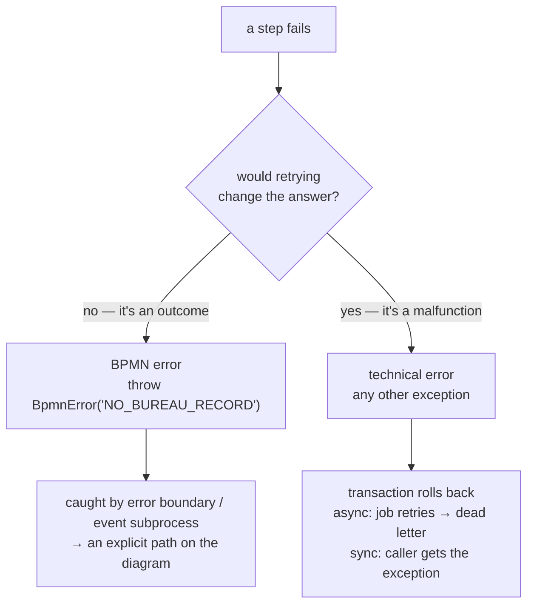

# BPMN errors vs technical errors: two failure planes

> **Motto** — Ask one question of every failure: *would retrying change the answer?*
> No → it's a business outcome, model it. Yes → it's a technical fault, retry it.

*Part of Phase 04 — Service integration & error handling. Concept lesson — no code
required.*

## The Problem

The bureau call fails. But "fails" is two completely different situations wearing one
word: **"this PAN has no bureau file"** (a fact about the applicant — calling again
won't conjure a file) and **"connection timed out"** (a fact about infrastructure —
calling again in a minute may well succeed). Handle the first with retries and you loop
pointlessly against a correct answer; handle the second by routing to a rejection path
and you decline loans because a router hiccuped. Most workflow incidents in production
trace back to these two planes being confused at design time.

## The Concept

| | BPMN error | Technical error |
| :-- | :-- | :-- |
| What it means | a *business outcome* off the happy path | infrastructure/code malfunction |
| Raised by | `throw new BpmnError("CODE")`, error end event, HTTP task `failStatusCodes` | any other exception |
| Who sees it | **the diagram** — error boundary events, error event subprocesses | **operations** — retries, then the dead-letter table (Phase 2, lesson 04) |
| Transaction | token *moves* along the error flow (state advances, commits) | segment **rolls back**; no token movement |
| Retried? | never — it's an answer, not a fault | yes, if async (default 3×) |
| If uncaught | instance **fails** — an uncaught BpmnError is a modelling bug | dead-letter job / propagated exception |
| Examples | no bureau record, KYC mismatch, offer declined, limit exceeded | timeout, 502, `NullPointerException`, DB down |

Three design consequences:

1. **Error codes are part of your process's API.** `NO_BUREAU_RECORD`,
   `KYC_MISMATCH`, `LIMIT_EXCEEDED` — a small, named, documented set. Boundary events
   subscribe by code; catch-all boundaries (no code) are the `except Exception` of
   BPMN — legitimate as a last line, lazy as a first.
2. **Business people review business failures.** Because BPMN errors are on the
   diagram, "what happens when KYC fails?" is answered by pointing, not by reading
   Java. That's the reason to be disciplined about the split — it keeps the diagram
   honest (Principle 2).
3. **Technical failures are invisible in the model — deliberately.** The diagram
   would drown if every timeout appeared on it. The engine's contract is: rollback,
   retry, dead-letter. Your job is monitoring that pipeline (lesson 05), not drawing
   it.

The grey zone: *"bureau is down and ops wants a manual fallback after 3 failed
attempts."* That's a technical failure that **becomes** a business decision after
persistence. The pattern: let retries exhaust, and use the dead-letter handler (or
`handleTaskFailureAsBpmnError` on HTTP tasks) to convert the final failure into a BPMN
error the model routes. Escalation is then visible in the diagram, while transient
blips stay out of it.

## Ship It

This lesson ships
[`outputs/failure-planes-cheatsheet.md`](../outputs/failure-planes-cheatsheet.md) —
the decision table plus a review checklist for delegate code and models.

## Check Yourself

**Q1.** A delegate throws `BpmnError("LIMIT_EXCEEDED")` but no boundary event or event
subprocess catches it anywhere up the scope chain. The instance…

- A) retries the task
- B) fails — an uncaught BPMN error is a modelling bug, not a retryable fault
- C) completes normally
- D) dead-letters the job

Answer
B — BPMN errors are never retried and don't
dead-letter; uncaught means the model has a hole. Ship a catch-all boundary or fix the
model.

**Q2.** The KYC service returns "documents don't match". The delegate should…

- A) throw `RuntimeException` so it retries
- B) throw `BpmnError("KYC_MISMATCH")` so the model routes to the re-submission path
- C) set a variable and return, hoping a gateway checks it
- D) log a warning

Answer
B — a mismatch is an outcome; retrying re-asks a
settled question. (C *works* but hides the failure semantics — error events exist so
outcomes off the happy path are first-class.)

**Q3.** Which failure appears on the BPMN diagram?

- A) a 30-second bureau timeout
- B) `NullPointerException` in a delegate
- C) "applicant has no bureau record"
- D) database connection pool exhausted

Answer
C — only business outcomes get drawn. A, B, D are
the job executor's problem and monitoring's problem.

**Challenge.** Audit one real integration you own. List every way it fails; tag each
*outcome* or *malfunction*; then check the code — how many outcomes are currently
thrown as generic exceptions (and therefore pointlessly retried)? That list is your
error-code catalogue for the boundary events you'll build next lesson.

## Related

- Next: [Boundary events](../../04-boundary-events/docs/en.md) — build the catching side
- The retry pipeline: [Phase 2, lesson 04](../../../02-the-engine-state-and-transactions/04-job-executor/docs/en.md)
