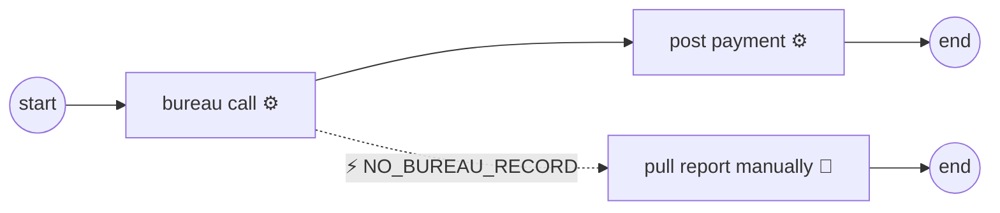

# Boundary events: catching errors on an activity

> **Motto** — A boundary event is a listener pinned to a box: while the activity runs,
> it waits; when its error fires, the token abandons the box and takes the boundary's
> path instead.

*Part of Phase 04 — Service integration & error handling. Concept reading:
[lesson 03 — two failure planes](../../03-bpmn-errors-vs-technical/docs/en.md).*

## The Problem

Lesson 03 established the contract: business failures are `BpmnError`s the model
routes. But *how* does a diagram say "if the bureau call raises `NO_BUREAU_RECORD`, go
to manual pull instead"? You can't draw a sequence flow out of a failure — flows leave
completed activities. You need a construct that sits *on* an activity, subscribes to a
failure, and owns its own outgoing path. That's the boundary event, and once you've
built its dispatch logic by hand, the XML is obvious.

## The Concept



Execution semantics, precisely:

1. The token enters `bureau call`. The boundary event is now *armed*.
2. The activity completes normally → boundary disarms, token takes the normal flow.
3. The activity raises `NO_BUREAU_RECORD` → the activity is **aborted** (an
   interrupting boundary), and the token continues from the boundary event's outgoing
   flow. This is *token movement*, not rollback: the error path commits like any
   other progress.
4. Matching is **by error code, innermost scope first**: a boundary with the exact
   code beats a catch-all (no code) boundary; if the activity has no catcher, the
   engine walks outward — enclosing subprocess boundaries, then error event
   subprocesses — and only an error uncaught *everywhere* kills the instance.

Boundary events aren't only for errors — the same pin-on-a-box shape carries timers
("escalate if this task sits 4 hours" — Phase 7) and messages ("cancel if the customer
withdraws"). Error boundaries are the ones you'll write first and most.

## Build It

[`code/error_boundary.py`](../code/error_boundary.py) adds a `boundaries` table to the
process — `activity → {error_code: target}` — and one dispatch function. The heart:

```python
def execute(inst, node):
    try:
        if node.kind == "service" and node.handler:
            node.handler(inst.variables)
    except BpmnError as e:                            # business plane: route it
        catcher = inst.process.catcher_for(node.name, e.code)
        if catcher is None:
            inst.incident = f"uncaught BpmnError {e.code} at {node.name} (modelling bug)"
            return None
        inst.variables["errorCode"] = e.code
        return catcher                                # token MOVES to the boundary path
    except Exception as e:                            # technical plane: don't route
        inst.incident = f"technical failure at {node.name}: {e}"
        return None                                   # real engine: rollback + retry
    return inst.process.next_of(node.name)[0]
```

The demo runs all four cases from lesson 03's table:

```
$ python3 error_boundary.py
happy path  -> complete
BpmnError   -> waiting at ['manual'] | errorCode = NO_BUREAU_RECORD
technical   -> incident: technical failure at bureau: bureau timed out
uncaught    -> incident: uncaught BpmnError LIMIT_EXCEEDED at bureau (modelling bug)
```

Note the asymmetry you built: the `BpmnError` case *advanced state* (token now waits
at a user task); the technical case *froze* it (a real engine rolls back and retries).
One `except` clause each — but opposite directions.

## Use It

The same catch in BPMN XML — you already deployed one in
[lesson 02's model](../../02-http-task/outputs/bureau-check.bpmn20.xml):

```xml
<serviceTask id="bureau" flowable:delegateExpression="${bureauDelegate}"/>

<boundaryEvent id="noRecord" attachedToRef="bureau">
  <errorEventDefinition errorRef="NO_BUREAU_RECORD"/>
</boundaryEvent>
<sequenceFlow sourceRef="noRecord" targetRef="manualPull"/>
```

A catch-all is the same element with no `errorRef`. For "any of these five tasks can
raise `KYC_MISMATCH`", don't pin five boundaries — wrap the tasks in a subprocess and
pin one boundary on it, or use an **error event subprocess** inside the scope; that's
the outward-walking scope chain from the Concept working for you.

## Ship It

This lesson ships the boundary-aware engine as a module:
[`code/error_boundary.py`](../code/error_boundary.py) — the toy lineage's final form:
tokens (1.01), gateways (1.02), persistence (2.01), jobs (2.04), and now failure
routing.

## Check Yourself

**Q1.** An interrupting error boundary fires on a service task. The task's normal
outgoing flow…

- A) also executes, in parallel
- B) is never taken — the activity aborted; the token continues from the boundary event
- C) executes after the boundary path completes
- D) causes a deadlock

<details><summary>Answer</summary>B — "interrupting" means the activity is dead; the
boundary path replaces its continuation entirely.</details>

**Q2.** A task can raise `KYC_MISMATCH`, and both a `KYC_MISMATCH` boundary and a
catch-all boundary sit on it. Which fires?

- A) both
- B) the catch-all — it's more general
- C) the named one — exact code beats catch-all
- D) whichever is defined first in the XML

<details><summary>Answer</summary>C — matching is most-specific-first, then outward
through enclosing scopes. Catch-alls are the last resort at each level.</details>

**Q3.** In the Build It engine, why does the technical-failure branch return `None`
instead of a boundary target?

- A) an oversight
- B) technical failures must not advance state — the real engine rolls back and retries; routing is reserved for business outcomes
- C) Python can't route exceptions
- D) to make the demo shorter

<details><summary>Answer</summary>B — this is lesson 03's whole point encoded in the
dispatch: the two planes leave `execute` in opposite directions.</details>

**Challenge.** Add *non-interrupting* boundaries to the toy engine: the boundary path
spawns an **extra** token while the activity keeps running (you'll need the gateway
lesson's multi-token handling). Then explain why error boundaries are always
interrupting but timer boundaries come in both flavours — what would a
non-interrupting error even mean?

## Related

- Next: [Retries & incident handling](../../05-retries-and-incidents/docs/en.md)
- Previous: [BPMN errors vs technical errors](../../03-bpmn-errors-vs-technical/docs/en.md)
