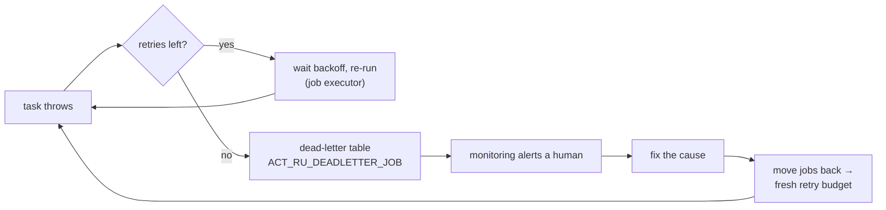

# Retries & incident handling: what happens when a bureau call fails

> **Motto** — Retries buy you time, not correctness: after the last retry a failed job
> goes silent in the dead-letter table, and your incident process is whatever you built
> to watch it.

*Part of Phase 04 — Service integration & error handling. Builds directly on
[Phase 2, lesson 04 — the job executor](../../../02-the-engine-state-and-transactions/04-job-executor/docs/en.md).*

## The Problem

Month-end, 22:40. The bureau starts returning 502s. Two hundred loan applications hit
their async `bureauCall` task; each fails, retries three times over a few minutes —
still 502 — and dead-letters. At 23:05 the bureau recovers. Nothing happens. The two
hundred instances sit frozen, invisible to customers ("my application just says
processing"), invisible to the diagram (technical failures don't appear there —
lesson 03), invisible to everyone except a table nobody is watching. The engine did
exactly what it promised. The gap is operational, and this lesson closes it.

## The Concept

The failure pipeline for an async task, end to end:



Your three levers, and where each is set:

1. **The retry policy** — per task in the model:
   `flowable:failedJobRetryTimeCycle="R5/PT10M"` (5 attempts, 10 minutes apart).
   Defaults (3 tries, immediate-ish) are almost never what a flaky third party needs;
   an external call without an explicit cycle is a model-review flag. Match the cycle
   to the dependency: a bureau that has 15-minute blips deserves `R6/PT15M`, not three
   instant retries that all land inside the same outage.
2. **The dead-letter watch** — a monitor on the dead-letter count (Phase 9 wires it
   properly). The count's normal value is zero; anything else pages someone. Without
   this, every lever downstream is decoration.
3. **The revive loop** — after the cause is fixed, move the jobs back
   (`action: move`); they re-enter the executable queue with a fresh budget. Because
   the failed transaction rolled back, re-running is safe *if the task is idempotent* —
   which you guaranteed when you made it async (Phase 2's payment-safety checklist).

The escalation pattern from lesson 03 completes the picture: where ops wants a
*modelled* fallback instead of a frozen instance ("after retries exhaust, route to
manual processing"), convert the terminal failure into a BPMN error the diagram
catches. Transient blips stay invisible; persistent failure becomes a drawn, staffed
path.

## Use It

[`code/incident_client.py`](../code/incident_client.py) is the ops loop as a script —
stdlib only, same auth as Phase 1's client. Triage groups the table by root cause so
two hundred identical 502s read as one line, not two hundred:

```
$ python3 incident_client.py
200 dead-letter job(s), 2 distinct cause(s):

  199 x org.flowable.common.engine.api.FlowableException: HTTP 502 from bureau
        e.g. job 5821  instance 5760  element bureauCall

    1 x java.lang.NullPointerException
        e.g. job 5900  instance 5872  element notifyTask

fix the cause, then revive with: python3 incident_client.py retry-all
```

— and the revive half is one call per job:

```python
def revive(job_id):
    """Move the job back to the executable table; the executor picks it up
    with a fresh retry budget. Only do this AFTER fixing the cause."""
    call("POST", f"/management/deadletter-jobs/{job_id}", {"action": "move"})
```

Note what the triage output *separates*: 199 jobs share a cause that recovery will fix
(revive them all), while the lone NPE is a code bug — reviving it without a fix just
buys another lap through the retry loop. Group-by-cause is the difference between an
incident and a mystery.

## Ship It

This lesson ships
[`outputs/incident_client.py`](../outputs/incident_client.py) — triage +
revive for the dead-letter table. The capstone's failure drill uses it verbatim, and
Phase 9 turns its counts into alerts.

## Check Yourself

**Q1.** `flowable:failedJobRetryTimeCycle="R5/PT10M"` means…

- A) 5 retries, 10 minutes total
- B) 5 attempts spaced 10 minutes apart
- C) retry every 5 minutes for 10 cycles
- D) 10 retries in 5 minutes

<details><summary>Answer</summary>B — ISO-8601 repetition: R⟨count⟩/⟨interval⟩. Size
the interval to outlive the dependency's typical outage.</details>

**Q2.** Reviving a dead-letter job is safe when…

- A) always — the engine handles it
- B) the underlying cause is fixed and the task is idempotent (its failed attempts rolled back but external effects may have fired)
- C) the instance is suspended first
- D) never; dead letters are terminal

<details><summary>Answer</summary>B — `move` re-runs the task from its last committed
state. Rollback undid engine state, not external calls — idempotency (Phase 2) is
what makes the re-run safe.</details>

**Q3.** Why does triage group dead letters by stack-trace first line?

- A) the API requires it
- B) an incident is usually one cause hitting many instances — grouping turns 200 rows into the 2 decisions actually needed
- C) to save bandwidth
- D) sorting is prettier

<details><summary>Answer</summary>B — the operational question is "what broke and can
I revive in bulk", not "what is job 5821's story".</details>

**Challenge.** Extend the client with `retry --cause "HTTP 502"`: revive only jobs
whose stack trace matches, leaving genuine bugs dead. Then add a `--watch` mode that
polls the count every 60 s and prints only on change — you've written the minimum
viable dead-letter monitor, one webhook short of Phase 9's alerting.

## Related

- Next: [Compensation](../../06-compensation/docs/en.md)
- The executor you're operating: [Phase 2, lesson 04](../../../02-the-engine-state-and-transactions/04-job-executor/docs/en.md)
