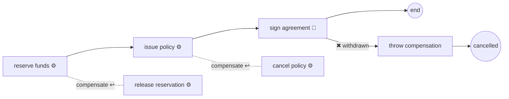

# Compensation: undoing completed work

> **Motto** — You can't roll back what already committed; you can only run another
> action that puts the world right — and compensation is modelling that action next to
> the work it undoes.

*Part of Phase 04 — Service integration & error handling. Concept lesson — no code
required.*

## The Problem

Loan disbursal, three committed steps in: funds reserved at the treasury, insurance
policy issued, and then the e-agreement step discovers the applicant withdrew.
Transactions can't help — each step committed long ago, across three external systems
that have no common rollback. But the business absolutely has an answer: *release the
reservation, cancel the policy*. Every mature operations team has these "undo
procedures"; the question is whether they live in a wiki (executed by hand, at 2 a.m.,
sometimes) or in the model (executed by the engine, in order, always).

## The Concept

Compensation is the saga pattern with a diagram. Each step that changes the world gets
a **compensation handler** — its undo action — attached like a boundary event. If the
process later throws a compensation event, the engine runs the handlers of *completed*
activities, in reverse order:

The rules that make it predictable:

1. **Only completed activities compensate.** If `issue policy` never ran, its handler
   never runs. The engine tracks what finished — the wiki procedure can't.
2. **Reverse order.** Undo happens newest-first, mirroring how the state was built
   (policy cancelled before the reservation that preceded it is released).
3. **Handlers are ordinary tasks** — usually service tasks calling your "cancel"
   APIs, occasionally user tasks ("manually reverse the ledger entry"). They can fail
   like any task, so lesson 05's retry/dead-letter pipeline applies to the *undo* too.
4. **Triggering is explicit.** A compensation throw event (often on the path out of an
   error boundary or a cancellation message) starts the unwind. Nothing compensates
   automatically just because something failed — you draw the decision.

When to reach for it — and when not:

| Situation | Answer |
| :-- | :-- |
| Multi-step external effects, later steps can abort the whole (booking, issuing, reserving) | **compensation** — this is the designed use |
| Failure within one transaction segment | plain rollback already covers it (Phase 2) |
| The "undo" is really a business process (refund approval, clawback with maker-checker) | model it as a normal subprocess — compensation handlers should be mechanical undos, not workflows |
| Only the last step ever fails | consider just reordering: do the risky step first |

The honest cost: compensable processes are roughly twice the modelling and testing
surface (every do has an undo, and undo paths need tests too). Use compensation where
the *sequence of external commitments* genuinely demands unwind — not as decoration on
every service task.

## Ship It

This lesson ships
[`outputs/compensation-patterns.md`](../outputs/compensation-patterns.md) — the
pattern card: XML skeleton, the four rules, and a checklist for deciding whether a
step needs a handler.

## Check Yourself

**Q1.** Compensation is thrown after steps A and B completed and C failed. Which
handlers run, in what order?

- A) A's, then B's
- B) B's, then A's — completed activities only, reverse order
- C) A's, B's and C's
- D) C's only

Answer
B — C never completed so it has nothing to undo;
the others unwind newest-first.

**Q2.** A compensation handler calling the treasury's release API times out. What
happens?

- A) the engine gives up on compensation
- B) the original activity re-runs
- C) it's a technical failure like any other — retries, then dead letter (lesson 05)
- D) the instance completes anyway

Answer
C — handlers are ordinary tasks on the ordinary
failure pipeline. Your undo paths need the same async/idempotency care as the do
paths.

**Q3.** "Customer withdrew, so refund the processing fee — refunds need a
maker-checker approval." Model the refund as…

- A) a compensation handler on the fee-collection task
- B) a normal subprocess on the withdrawal path — it's a business process, not a mechanical undo
- C) a script task
- D) manual ops work outside the engine

Answer
B — compensation handlers should be automatic
reversals. Anything with its own approvals, waits, and decisions is a process and
deserves to be modelled as one.

**Challenge.** Take the capstone's disbursal sequence (reserve → issue policy →
disburse) and write its compensation table: for each step, the undo API, whether the
undo is idempotent, and what happens if the undo itself dead-letters. That table *is*
the hard part of compensation — the XML is twenty minutes.

## Related

- Phase README: [Service integration & error handling](../../README.md)
- The failure pipeline handlers run on: [Retries & incidents](../../05-retries-and-incidents/docs/en.md)
