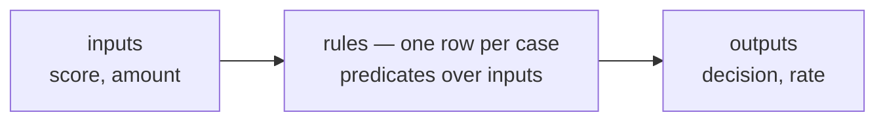

# A decision engine in 80 lines: rules, inputs, outputs

> **Motto** — A business rule is a row, not an `if`: make policy data instead of code
> and the people who own the policy can finally read it.

*Part of Phase 05 — DMN: decisions as tables. Concept reading:
[Principle 7 — decisions are not processes](../../../../foundations/process-automation-principles.md).*

## The Problem

Since Phase 1, the loan triage has decided approvals with `${score >= 700}` on a
gateway. Real credit policy is never one number: it's score bands crossed with ticket
sizes, employment types, product variants — and it changes every quarter, decided by a
credit committee that does not read Java or BPMN condition expressions. Today that
policy is smeared across gateway conditions and service-layer `if`s; the committee's
latest circular becomes a Jira ticket, a sprint, and a deploy. The fix is a change of
*representation*: policy as a table.

## The Concept

A decision table has three parts, and its engine is almost embarrassingly small:



| Score | Amount | → Decision | → Rate |
| :-- | :-- | :-- | :-- |
| ≥ 750 | ≤ 10,00,000 | auto-approve | 10.5 |
| ≥ 700 | ≤ 5,00,000 | auto-approve | 11.5 |
| ≥ 650 | – (any) | manual-review | 13.0 |
| < 650 | – | decline | – |

Evaluation is: find the rows whose every cell matches the input context; return their
outputs. That's it. What the table representation buys over equivalent code:

1. **Reviewability** — the *entire* policy is visible at once, in the domain's own
   vocabulary. A credit head can audit row 3 without an engineer in the room.
2. **Queryability** — "which combinations can ever auto-approve?" is a filter over
   rows, not archaeology through call sites.
3. **Independent change cadence** — a table deploys on the committee's schedule; the
   process and code deploy on engineering's (that split is lesson 04's whole topic).

The dashes matter: `-` ("any value") is what keeps tables compact, and *overlapping
rows* are what make the next lesson necessary — with score 780 / amount 4 lakh, rows 1
**and** 2 both match. Which wins is not obvious — it's a declared policy called the
**hit policy**, and guessing it wrong is the classic DMN production bug.

## Build It

[`code/decision_engine.py`](../code/decision_engine.py) — the core is one dataclass
and one method:

```python
@dataclass
class DecisionTable:
    key: str
    inputs: list     # input variable names, in column order
    rules: list      # ordered Rule rows

    def matches(self, rule, context):
        return all(
            pred is None or pred(context[name])
            for name, pred in zip(self.inputs, rule.when)
        )

    def evaluate(self, context):
        for rule in self.rules:          # FIRST hit policy, for now
            if self.matches(rule, context):
                return dict(rule.then)
        return None                      # no rule fired: the caller must decide
```

Run it:

```
$ python3 decision_engine.py
score=780 amount=  800,000 -> {'decision': 'auto-approve', 'rate': 10.5}
score=720 amount=  800,000 -> {'decision': 'manual-review', 'rate': 13.0}
score=660 amount=  200,000 -> {'decision': 'manual-review', 'rate': 13.0}
score=610 amount=  100,000 -> {'decision': 'decline', 'rate': None}
```

Note the second case: score 720 *feels* approvable, but the ₹8 lakh ticket exceeds row
2's cap and falls through to manual review — exactly the kind of interaction between
columns that a lone `${score >= 700}` gateway condition silently gets wrong.

And note `evaluate` returning `None` when nothing matches: an incomplete table is a
*policy hole*. Whether that's an error or a designed fall-through is, again, a hit
policy question.

## Use It

In Flowable the same table is a deployable artifact (`.dmn` XML — lesson 03) evaluated
by a dedicated DMN engine, callable from a process:

```xml
<serviceTask id="decide" flowable:type="dmn">
  <extensionElements>
    <flowable:field name="decisionTableReferenceKey">
      <flowable:string><![CDATA[creditDecision]]></flowable:string>
    </flowable:field>
  </extensionElements>
</serviceTask>
```

The task reads process variables (`score`, `amount`), evaluates the table, and writes
the outputs (`decision`, `rate`) back as variables for the next gateway to route on.
The gateway keeps only *routing* (`${decision == 'auto-approve'}`); the *policy* lives
in the table.

## Ship It

This lesson ships [`code/decision_engine.py`](../code/decision_engine.py) — the toy
DMN core that lesson 02 extends with the full hit-policy family.

## Check Yourself

**Q1.** What's the essential difference between a decision table and a chain of `if`s?

- A) tables are faster
- B) tables are data — reviewable as a whole, queryable, and changeable on the business's cadence
- C) tables can't express ranges
- D) nothing; it's syntax

<details><summary>Answer</summary>B — the logic is equivalent; the *representation*
is the product. Policy-as-data is what lets non-engineers own it.</details>

**Q2.** Score 780, amount 4,00,000: rows 1 and 2 both match. What decides the result?

- A) the row with more specific cells
- B) the engine averages the outputs
- C) the table's declared hit policy (lesson 02)
- D) it's always an error

<details><summary>Answer</summary>C — overlap resolution is a declared policy, not a
convention. UNIQUE makes it an error; FIRST makes row order load-bearing.</details>

**Q3.** `evaluate` returns `None` (no rule matched). In a credit table this most
likely means…

- A) the applicant is approved by default
- B) a policy hole — a combination the committee never specified; it should surface loudly, not default silently
- C) the engine is broken
- D) the inputs were wrong types

<details><summary>Answer</summary>B — incomplete tables are the second classic DMN
bug (after wrong hit policy). Completeness is checkable precisely because the policy
is data.</details>

**Challenge.** Add a third input column `employment` (`"salaried"`/`"self-employed"`)
to `CREDIT` with a stricter amount cap for self-employed applicants, and write a
ten-line completeness checker: generate the cross product of representative values
and report every combination where `evaluate` returns `None`.

## Related

- Next: [Hit policies](../../02-hit-policies/docs/en.md)
- Concept: [Principle 7](../../../../foundations/process-automation-principles.md)
