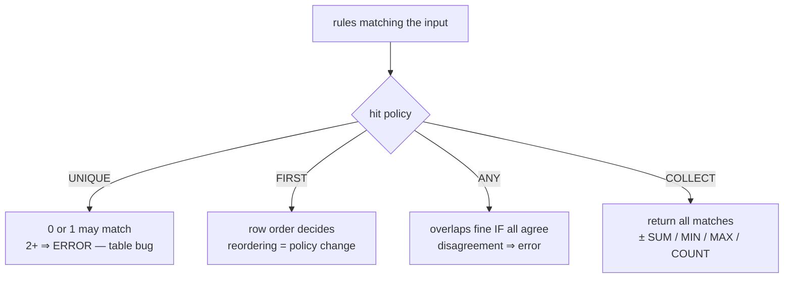

# Hit policies: FIRST, UNIQUE, COLLECT and why they matter

> **Motto** — The hit policy is the table's contract about overlap: UNIQUE makes
> overlaps a caught bug, FIRST makes them silent policy — choose like it matters,
> because it does.

*Part of Phase 05 — DMN: decisions as tables.*

## The Problem

Lesson 01 ended on a cliff: score 780, amount ₹4 lakh, two rows match. Multiply that by
a real table — forty rows, five input columns, edited quarterly by three different
analysts — and overlaps are not an edge case, they're a certainty. The question is
never "will rows overlap" but "what happens when they do": error? first wins? all of
them? The DMN answer is a single declared letter on the table — the **hit policy** —
and tables copied from examples with an unconsidered `FIRST` are how banks end up
pricing the same customer two different ways depending on row order.

## The Concept



| Policy | Overlap is… | Result | Reach for it when |
| :-- | :-- | :-- | :-- |
| **UNIQUE** | a bug, caught at evaluation | the one match (or none) | classification: risk bands, eligibility — rows *should* partition the space |
| **FIRST** | intentional; order is the tie-break | first matching row | exception-then-default tables ("specific offers first, catch-all last") |
| **ANY** | tolerable redundancy | the agreed value | denormalised tables where several rows restate one truth |
| **COLLECT** | the whole point | all matches, or an aggregate | accumulation: fee components, applicable checks, SUM/COUNT pricing |

Two consequences people learn the hard way:

1. **UNIQUE is the strictest and therefore the safest default.** It turns analyst
   mistakes (a `<=` where `<` was meant) into loud evaluation errors instead of quiet
   misclassification. Use FIRST only when "specific rules shadow general ones" is
   genuinely the mental model — and then treat *row reordering as a policy change*
   requiring the same review as an edit.
2. **No-match is part of the contract too.** UNIQUE/FIRST returning nothing means the
   table has a hole; COLLECT returning an empty list may be perfectly normal (no
   surcharges applied). Decide which your table means, and make the process route the
   empty case explicitly.

## Build It

[`code/hit_policies.py`](../code/hit_policies.py) extends lesson 01's engine — the
whole family is one method:

```python
if self.hit_policy == "UNIQUE":
    if len(hits) > 1:
        raise ValueError(
            f"{self.key}: UNIQUE violated — {len(hits)} rules match {context}")
    return hits[0] if hits else None
```

The demo plants a real analyst bug — a risk-band table where one row says `>= 750`
and the next says `700 <= s <= 750` — and evaluates score 750 under both policies:

```
$ python3 hit_policies.py
clean input : {'band': 'prime'}
overlap bug : riskBand: UNIQUE violated — 2 rules match {'score': 750}
fees online : 500
fees branch : 1750
same table, FIRST: {'band': 'prime'} (bug hidden)
```

Same rows, same input: UNIQUE **catches** the boundary overlap; FIRST silently ships
whichever band happens to sit higher in the file. And the COLLECT+SUM fee table shows
the accumulation case — base fee + branch surcharge + big-ticket diligence = 1750,
three rows contributing to one number.

## Use It

In DMN XML the policy is one attribute (lesson 03 writes the full file):

```xml
<decisionTable id="riskBandTable" hitPolicy="UNIQUE">     <!-- default -->
<decisionTable id="feeTable" hitPolicy="COLLECT" aggregation="SUM">
```

Flowable evaluates exactly these semantics, with one operational note: a UNIQUE
violation or a no-match surfaces as an evaluation failure in the calling process —
i.e. a *technical* error on the decision task, landing in the Phase 4 pipeline
(retry, dead-letter). Retrying won't fix a table bug, which is precisely why UNIQUE
violations should page the table's owner, not ops (lesson 04).

## Ship It

This lesson ships [`code/hit_policies.py`](../code/hit_policies.py) — the complete
toy DMN engine (tables + UNIQUE/FIRST/ANY/COLLECT with aggregation), small enough to
use as an oracle when a production table misbehaves.

## Check Yourself

**Q1.** A risk-band table should assign every score exactly one band. Best policy?

- A) FIRST — simplest
- B) UNIQUE — partitioning is the intent, so overlaps must be errors
- C) COLLECT — return all candidate bands
- D) ANY

<details><summary>Answer</summary>B — when rows are meant to partition the input
space, UNIQUE turns any accidental overlap into a caught bug instead of an
order-dependent answer.</details>

**Q2.** Under FIRST, an analyst drags a row up "for readability". What just happened?

- A) nothing — order is cosmetic
- B) a policy change: inputs matched by both rows now get the moved row's outputs
- C) the table becomes invalid
- D) the engine re-sorts rows anyway

<details><summary>Answer</summary>B — under FIRST, order *is* semantics. That review
burden is the hidden cost that makes UNIQUE the better default.</details>

**Q3.** Which is a natural COLLECT+SUM use?

- A) choosing an applicant's risk band
- B) totalling every fee component whose condition applies
- C) picking an interest rate
- D) validating a PAN

<details><summary>Answer</summary>B — accumulation across all applicable rows is what
COLLECT exists for; classification and pricing pick *one* answer.</details>

**Challenge.** Write a static overlap checker for UNIQUE tables: for each pair of
rows, decide whether some input could satisfy both (for interval predicates this is
just interval intersection). Run it on `RISK_BAND` — it should flag rows 1–2 *without
evaluating anything*. You've built the validation Flowable's model editor runs on
save.

## Related

- Next: [DMN XML & the decision task](../../03-dmn-xml-and-decision-task/docs/en.md)
- Previous: [A decision engine in 80 lines](../../01-decision-engine-from-scratch/docs/en.md)
