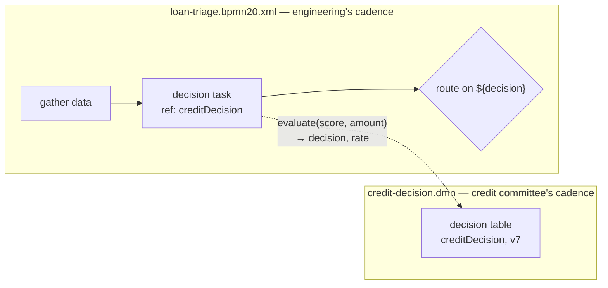

# DMN XML & the decision task: wiring DMN into BPMN

> **Motto** — The table is a deployable artifact with its own lifecycle; the process
> just asks the question — one task, key in, variables out.

*Part of Phase 05 — DMN: decisions as tables. This is the phase's **Use It** lesson.*

## The Problem

You have the semantics (lessons 01–02) as Python. Flowable's DMN engine wants the
standard interchange format: a `.dmn` XML file, deployable next to your `.bpmn20.xml`
models but *independently* of them — that independence being the entire point
(Principle 7: the table changes on the committee's cadence, the process on
engineering's). And the process needs exactly one touchpoint: a task that names the
table, feeds it variables, and collects the outputs.

## The Concept

Two artifacts, two lifecycles, one seam:



A `.dmn` file mirrors what you built by hand, element for element:

| Toy engine (lessons 01–02) | DMN XML |
| :-- | :-- |
| `DecisionTable.key` | `<decision id="creditDecision">` — the reference key |
| `inputs` list | `<input><inputExpression>score</inputExpression></input>` |
| output names | `<output name="decision" typeRef="string"/>` |
| `Rule.when` predicates | `<inputEntry><text>>= 750</text></inputEntry>` (`-` = any) |
| `Rule.then` values | `<outputEntry><text>"auto-approve"</text></outputEntry>` |
| `hit_policy` | `<decisionTable hitPolicy="FIRST">` |

Like the process definition key in Phase 1, the **decision key** is the stable name:
redeploying `creditDecision` creates version 2, 3, … and callers get the latest by
default. Policy rollout without touching the process — and Phase 8's versioning
questions apply here too.

## Build It

The full file is
[`outputs/credit-decision.dmn`](../outputs/credit-decision.dmn) — lesson 01's table,
transcribed. The parts worth staring at:

```xml
<decision id="creditDecision" name="Credit decision">
  <decisionTable id="creditDecisionTable" hitPolicy="FIRST">
```

`hitPolicy="FIRST"` is a *choice made on purpose* here: the rows are
exception-then-default (specific auto-approve bands first, catch-all decline last), so
order-as-shadowing is the honest mental model. Lesson 02's caveat stands — reordering
rows in this file is a policy change and reviews like one.

```xml
<rule>
  <inputEntry id="r3c1"><text><![CDATA[>= 650]]></text></inputEntry>
  <inputEntry id="r3c2"><text><![CDATA[-]]></text></inputEntry>
  <outputEntry id="r3o1"><text><![CDATA["manual-review"]]></text></outputEntry>
  <outputEntry id="r3o2"><text><![CDATA[13.0]]></text></outputEntry>
</rule>
```

Cells are expressions over the input (`>= 650`), `-` is "any", string outputs are
quoted. Same well-formedness check as Phase 1's BPMN:

```bash
python3 -c "import xml.dom.minidom, sys; xml.dom.minidom.parse(sys.argv[1]); print('well-formed')" \
  flowable/phases/05-dmn-decisions/03-dmn-xml-and-decision-task/outputs/credit-decision.dmn
```

## Use It

Deploy the `.dmn` exactly like a process model (Phase 1's client works —
`POST /dmn-repository/deployments` on the REST engine), then replace the loan triage's
hard-coded gateway policy with a decision task:

```xml
<serviceTask id="decideCredit" name="Credit decision" flowable:type="dmn">
  <extensionElements>
    <flowable:field name="decisionTableReferenceKey">
      <flowable:string><![CDATA[creditDecision]]></flowable:string>
    </flowable:field>
  </extensionElements>
</serviceTask>

<exclusiveGateway id="route" default="toReview"/>
<sequenceFlow id="toAuto" sourceRef="route" targetRef="autoApprove">
  <conditionExpression xsi:type="tFormalExpression">${decision == 'auto-approve'}</conditionExpression>
</sequenceFlow>
```

The task reads `score` and `amount` from the instance, evaluates the table, and writes
`decision` and `rate` back as process variables. Compare the gateway now with Phase
1's: `${score >= 700}` (policy in the diagram) became `${decision == 'auto-approve'}`
(routing on a decision made elsewhere). That's Principle 7 mechanised — and the
evaluation itself runs inside the decision task's transaction segment, so every Phase
2 rule (boundaries, async, rollback) applies unchanged.

## Ship It

This lesson ships
[`outputs/credit-decision.dmn`](../outputs/credit-decision.dmn) — the capstone's
credit decision, deployable as-is.

## Check Yourself

**Q1.** The credit committee tightens the auto-approve band. What gets redeployed?

- A) the BPMN model and the DMN file
- B) only the `.dmn` — the process keeps referencing `creditDecision` and picks up the new version
- C) the Java service layer
- D) everything, to be safe

<details><summary>Answer</summary>B — separate artifacts, separate lifecycles, joined
by the reference key. That deployment asymmetry is the business case for
DMN.</details>

**Q2.** After the decision task runs, where are `decision` and `rate`?

- A) in the DMN engine's private storage
- B) returned to the REST caller only
- C) written as process variables on the instance, ready for gateways and later tasks
- D) in history only

<details><summary>Answer</summary>C — the decision task's contract: variables in,
table evaluated, outputs back as variables (Phase 2's scoping rules apply to the
writes).</details>

**Q3.** Why is `${decision == 'auto-approve'}` on the gateway acceptable when
`${score >= 700}` was flagged in Phase 1's task-type guide?

- A) it isn't
- B) the first is *routing* on a decision's result; the second embeds the *policy* itself in the diagram
- C) string comparisons are safer than numeric
- D) gateways can't read numbers

<details><summary>Answer</summary>B — gateways route, tables decide. The threshold
lives where the committee can change it; the diagram only branches on the
answer.</details>

**Challenge.** Deploy `credit-decision.dmn` to your local engine, extend Phase 1's
`loan-triage.bpmn20.xml` with the decision task above, and re-run Phase 1's REST
client unchanged. Then redeploy the `.dmn` with row 2's cap raised to ₹7.5 lakh and
prove — with two instance runs — that the policy changed without the process
deployment moving.

## Related

- Next: [Who owns the rules?](../../04-decision-governance/docs/en.md)
- Previous: [Hit policies](../../02-hit-policies/docs/en.md)
- The versioning questions this raises: Phase 8 (see [`ROADMAP.md`](../../../../ROADMAP.md))
