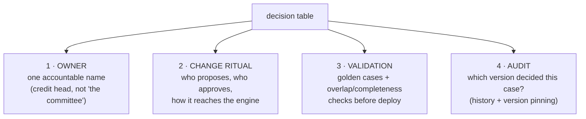

# Who owns the rules? Decision governance for product teams

> **Motto** — A decision table without a named owner, a review ritual, and a test set
> is just an `if` statement with better fonts.

*Part of Phase 05 — DMN: decisions as tables. Concept lesson — no code required.
Concept reading: [Principle 7](../../../../foundations/process-automation-principles.md).*

## The Problem

The technology from lessons 01–03 delivers exactly one thing: policy that can change
without an engineering release. That is a *capability*, not an outcome. Handed out
without governance it produces the failure modes every rules-engine veteran has seen:
the table nobody dares edit because nobody remembers why row 17 exists; the "quick
change" that priced a segment negative for a weekend; the audit that finds the table
in production doesn't match the policy the committee approved. DMN moves the risk from
*deployment* to *authorship* — and authorship needs the same discipline code got.

## The Concept

Four questions, answered per table and written down:

**1. Ownership.** One name per table. The engineering smell test: if a UNIQUE
violation fires in production (lesson 02), does the alert route to a person who can
*fix the policy*? If it pages ops, ownership is unassigned.

**2. The change ritual.** The healthy pipeline looks like code review because it is
one: propose (edited table), diff (row-level — this is why tables beat prose policy
documents), approve (the owner + a second pair of eyes), deploy (new version via the
same CI that deploys models). The anti-pattern is edit-in-production consoles: the
capability to change policy in a browser is precisely why write access to production
tables should not exist.

**3. Validation.** Tables are data, so they're testable as data:

- **Golden cases** — a spreadsheet of input → expected output pairs the owner
  maintains; every table version must pass before deploy. Your lesson-01 engine is a
  perfectly good runner for it.
- **Structural checks** — overlap detection for UNIQUE tables, completeness over
  representative inputs (the lesson-01/02 challenges), type checks on cells.
- **Impact replay** — before activating v8, run last month's real inputs through v7
  *and* v8 and diff the decisions. "This change flips 3.2% of applications from auto
  to manual" is the sentence the committee actually needs.

**4. Audit.** Two rules keep the regulator conversation short: history must record
*which table version* produced each decision (Flowable's DMN history does, if you keep
it — Phase 9's retention decision applies), and in regulated flows, pin in-flight
instances to the version that started them rather than "latest" — the Phase 8
versioning discipline, applied to decisions.

And the scope question that precedes all four: **does this rule belong in a table at
all?** The boundary from Phase 1's task-type guide, sharpened:

| Belongs in DMN | Belongs in code |
| :-- | :-- |
| thresholds, bands, grids the business recalibrates | algorithms (EMI math, scorecard computation) |
| eligibility and routing policy | validation of data shape/integrity |
| pricing components, fee schedules | anything needing loops, external calls, state |
| rules a regulator will ask to *see* | rules only engineers will ever touch |

## Ship It

This lesson ships
[`outputs/decision-governance-checklist.md`](../outputs/decision-governance-checklist.md)
— the four questions as a per-table checklist, ready for your team's operating doc.

## Check Yourself

**Q1.** A UNIQUE violation fires in production. Who should the alert reach?

- A) ops, to retry the job
- B) the table's owner — it's a policy bug; retrying re-asks a broken question
- C) the customer
- D) nobody; it self-heals

Answer
B — this is Phase 4's two-planes logic applied to
decisions: a table bug is not a transient fault, and the routing of its alert is the
practical test of whether ownership exists.

**Q2.** The committee approves a band change. The *safest* path to production is…

- A) edit the table in the production console
- B) a new table version through diff → approval → CI deploy, after golden cases and an impact replay
- C) hotfix the gateway condition instead
- D) email the new table to engineering

Answer
B — the whole pipeline exists to make policy
changes fast *and* reviewed. The console edit skips every safeguard the format makes
possible.

**Q3.** "Recompute the EMI schedule for this rate" belongs…

- A) in a COLLECT table
- B) in code — it's an algorithm, not a policy; DMN holds the *rate*, code does the *math*
- C) in a script task
- D) in the gateway

Answer
B — tables hold the numbers the business tunes;
computation stays in tested code. Splitting exactly there keeps both sides
honest.

**Challenge.** Pick one policy currently living in your codebase (a threshold, a
routing rule, a fee grid). Write its governance card: owner, change ritual, five
golden cases, and the impact-replay query you'd run before activating a change. If
you can't name the owner, you've learned why it's still in code.

## Related

- Phase README: [DMN: decisions as tables](../../README.md)
- Version pinning for in-flight work: Phase 8 (see [`ROADMAP.md`](../../../../ROADMAP.md))
- History retention for audit: Phase 9 (see [`ROADMAP.md`](../../../../ROADMAP.md))
