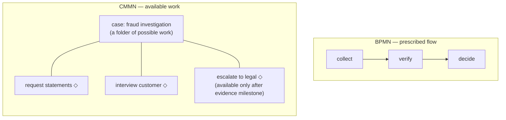

# Processes vs cases: prescribed flow vs available work

> **Motto** — BPMN says "do this, then this"; CMMN says "while the case is open,
> these things *may* happen" — one models a route, the other a workspace.

*Part of Phase 06 — CMMN: case management. Concept lesson — no code required.
Concept reading:
[Principle 8](../../../../foundations/process-automation-principles.md).*

## The Problem

Try to model a fraud investigation in BPMN and watch it fight you: the
investigator might request statements, interview the customer, call the bank,
escalate — in any order, some never, some repeatedly, driven by judgment.
Your diagram becomes a hairball of loops and inclusive gateways trying to
*prescribe* what is inherently *discretionary*. That's not a modelling skill
gap; it's a paradigm mismatch. BPMN's core assumption — a knowable
happy path — doesn't hold for knowledge work, and CMMN exists for exactly the
work where it doesn't.

## The Concept

The inversion, side by side:

| | BPMN process | CMMN case |
| :-- | :-- | :-- |
| Core metaphor | a route: tokens move along flows | a workspace: plan items become available/active/completed |
| Order | the model decides | the *case worker* decides, within guardrails |
| "Next step" | whatever the token faces | whatever is enabled — possibly several, possibly none |
| Guardrails | sequence flows, gateways | **sentries**: "X becomes available when Y completes / when data says so" |
| Completion | tokens reach end events | required items done, nothing active — or worker closes it |
| Home turf | origination, payments, onboarding — the whole course so far | investigations, disputes, complex claims, advisory work |

The litmus test, in one question: **who owns the order?** If the *organisation*
does ("KYC before decision, always" — every capstone step), it's a process. If
the *practitioner* does ("interview first or statements first? depends on the
case"), it's a case. Most real systems are processes with a few discretionary
pockets — which is why lesson 03's mixing pattern (cases calling processes, and
vice versa) matters more than pure CMMN, and why lesson 04 will warn you how
rarely *pure* CMMN is the answer.

One mental bridge from what you've built: a CMMN case behaves like a scope full
of Phase 7 event subprocesses — units of work that arm when their condition
holds — with the *human* as the event source. Same engine machinery underneath
(Phase 2's rows, Phase 3's tasks); different authority over sequencing.

## Ship It

This lesson ships
[`outputs/process-or-case-guide.md`](../outputs/process-or-case-guide.md) — the
litmus test and the traps on both sides.

## Check Yourself

**Q1.** The question that sorts process from case is…

- A) how many steps there are
- B) who owns the order — the organisation (process) or the practitioner within guardrails (case)
- C) whether humans are involved
- D) data volume

Answer
B — humans appear in both (Phase 3 is all
process-side humans). Discretion over *sequencing* is the divider.

**Q2.** In CMMN, sequencing pressure ("escalation only after evidence complete")
is expressed by…

- A) sequence flows
- B) sentries gating a plan item's availability on other items' completion or case data
- C) gateway conditions
- D) it can't be expressed

Answer
B — sentries are guardrails on *availability*,
not a route: the worker still chooses among whatever is enabled.

**Q3.** Loan origination (the capstone) is a process, not a case, because…

- A) it has service tasks
- B) the order is organisationally mandated — KYC before decision before offer; no case worker may reorder it
- C) it's too long for CMMN
- D) CMMN lacks timers

Answer
B — the litmus test applied. The capstone's
one discretionary pocket (fraud referral) is exactly where lesson 03's mixing
would enter.

**Challenge.** Take three "too dynamic for BPMN" claims you've heard (or make
them: dispute handling, hardship restructuring, high-value client onboarding)
and run the litmus test on each *step*, not each flow. Typical finding: 80% of
the "dynamic" flow is prescribed, with one genuinely discretionary stage — the
shape lesson 03 models.

## Related

- Next: [Plan items, stages, milestones, sentries](../../02-plan-items-and-sentries/docs/en.md)
- The warning label: [lesson 04](../../04-when-cmmn-is-overkill/docs/en.md)
