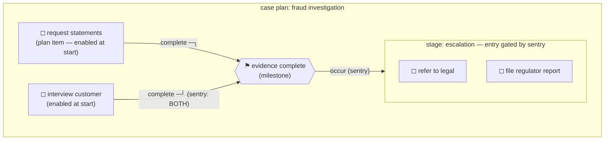

# Plan items, stages, milestones, sentries

> **Motto** — Four constructs carry all of CMMN: plan items are the possible work,
> stages group it, milestones mark achievement, and sentries are the *only* place
> sequencing pressure is allowed to live.

*Part of Phase 06 — CMMN: case management.*

## The Problem

Lesson 01 sold the paradigm; now the vocabulary. CMMN's spec is notoriously
dense — but the working subset is four constructs, and one deployable case shows
all of them: a fraud investigation where two evidence tasks can run in any
order, a milestone fires when both are done, and only *then* does the escalation
stage — legal referral, regulator report — become available. Guardrails without
a route.

## The Concept



| Construct | Is | Lifecycle essence |
| :-- | :-- | :-- |
| **Plan item** | one unit of possible work (human task, process task, …) | available → enabled → active → completed; *the worker* moves it, not a token |
| **Stage** | a folder of plan items with its own entry/exit | opens like a scope; its items become available inside it |
| **Milestone** | a named achievement, no work of its own | *occurs* when its sentry fires — the case's progress vocabulary |
| **Sentry** | the guardrail: ON-parts (events: "X completed") + optional IF-part (condition on case data) | when satisfied → entry criterion enables the item / exit criterion terminates it |

Two semantics that make CMMN genuinely different, not just different-shaped:

1. **Enablement, not invocation.** A satisfied entry sentry doesn't *start*
   work — it makes the item *available for the worker to start* (auto-start
   exists via `isBlocking`/manual-activation flags, but discretion is the
   default). Compare Phase 7's event subprocesses: same arming idea, but there
   the event fires the work; here it unlocks it.
2. **Completion is negotiated, not reached.** No end event: the case can
   complete when no required items are pending and nothing is active — or the
   worker terminates it. "When is this case done?" is a modelling decision you
   make with required-rules, and forgetting it produces immortal cases (the
   CMMN equivalent of Phase 1's dead-instance gateway bug).

## Use It

The full model —
[`outputs/fraud-investigation.cmmn`](../outputs/fraud-investigation.cmmn) — is
deployable to the stock Docker engine (the CMMN engine is in there; Phase 0's
map). The guardrail, in XML — a sentry with two ON-parts is an AND:

```xml
<sentry id="sentryEvidence">
  <planItemOnPart id="onStatements" sourceRef="piStatements">
    <standardEvent>complete</standardEvent>
  </planItemOnPart>
  <planItemOnPart id="onInterview" sourceRef="piInterview">
    <standardEvent>complete</standardEvent>
  </planItemOnPart>
</sentry>
```

Drive it over REST — same idioms as everywhere (`cmmn-repository/*`,
`cmmn-runtime/*`), and Phase 3's task API serves CMMN human tasks unchanged:

```bash
# deploy, then:
curl -su rest-admin:test -X POST .../cmmn-runtime/case-instances \
  -H 'Content-Type: application/json' -d '{"caseDefinitionKey": "fraudInvestigation"}'
# both evidence tasks are open AT ONCE (no order); complete them in either order;
# watch 'Refer to legal' and 'File regulator report' appear only after both.
```

That "appear only after" moment is the whole lesson: nothing routed a token —
completing the second evidence task satisfied a sentry, the milestone occurred,
the stage's entry criterion fired, and two new tasks became available for a
human to choose between.

## Ship It

This lesson ships
[`outputs/fraud-investigation.cmmn`](../outputs/fraud-investigation.cmmn) — the
four constructs in one deployable, REST-drivable case.

## Check Yourself

**Q1.** A satisfied entry sentry on a human-task plan item means…

- A) the task executes immediately
- B) the item becomes available/enabled — a person may now choose to start it (discretion is the default; auto-start is opt-in)
- C) the case completes
- D) a token moves

<details><summary>Answer</summary>B — enablement, not invocation. The worker
stays the scheduler.</details>

**Q2.** Two ON-parts in one sentry combine as…

- A) OR — either event fires it
- B) AND — all parts must be satisfied (want OR? give the item two entry criteria, each with its own sentry)
- C) XOR
- D) sequence

<details><summary>Answer</summary>B — within a sentry: AND; multiple sentries on
one item: OR. The most-quizzed fact in CMMN, and the one that silently inverts
your guardrail if misremembered.</details>

**Q3.** A case with no required items and no exit criteria…

- A) completes when work runs out
- B) can linger forever — completion is a modelled decision; without required-rules or termination, you've built immortal cases
- C) errors at deploy
- D) completes after a timeout

<details><summary>Answer</summary>B — the CMMN counterpart of the no-default-flow
gateway: legal model, operational leak. Decide completion explicitly.</details>

**Challenge.** Add an IF-part to `sentryEscalation` —
`${suspectedAmount > 1000000}` — so escalation unlocks only for large cases, and
a `repetitionRule` on the interview task (real investigations interview more
than once). Deploy and verify both against the REST drill above.

## Related

- Next: [Mixing BPMN and CMMN](../../03-mixing-bpmn-and-cmmn/docs/en.md)
- Task machinery reused: [Phase 3, lesson 01](../../../03-user-tasks-identity-and-forms/01-task-lifecycle/docs/en.md)
