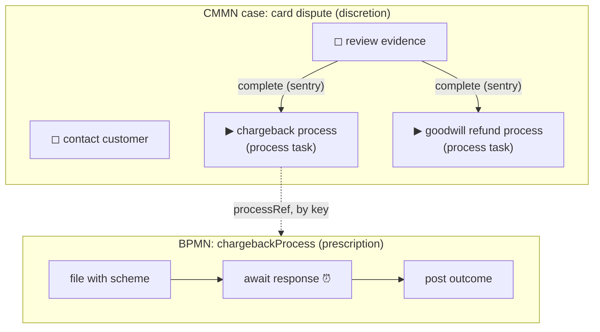

# Mixing BPMN and CMMN: process tasks inside cases

> **Motto** — The case decides *whether and when*; the process decides *how* — mixing
> lets each paradigm own exactly the half it's good at.

*Part of Phase 06 — CMMN: case management. This is the phase's **Use It** lesson.*

## The Problem

Lesson 01's litmus test rarely returns a pure answer. A card dispute:
investigation is genuinely discretionary (contact, evidence review — worker's
call, any order), but the *chargeback itself* is a scheme-mandated, deadline-
driven, prescribed sequence — as BPMN as anything in the capstone. Force the
whole thing into CMMN and you hand a regulated sequence to worker discretion;
force it into BPMN and you're back to lesson 01's hairball. The platform's
answer (Phase 0's map): reference across engines, and let each stage live in its
paradigm.

## The Concept



The bridge constructs, both directions:

| Direction | Construct | Semantics |
| :-- | :-- | :-- |
| Case → process | CMMN **process task** (`processRefExpression`) | a plan item that, when started, launches a BPMN instance; blocking by default — the item completes when the process ends |
| Process → case | BPMN **case service task** | a process step that opens a CMMN case (e.g. capstone's fraud referral spawning an investigation) |

Design rules for the seam:

1. **Sentries gate the *launch*, BPMN owns the *inside*.** In the shipped model,
   neither chargeback nor refund is available until evidence review completes —
   but once launched, the chargeback's scheme deadlines (Phase 7 timers) and
   retries (Phase 4) run under process discipline, untouchable by case
   discretion. Guardrail outside, contract inside.
2. **Reference by key, version independently.** The case names
   `chargebackProcess`; Phase 8's whole apparatus applies to each artifact
   separately. The scheme changes its rules → redeploy the process; the ops
   team reorganises investigation → redeploy the case. Neither deploy touches
   the other.
3. **Variables cross explicitly.** In/out parameter mappings on the process
   task — not ambient sharing. The Phase 10.03 boundary discipline applies at
   this seam too: pass references and routing facts.
4. **Blocking vs non-blocking is a real decision.** Blocking (default): the
   case item stays active until the process finishes — the case *waits on* the
   how. Non-blocking: fire-and-continue — the case records that the process
   was launched and moves on. Chargeback: blocking (its outcome drives the
   case). Notification process: non-blocking.

## Use It

The model — [`outputs/dispute-case.cmmn`](../outputs/dispute-case.cmmn) — with
the bridge in full:

```xml
<processTask id="ptChargeback" name="Chargeback (BPMN)"
    flowable:fallbackToDefaultTenant="true">
  <processRefExpression><![CDATA[chargebackProcess]]></processRefExpression>
</processTask>
```

The drill (a good afternoon exercise): write a three-step `chargebackProcess` in
BPMN (Phase 1 skills — file, timer wait, post outcome), deploy both artifacts,
start a dispute case, and watch the two paradigms hand off — the chargeback
plan item is *unavailable* until evidence completes (sentry), *available* after
(worker's choice — maybe this dispute settles with a goodwill refund instead),
and once started, its BPMN innards march on rails. One case, one process
instance, two clocks of authority.

The reverse bridge you've already almost met: the capstone's challenge lesson
suggested a fraud referral — that's a BPMN **case service task** opening
lesson 02's `fraudInvestigation` from inside `loanOrigination`. Prescription
spawning discretion.

## Ship It

This lesson ships [`outputs/dispute-case.cmmn`](../outputs/dispute-case.cmmn) —
the mixing pattern as a deployable case, with both launch decisions
(chargeback/refund) gated by one evidence sentry.

## Check Yourself

**Q1.** In the dispute model, who decides *whether* a chargeback runs, and who
decides *how*?

- A) BPMN both
- B) the case worker decides whether/when (once the sentry enables it); the BPMN process owns how — steps, deadlines, retries
- C) CMMN both
- D) the customer

<details><summary>Answer</summary>B — the seam in one sentence: discretion
outside, contract inside.</details>

**Q2.** A blocking process task completes…

- A) as soon as the process starts
- B) when the launched BPMN instance ends — the case waits on the outcome (non-blocking = fire-and-continue, for launches whose outcome the case doesn't consume)
- C) after a timeout
- D) when the worker closes it

<details><summary>Answer</summary>B — blocking is the default and the right
choice when case logic (sentries, milestones) depends on the process's
result.</details>

**Q3.** The scheme tightens chargeback deadlines. What redeploys?

- A) the case and the process
- B) only `chargebackProcess` — reference-by-key keeps the case untouched (Phase 8 applies per artifact)
- C) only the case
- D) both, atomically

<details><summary>Answer</summary>B — the same decoupling as BPMN→DMN in Phase
5: the platform's cross-references exist exactly for independent
cadences.</details>

**Challenge.** Build the drill: the three-step `chargebackProcess` (with a Phase
7 timer for the scheme's response window), deploy both, run one dispute to a
chargeback outcome and one to a goodwill refund. Then add the reverse bridge —
a case service task in the capstone's decline path opening a retention case —
and you've used every cross-engine reference on Phase 0's map.

## Related

- Next: [When CMMN is overkill](../../04-when-cmmn-is-overkill/docs/en.md)
- The map of bridges: [Phase 0, lesson 02](../../../00-orientation-and-setup/02-platform-map/docs/en.md)
