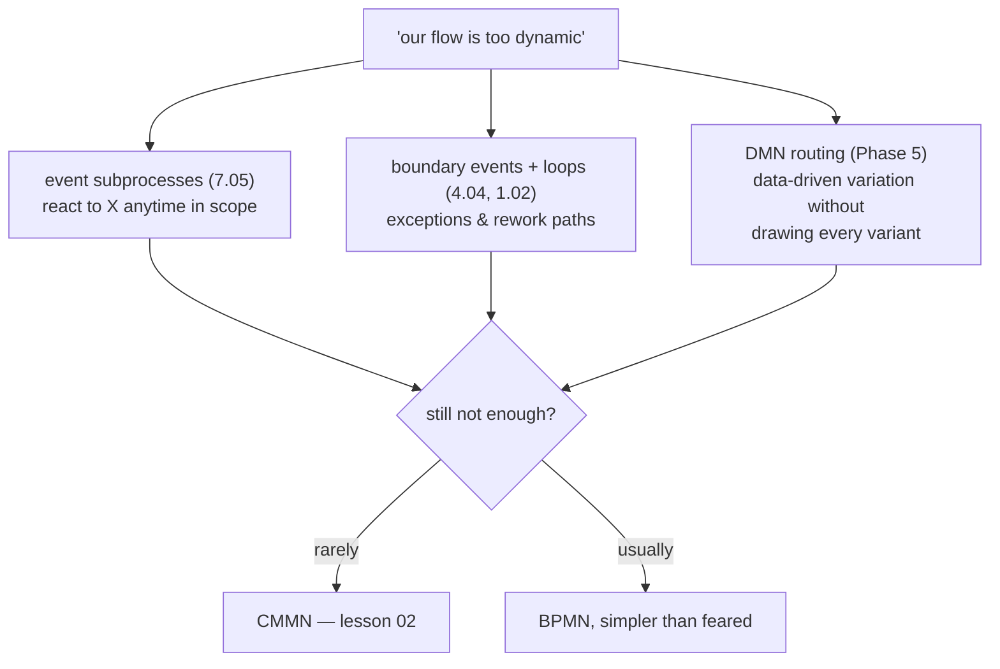

# When CMMN is overkill (most of the time)

> **Motto** — Reach for CMMN only after BPMN has actually failed you in the modeler —
> not in the meeting where someone said "our process is too dynamic".

*Part of Phase 06 — CMMN: case management. Concept lesson — no code required. The
phase's honest closing.*

## The Problem

CMMN is elegant, standardised, and — in most organisations that adopted it —
regretted. Camunda deprecated their implementation years ago for lack of use;
Flowable keeps a first-class one (it's genuinely good, and Flowable Work's case
UIs lean on it), but the industry pattern is clear: teams choose CMMN in the
architecture phase for flexibility they never exercise, then pay its costs —
scarcer skills, weaker tooling ecosystems, harder testing, models reviewers
can't read — for years. This lesson is the checklist that keeps you off that
path, and the short list of cases where CMMN earns its keep.

## The Concept

Why "too dynamic for BPMN" is usually false — the three escape hatches you
already own:

Most "dynamic" requirements decompose into: *interruptions* (event
subprocesses), *exceptions* (boundary events), *rework* (loops), and *variants*
(DMN-driven routing). What remains — genuine practitioner authority over
sequencing, lesson 01's litmus test — is rarer than the meeting believes.

The real costs you accept with CMMN, spelled out:

| Cost | Why it bites |
| :-- | :-- |
| **Skills** | every engineer/BA knows some BPMN; CMMN fluency is rare — reviews, hiring, and handovers all pay |
| **Tooling & ecosystem** | modelers, linters, courses, StackOverflow depth — an order of magnitude thinner |
| **Testability** | a process has paths you can enumerate and assert; a case has *state spaces* — "any order, maybe never, maybe twice" multiplies test scenarios |
| **Legibility** | sentries encode logic invisibly (an AND across ON-parts, an IF-part in XML) — the diagram shows less of the behaviour than BPMN's does, the opposite of Principle 2's promise |
| **Ops intuition** | "where is case X stuck?" has fuzzier answers when nothing was ever *supposed* to happen next (Phase 9's oldest-instance signal needs rethinking per case model) |

When CMMN genuinely earns it — all three at once:

1. Practitioner authority over sequencing is *real and defended* (investigators,
   adjusters, clinicians — people whose judgment is the product);
2. The discretionary surface is *large* (a dozen-plus optional activities —
   below that, one BPMN stage with event subprocesses covers it);
3. Guardrails still matter (sentries, milestones, required items — otherwise
   you wanted a task list, not an engine).

Fraud investigation (lesson 02) passes all three. Dispute handling passed by
*containing* its discretion in one stage (lesson 03). The capstone fails 1 —
and that's the normal case, which is the point.

## Ship It

This lesson ships
[`outputs/cmmn-adoption-checklist.md`](../outputs/cmmn-adoption-checklist.md) —
the escape hatches, the three-conditions test, and the containment strategy —
closing Phase 6 and, with it, the course's last engine.

## Check Yourself

**Q1.** "Our onboarding is too dynamic for BPMN — documents arrive in any
order." The first answer is…

- A) CMMN
- B) BPMN with event subprocesses / message catches per document — arrival order is an *event* problem (Phase 7), not a discretion problem
- C) a task list
- D) Temporal

Answer
B — unordered *inputs* are not unordered
*work*. The litmus test asks who sequences the work, and onboarding's work is
prescribed.

**Q2.** CMMN's testability cost comes from…

- A) slow engines
- B) state-space explosion — optional, repeatable, order-free items multiply the scenarios a test suite must cover versus a process's enumerable paths
- C) missing assertions
- D) XML

Answer
B — discretion for the worker is combinatorics
for the tester. Budget for it or constrain the model.

**Q3.** The containment strategy for a mostly-prescribed flow with one
discretionary pocket is…

- A) model everything in CMMN for consistency
- B) BPMN end to end, with the pocket as a case (via case service task) or the case wrapping processes (lesson 03) — discretion quarantined where it's real
- C) two separate products
- D) gateway spaghetti

Answer
B — lesson 03's seam exists precisely so
CMMN's costs are paid only on the stage that needs its powers.

**Challenge.** Take lesson 02's fraud investigation and — as devil's advocate —
model it in plain BPMN using only the escape hatches. Write down exactly where
it breaks (hint: "interview may repeat, statements may be skipped, order is
judgment" survives; "escalation stage unlocked by evidence" does too; what
finally breaks is *completion semantics*). Knowing precisely where BPMN fails
is what earns you the right to use CMMN there.

## Related

- Phase README: [CMMN: case management](../../README.md)
- The escape hatches: [7.05](../../../07-events-timers-and-messaging/05-event-subprocesses/docs/en.md) · [4.04](../../../04-service-integration-and-error-handling/04-boundary-events/docs/en.md) · [Phase 5](../../../05-dmn-decisions/README.md)
