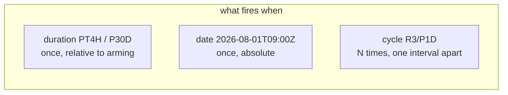

# Timer events: ISO-8601 durations, cycles, due dates

> **Motto** — Deadlines belong in the model: a timer is declared next to the step it
> governs, versioned with the process, and fired by the same job machinery you already
> built.

*Part of Phase 07 — Events, timers & messaging. Concept reading:
[Principle 5 — time is a first-class citizen](../../../../foundations/process-automation-principles.md).*

## The Problem

"Expire the offer after 30 days. Remind the customer daily for the first three. Escalate
approvals stuck past four hours." In ordinary systems each of these becomes a cron job,
a scheduler table, and a slow drift between what the code does and what the SLA document
says. The process engine's claim is stronger: the deadline is *part of the flow* — drawn
on the diagram, deployed with the model, cancelled automatically when the step it
guards completes. You built the firing machinery in Phase 2 (the job executor); this
lesson is the semantics layered on top.

## The Concept

Three timer shapes, one notation (ISO-8601), three places to attach them:



| Attached as | Semantics | Typical use |
| :-- | :-- | :-- |
| **Boundary (interrupting)** | activity aborted; token takes the timer path | offer expiry, SLA breach |
| **Boundary (non-interrupting)** | extra token spawns; activity keeps waiting | reminders, escalation pings |
| **Intermediate catch** | token parks until the time passes | cooling-off periods, "wait until 9 am" |
| **Timer start event** | new instance per firing | scheduled batch processes |

Underneath, every one of them is a row in the timer-job table with a due date — armed
when the token arrives, **disarmed when the activity completes first**. That
cancellation is the part cron can never give you: complete the offer task and the
expiry simply never fires; no "check if still relevant" guard code anywhere.

The two flavours of boundary timer are the design decision that matters:
*interrupting* = the deadline **changes the flow** (expiry ends the offer);
*non-interrupting* = the deadline **adds work** (a reminder, while the offer stays
open). Reminders-then-expiry is the composition you'll use constantly: a
non-interrupting `R3/P1D` cycle plus an interrupting `P30D` on the same task.

## Build It

[`code/timer_events.py`](../code/timer_events.py) — an ISO-8601 parser plus a timer
service over Phase 2's job pattern. Parsing is two small functions:

```python
def parse_duration(text):
    """P3D, PT4H, PT30M, P1DT12H ... -> seconds."""
    m = DUR.match(text)
    assert m and text != "P", f"bad ISO-8601 duration: {text!r}"
    g = {k: int(v or 0) for k, v in m.groupdict().items()}
    return ((g["d"] * 24 + g["h"]) * 60 + g["m"]) * 60 + g["s"]

def parse_cycle(text):
    """R3/P1D -> (3 repetitions, 86400 s apart). R/P1D -> unbounded."""
```

The demo composes the capstone's offer step — three daily reminders
(non-interrupting cycle) under a 30-day hard expiry (interrupting duration):

```
$ python3 timer_events.py
  day    1: reminder sent
  day    2: reminder sent
  day    3: reminder sent
  day   30: offer EXPIRED — token leaves acceptOffer
timers drained; sanity: PT4H=14400s P1DT12H=129600s
```

Note what `expire` does besides flipping state: it cancels the reminder cycle —
interrupting boundaries tear down their siblings. And `accept_offer_completed()` shows
the other direction: completing the task disarms *both* timers. Arming and disarming
are the whole trick; firing is just Phase 2's `tick`.

## Use It

The same composition in Flowable XML — two boundary events on one task:

```xml
<userTask id="acceptOffer" name="Accept loan offer"
    flowable:candidateGroups="applicants"/>

<boundaryEvent id="reminder" attachedToRef="acceptOffer" cancelActivity="false">
  <timerEventDefinition><timeCycle>R3/P1D</timeCycle></timerEventDefinition>
</boundaryEvent>

<boundaryEvent id="offerExpiry" attachedToRef="acceptOffer" cancelActivity="true">
  <timerEventDefinition><timeDuration>P30D</timeDuration></timerEventDefinition>
</boundaryEvent>
```

`cancelActivity` is the interrupting/non-interrupting switch. Durations can be
expressions — `<timeDuration>${offerValidity}</timeDuration>` — so the 30 days can
come from a DMN table (Phase 5) instead of being baked into the model. Operationally,
these are rows in `ACT_RU_TIMER_JOB`; a timer that "didn't fire" is diagnosed with
exactly the Phase 2/Phase 4 job tooling.

## Ship It

This lesson ships [`code/timer_events.py`](../code/timer_events.py) — the ISO-8601
parser and arm/disarm/fire semantics as a module; the capstone model uses the
composition verbatim.

## Check Yourself

**Q1.** A 30-day interrupting expiry is armed on `acceptOffer`; the customer accepts
on day 12. What fires on day 30?

- A) the expiry, harmlessly
- B) nothing — completing the activity disarmed its boundary timers
- C) the expiry, and the instance errors
- D) depends on the job executor

<details><summary>Answer</summary>B — disarm-on-completion is the property that
removes all the "is this still relevant?" guard code cron solutions need.</details>

**Q2.** Reminders while a task stays open need a boundary timer that is…

- A) interrupting, so the reminder is sent exactly once
- B) non-interrupting with a cycle — extra tokens spawn, the task keeps waiting
- C) a timer start event
- D) an intermediate catch after the task

<details><summary>Answer</summary>B — non-interrupting means "add work, don't abort";
the cycle gives you the repetition.</details>

**Q3.** `R3/P1D` means…

- A) 3 firings, one day apart
- B) fire after 3 days, once
- C) fire every 3 days forever
- D) 1 firing after 3 days, retried daily

<details><summary>Answer</summary>A — R⟨count⟩/⟨interval⟩, the same notation Phase 4
used for retry cycles (`R5/PT10M`). Omit the count (`R/P1D`) for unbounded.</details>

**Challenge.** Add `parse_date` (absolute ISO timestamps) and a `TimerService.at()`
for it, then model a "cooling-off until the 1st of next month" intermediate catch.
Then break the parser deliberately — `PT30` (no unit) — and make the error message say
*which* part of the string is malformed; bad ISO strings in models are a real
deploy-time failure class.

## Related

- Next: [Message events](../../02-message-events/docs/en.md)
- The machinery underneath: [Phase 2, lesson 04 — the job executor](../../../02-the-engine-state-and-transactions/04-job-executor/docs/en.md)
