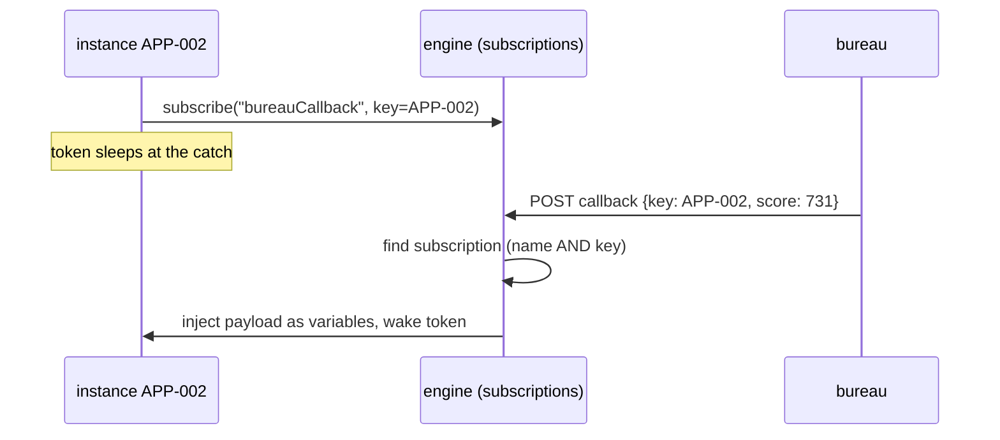

# Message events: correlating the outside world to an instance

> **Motto** — Delivery is easy; *correlation* is the feature — the payload must find
> the one instance, among fifty thousand, that is waiting for exactly it.

*Part of Phase 07 — Events, timers & messaging.*

## The Problem

Phase 4's HTTP task was request/response: call, wait, continue. But the bureau you
actually integrate with answers by webhook, minutes later. E-sign providers, payment
gateways, checkers on the other side of a maker-checker — the world responds
*asynchronously*, addressed to "application APP-002", not to "execution 84719 in your
engine". Between the callback arriving and the right token waking lies the problem
this lesson builds: **correlation** — and getting it wrong produces the two classic
production bugs: the callback that wakes the *wrong* instance, and the callback that
wakes *nobody* and is silently dropped.

## The Concept

A message catch event is a wait state with an address: the token subscribes to a
*(message name, correlation key)* pair and sleeps. Delivery is a lookup, not a
broadcast:



Three rules keep it honest:

1. **The key is a business identifier**, chosen at design time — application ID,
   order number — never an engine-internal execution ID. The outside system knows
   *business* names; that's the whole point.
2. **A delivery must match exactly one subscription.** Zero matches = late,
   duplicate, or mis-keyed callback — surface it (queue, alert, DLQ), never drop it
   silently. Two matches = your key isn't unique enough; the engine should refuse the
   second subscription rather than let deliveries become ambiguous.
3. **Messages are point-to-point.** One delivery wakes one token. "Tell every
   waiting instance the repo rate changed" is a different primitive — the *signal* —
   and lesson 03 draws that line.

## Build It

[`code/message_events.py`](../code/message_events.py) — a broker in ~40 lines whose
entire value is in the lookup:

```python
def correlate(self, message, key, payload):
    hits = [s for s in self.subs if s.message == message and s.key == key]
    if not hits:
        raise CorrelationError(
            f"no instance waiting for {message!r} with key {key!r} "
            f"(late? already completed? wrong key?)")
    (sub,) = hits                       # unique by construction
    self.subs.remove(sub)
    sub.wake(payload)
```

The demo runs two loan instances waiting on the same message name with different keys,
answers them out of order, and exercises both failure modes:

```
$ python3 message_events.py
  ambiguity : duplicate subscription bureauCallback/APP-001 — correlation would be ambiguous
  APP-002: woke with score=731
  APP-001: woke with score=688
  duplicate : no instance waiting for 'bureauCallback' with key 'APP-001' (late? ...)
```

APP-002's callback arriving first and waking APP-002 — not the instance that
subscribed first — is the line that separates correlation from a queue.

## Use It

In the model, the catch subscribes; the message name is declared once and referenced:

```xml
<message id="bureauCallbackMsg" name="bureauCallback"/>

<intermediateCatchEvent id="awaitBureau">
  <messageEventDefinition messageRef="bureauCallbackMsg"/>
</intermediateCatchEvent>
```

The webhook side delivers by finding the execution and triggering it — over REST:

```python
# inside your webhook handler: correlate by business key
execs = call("GET", "/runtime/executions?messageEventSubscriptionName=bureauCallback"
                    f"&processInstanceBusinessKey={app_id}")["data"]
call("PUT", f"/runtime/executions/{execs[0]['id']}", {
    "action": "messageEventReceived", "messageName": "bureauCallback",
    "variables": [{"name": "score", "value": 731}],
})
```

— which is why Phase 1's advice to start instances **with a business key** stops being
a nicety here: `startProcessInstanceByKey("loan", businessKey=app_id, ...)` is what
makes the webhook's query possible. Messages can also *start* instances
(`<startEvent>` with a message definition) — "a new inbound application event creates
a process" — which is the doorway to lesson 04's event registry.

## Ship It

This lesson ships [`code/message_events.py`](../code/message_events.py) — the
subscription/correlation core, plus both failure modes as executable documentation.

## Check Yourself

**Q1.** The correlation key should be…

- A) the execution ID, for precision
- B) a business identifier the external system already knows (application ID, order number)
- C) a random UUID minted at subscription time
- D) the task ID

<details><summary>Answer</summary>B — the outside world addresses you in business
terms; engine-internal IDs would force you to leak and track them
externally. (C describes a workable pattern — but then *you* must send the UUID out
and store it, which is just the business key with extra steps.)</details>

**Q2.** A bureau callback arrives and zero subscriptions match. Best handling?

- A) drop it — nobody's waiting
- B) surface it: park it in a store/DLQ and alert, because it's a late, duplicate, or mis-keyed delivery about real money
- C) wake a random instance
- D) create a new process instance

<details><summary>Answer</summary>B — silent drops are how "the bureau says they sent
it" tickets are born. Unmatched deliveries are data about a correctness
problem.</details>

**Q3.** Fifty instances should all react when the repo rate changes. Messages are the
wrong tool because…

- A) fifty deliveries would be slow
- B) messages are point-to-point — one delivery, one instance; broadcast is what signals are for
- C) rates aren't valid payloads
- D) they aren't — send fifty messages

<details><summary>Answer</summary>B — the one-to-one contract is what makes
correlation errors detectable; broadcast semantics is a different primitive (next
lesson).</details>

**Challenge.** Add a `park()` path to the broker: unmatched deliveries go to a
`parked` list, and every new subscription first checks it — solving the race where
the callback arrives *before* the instance reaches its catch event (it happens weekly
in production). Decide and document how long parked messages live.

## Related

- Next: [Signals vs messages](../../03-signals-vs-messages/docs/en.md)
- Previous: [Timer events](../../01-timer-events/docs/en.md)
