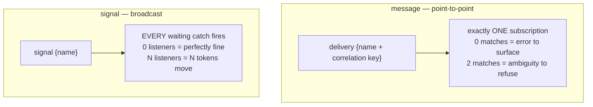

# Signals vs messages: broadcast vs point-to-point

> **Motto** — A message finds *the one* instance that owns the conversation; a signal
> reaches *everyone* who cares — confuse them and you either drop deliveries or stampede
> your engine.

*Part of Phase 07 — Events, timers & messaging. Concept lesson — no code required.*

## The Problem

Two events land in your loan platform on the same afternoon. The bureau's callback for
application APP-002: exactly one instance must receive it, and delivering it twice or
to a sibling would be a correctness bug. And RBI revises the repo rate: *every*
in-flight application holding a floating-rate offer must recalculate. Same engine, same
"something happened outside" shape — opposite delivery semantics. BPMN gives each its
own primitive, and models that use the wrong one work fine in the demo and fail at the
first duplicate or the first thousand-instance broadcast.

## The Concept

| | Message | Signal |
| :-- | :-- | :-- |
| Addressing | name **+ correlation key** | name only |
| Receivers | exactly one | zero to N — all of them |
| Zero receivers means | a problem (late/mis-keyed) — surface it | nothing to do — normal |
| Carries payload | yes, into the one instance's variables | engine-level: use sparingly; receivers usually re-read state |
| Scope | always engine-wide, keyed | engine-wide, or *instance-scoped* (a signal thrown and caught within one instance) |
| Typical use | bureau callback, e-sign webhook, payment confirmation | rate change, "compliance freeze all onboarding", cache invalidation between branches |

Two design rules fall out:

1. **If you need a correlation key, it's a message.** The moment "which instance?"
   has an answer, broadcast is wrong — a signal named `bureauCallback-APP-002` (a real
   anti-pattern found in real models) is a message wearing a signal costume, and it
   defeats duplicate detection.
2. **If zero listeners is fine, it's a signal.** Messages *must* land; signals are
   fire-and-forget by design. This is also the operational warning: a signal caught by
   10,000 instances moves 10,000 tokens — on a synchronous throw, in one transaction.
   Broadcast to large populations wants async continuations (Phase 2) between the
   catch and any heavy work.

Both also come as **event subprocess** triggers (lesson 05) — "while this scope is
active, react to X" — which is where signals shine: a `complianceFreeze` signal event
subprocess in every onboarding process is one drawn element per model, not a boundary
on every task.

## Ship It

This lesson ships
[`outputs/signal-message-cheatsheet.md`](../outputs/signal-message-cheatsheet.md) —
the decision table plus the model-review flags.

## Check Yourself

**Q1.** "When the checker approves batch B-77, continue that batch's process." Message
or signal?

- A) signal — approvals are broadcasts
- B) message — there's a correlation key (B-77) and exactly one intended receiver
- C) either works
- D) timer

Answer
B — "that batch's" is a correlation key wearing
prose. One intended receiver = message, always.

**Q2.** A signal is thrown and no instance is waiting. What should happen?

- A) an error — deliveries must land
- B) nothing, by design — zero listeners is a normal outcome for broadcast
- C) the signal is queued until someone subscribes
- D) a new instance starts

Answer
B — this is the semantic core of the split. If
zero receivers worries you, you wanted a message (or a signal *start* event, which
does create instances).

**Q3.** The model review finds `<signal name="paymentConfirmed-${orderId}"/>`. The
verdict?

- A) fine — dynamic names are expressive
- B) an anti-pattern: a keyed, single-receiver event is a message; the costume defeats correlation-error detection
- C) fine if orders are unique
- D) prefer a timer

Answer
B — per-key signal names re-implement correlation
without its safety rails (no ambiguity refusal, no unmatched-delivery
surface).

**Challenge.** Sweep a process model you own (or the capstone, next phase) and label
every external interaction M or S using the two rules. Then find the one that's
neither — a *conditional* event or a polling loop — and write down why it resisted
classification; that's usually where an event registry (next lesson) belongs.

## Related

- Next: [The event registry](../../04-event-registry/docs/en.md)
- Previous: [Message events](../../02-message-events/docs/en.md)
