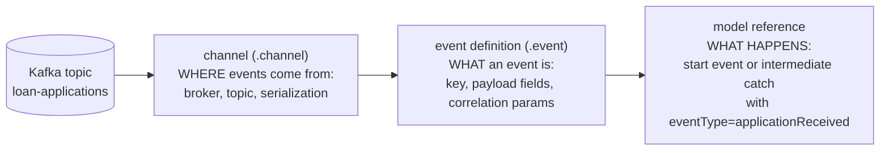

# The event registry: Kafka in, process out

> **Motto** — The event registry turns "write a consumer, parse the payload, call the
> engine" into three declarative files: a channel, an event definition, and a start
> event in the model.

*Part of Phase 07 — Events, timers & messaging.*

## The Problem

Lesson 02's webhook pattern assumed the world speaks HTTP to you. Increasingly it
doesn't — it speaks **topics**: partner applications land on Kafka, payment
confirmations on RabbitMQ, core-banking events on JMS. The hand-rolled answer is a
consumer service per topic: deserialize, validate, map fields, find-or-start the
process instance, handle redelivery. Multiply by every topic and you've built a glue
layer nobody budgeted — with its own deploys, bugs, and drift from the models it
feeds. Flowable's **event registry** deletes that layer: the mapping from broker
events to process actions becomes deployable configuration.

## The Concept

Three declarative pieces, deployed like models, versioned like models:



| Piece | Owns | Analogy |
| :-- | :-- | :-- |
| **Channel** | transport: inbound/outbound, kafka/jms/rabbit, topic, JSON mapping | a typed socket |
| **Event definition** | schema: payload fields + which of them are **correlation parameters** | the message contract |
| **Model reference** | reaction: start a new instance, or wake a waiting catch | lesson 02, generalised |

The registry rides on machinery you already own: an inbound event with correlation
parameters behaves like lesson 02's message (find the one instance where
`applicationId` matches); an event start creates instances the way message starts do.
Outbound channels run the other way — a process step *publishes* an event instead of
calling an API. What's genuinely new is **where the integration logic lives**: in
deployable artifacts the same review/version pipeline covers, not in a sidecar
service.

The honest boundary: the registry does transport + schema + correlation. It does
**not** do content-based transformation, enrichment, aggregation of three topics into
one event, or ordering guarantees beyond the broker's. If the mapping needs logic,
you still want a thin stream processor in front — the registry then consumes *its*
clean output topic.

## Use It

The three artifacts for the capstone's intake, all shipped under this lesson's
`outputs/` folder:

**[`loan-applications.channel`](../outputs/loan-applications.channel)** — where:

```json
{
  "key": "loanApplicationsChannel",
  "channelType": "inbound",
  "type": "kafka",
  "topics": ["loan-applications"],
  "deserializerType": "json",
  "channelEventKeyDetection": { "fixedValue": "applicationReceived" }
}
```

**[`application-received.event`](../outputs/application-received.event)** — what:

```json
{
  "key": "applicationReceived",
  "correlationParameters": [ { "name": "applicationId", "type": "string" } ],
  "payload": [
    { "name": "applicationId", "type": "string" },
    { "name": "pan", "type": "string" },
    { "name": "amount", "type": "double" },
    { "name": "channel", "type": "string" }
  ]
}
```

And the reaction, in the BPMN model — a start event referencing the event type:

```xml
<startEvent id="applicationArrives" flowable:eventType="applicationReceived">
  <extensionElements>
    <flowable:eventOutParameter source="applicationId" target="applicationId"/>
    <flowable:eventOutParameter source="amount" target="amount"/>
  </extensionElements>
</startEvent>
```

Deploy all three (Spring Boot: drop them in `src/main/resources/eventregistry/`;
the Kafka connection itself is `spring.kafka.*` configuration), then publish a test
event with [`outputs/producer.py`](../outputs/producer.py):

```
$ python3 producer.py APP-1042
published: {'applicationId': 'APP-1042', 'pan': 'ABCDE1234F', 'amount': 750000.0, ...}
# engine side: a new loanOrigination instance exists, variables populated
```

No controller, no consumer service, no glue — the diagram now starts from a topic.

## Ship It

This lesson ships the intake trio —
[`loan-applications.channel`](../outputs/loan-applications.channel),
[`application-received.event`](../outputs/application-received.event),
[`producer.py`](../outputs/producer.py) — reused by the capstone as its
event-driven front door.

## Check Yourself

**Q1.** The registry's three pieces split responsibilities as…

- A) channel = what, event = where, model = when
- B) channel = where (transport/topic), event = what (schema + correlation), model = what happens (start/continue)
- C) all three describe the payload
- D) the split is arbitrary

<details><summary>Answer</summary>B — transport, contract, reaction. Each changes on
a different cadence, which is why they're separate deployable files.</details>

**Q2.** An inbound event should *continue* a waiting instance rather than start one.
What makes that work?

- A) the topic name
- B) correlation parameters on the event definition matching the instance — lesson 02's mechanism, fed from a topic instead of a webhook
- C) the instance polls the topic
- D) it can't; registry events only start instances

<details><summary>Answer</summary>B — the registry is a transport adapter; the
find-the-one-instance semantics underneath is exactly the message correlation you
built.</details>

**Q3.** Events on the topic need enrichment from a CRM before they're usable. Where
does that logic go?

- A) in the channel definition
- B) in a stream processor in front; the registry consumes its clean output topic
- C) in the correlation parameters
- D) in a script task after the start

<details><summary>Answer</summary>B — the registry is deliberately logic-free:
transport, schema, correlation. Transformation is a job for code that can be
tested as code.</details>

**Challenge.** Design (on paper) the *outbound* half: a channel + event pair that
publishes `decisionMade {applicationId, decision, rate}` after the capstone's DMN
task, so downstream systems consume decisions from a topic instead of polling
history. Decide which field is the Kafka record key and why that choice matters for
consumers' ordering.

## Related

- Next: [Event subprocesses](../../05-event-subprocesses/docs/en.md)
- The correlation core underneath: [Message events](../../02-message-events/docs/en.md)
