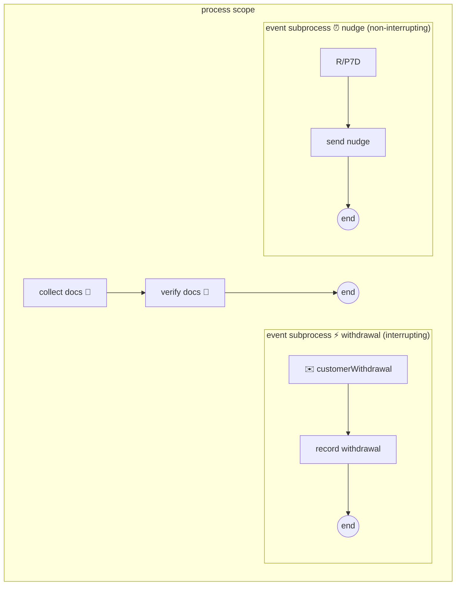

# Event subprocesses & interrupting vs non-interrupting starts

> **Motto** — A boundary event guards one box; an event subprocess guards the whole
> scope — "while any of this is running, here's how we react to X."

*Part of Phase 07 — Events, timers & messaging. This is the phase's **Use It**
lesson.*

## The Problem

The customer can withdraw their application at *any* point — during document
collection, verification, review, offer. Model that with boundary events and you pin
the same withdrawal catch onto every activity, five copies that must stay in sync
through every model edit. Miss one and withdrawal during that step is silently
impossible. The same shape recurs for "compliance freeze", "fraud flag raised",
"send a status nudge weekly while open" — reactions that belong to the *process as a
whole*, not to any single box.

## The Concept

An event subprocess is a subprocess with `triggeredByEvent="true"`: it has no incoming
flows, sits inside a scope, and its **start event** — message, timer, signal, error —
arms when the scope becomes active:



The one attribute that changes everything is on the start event:

| `isInterrupting` | When it fires | Use for |
| :-- | :-- | :-- |
| `true` (default) | the scope's main flow is **terminated**; only the handler runs | withdrawal, fraud stop, hard cancellation |
| `false` | a **parallel** token runs the handler; main flow untouched; can fire repeatedly | nudges, escalations, audit pings |

Placement = scope: at process level it guards the whole instance; inside an embedded
subprocess it guards just that stage (a withdrawal handler that only applies before
disbursal, say). And the error event subprocess variant is Phase 4's scope-chain
walking, drawn: errors uncaught by any boundary land in the enclosing scope's error
event subprocess before killing the instance.

Versus boundary events, the trade is *coverage vs precision*: one drawn element
covering the scope, or per-activity reactions where each step should respond
differently. The withdrawal case wants coverage; "this specific bureau call gets a
manual fallback" wanted the boundary (Phase 4).

## Use It

The full model is
[`outputs/application-with-events.bpmn20.xml`](../outputs/application-with-events.bpmn20.xml)
— a two-task main flow plus both handler flavours. The load-bearing lines:

```xml
<subProcess id="withdrawalHandler" triggeredByEvent="true">
  <startEvent id="withdrawalStart" isInterrupting="true">
    <messageEventDefinition messageRef="withdrawalMsg"/>
  </startEvent>
  ...
</subProcess>

<subProcess id="nudgeHandler" triggeredByEvent="true">
  <startEvent id="nudgeStart" isInterrupting="false">
    <timerEventDefinition><timeCycle>R/P7D</timeCycle></timerEventDefinition>
  </startEvent>
  ...
</subProcess>
```

Deploy it with Phase 1's client and run the drill:

1. Start an instance; `collectDocs` is waiting.
2. Deliver `customerWithdrawal` (lesson 02's REST correlation, business key =
   application). The open task **vanishes** — interrupting start killed the main
   flow — and history shows `recordWithdrawal` ran; `outcome = withdrawn`.
3. Start a second instance and leave it. Every 7 days (or sooner if you shrink the
   cycle for the test), `sendNudge` executes while `collectDocs` stays open —
   parallel tokens, main flow untouched.

## Ship It

This lesson ships
[`outputs/application-with-events.bpmn20.xml`](../outputs/application-with-events.bpmn20.xml)
— the withdrawal + nudge pattern the capstone embeds directly.

## Check Yourself

**Q1.** Withdrawal must be possible during any of five steps. Event subprocess beats
five boundary events because…

- A) boundary events can't catch messages
- B) one drawn element covers the scope and survives model edits; five copies drift and one always gets missed
- C) it's faster at runtime
- D) it isn't better

<details><summary>Answer</summary>B — scope-level reactions belong to the scope. Per
-activity boundaries are for per-activity responses.</details>

**Q2.** A non-interrupting timer event subprocess with `R/P7D` on a long-running
instance fires…

- A) once, then disarms
- B) every 7 days while the scope is active, each firing a parallel token; the main flow never notices
- C) only if the main flow is idle
- D) it can't use cycles

<details><summary>Answer</summary>B — non-interrupting + cycle is the recurring
-side-effect pattern: nudges, SLAs, sweep checks.</details>

**Q3.** Where does an error event subprocess sit in Phase 4's uncaught-error story?

- A) it replaces boundary events
- B) it's the scope-level rung of the catch chain: activity boundary first, then enclosing scopes' error event subprocesses, then the instance fails
- C) it only catches technical errors
- D) unrelated mechanism

<details><summary>Answer</summary>B — same walking-outward search, one more place to
land before "uncaught BpmnError = dead instance".</details>

**Challenge.** Add a third handler to the model: an interrupting **signal** event
subprocess for `complianceFreeze` (lesson 03's broadcast) that routes to a user task
"await compliance clearance" instead of ending the instance. Then answer: after
clearance, how do you resume the main flow — and why does that question reveal the
difference between *pausing* a process and *terminating* it?

## Related

- Phase README: [Events, timers & messaging](../../README.md)
- Boundary-level catching: [Phase 4, lesson 04](../../../04-service-integration-and-error-handling/04-boundary-events/docs/en.md)
